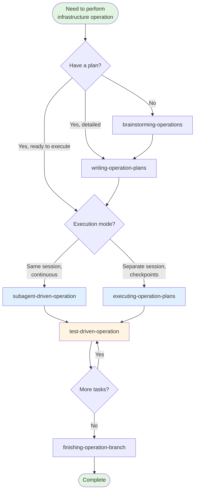

# SREPowers

SRE infrastructure skills for Claude Code: Test-Driven Operations and Subagent-Driven Operations for Kubernetes, Keycloak, GitOps, API workflows, and more.

## Overview

SREPowers adapts proven software development workflows (TDD, subagent-driven development) for infrastructure operations. These skills help you execute infrastructure changes systematically with verification-first discipline.

## Skill Workflow Diagram



## SRE Principles

All skills in SREPowers are bound by five core principles:

| # | Principle | Description |
|---|-----------|-------------|
| 1 | **Safety First** | All operational commands MUST include dry-run validation before execution |
| 2 | **Structured Output** | Use tables, bullet points, and explicit phases (Pre-check → Execute → Verify) |
| 3 | **Evidence-Driven** | Always reference specific log lines, metrics, or config parameters |
| 4 | **Audit-Ready** | Every recommendation must be traceable and reversible |
| 5 | **Communication** | Technical accuracy with business clarity |

## Installation

### Via Claude Code Marketplace (Recommended)

```bash
# Add the marketplace
/plugin marketplace add yg-codes/srepowers

# Install the plugin
/plugin install srepowers@srepowers-marketplace

# Verify installation
/help
# You should see:
# /test-driven-operation - Use when executing infrastructure operations...
# /subagent-driven-operation - Use when executing infrastructure operation plans...
```

### Manual Installation

Clone this repository to your local skills directory:

```bash
# Clone the repository
git clone https://github.com/yg-codes/srepowers.git ~/.claude/plugins/srepowers

# Or copy skills directly
cp -r srepowers/skills/* ~/.claude/skills/
```

## Skill Selection Guide

| Situation | Recommended Skill | Alternative |
|-----------|-------------------|-------------|
| **Planning phase** | | |
| Need to design an infrastructure operation | `brainstorming-operations` | - |
| Have a design, need detailed steps | `writing-operation-plans` | - |
| **Execution phase** | | |
| Ready to execute, want continuous flow | `subagent-driven-operation` | - |
| Long operation, need checkpoints | `executing-operation-plans` | - |
| Single operation with verification | `test-driven-operation` | - |
| **Kubernetes** | | |
| Deploy workloads, configure cluster | `kubernetes-specialist` | - |
| Build container images | `container-engineer` | - |
| Progressive deployment | `progressive-delivery` | - |
| **Infrastructure as Code** | | |
| Write Terraform modules | `terraform-engineer` | - |
| Orchestrate with Terragrunt | `terragrunt-expert` | - |
| **Databases** | | |
| PostgreSQL operations | `postgresql-engineer` | - |
| **Incident Response** | | |
| Production incident | `incident-commander` | `systematic-troubleshooting` |
| Write post-mortem | `post-mortem-writer` | - |
| **Cost & Optimization** | | |
| Analyze cloud costs | `cost-optimizer` | - |
| Reduce operational toil | `toil-analysis` | - |
| **Observability** | | |
| Set up monitoring | `observability-engineer` | - |
| Verify with metrics | `observability-integration` | - |

## Available Skills

### test-driven-operation

**Use when:** Executing infrastructure operations with verification commands - API calls, kubectl, Keycloak CRDs, Git MRs, Linux server operations.

**Core principle:** If you didn't watch the verification fail, you don't know if it verifies the right thing.

**Workflow:**
1. **RED** - Write failing verification command (kubectl, API call, etc.)
2. **Verify RED** - Run it and watch it fail
3. **GREEN** - Execute minimal infrastructure operation
4. **Verify GREEN** - Run verification and confirm it passes
5. **REFACTOR** - Document and clean up

**Example:**
```bash
# RED - Verification fails
kubectl get pod -n production -l app=api-server
# Error: No resources found

# GREEN - Apply minimal manifest
kubectl apply -f api-server-pod.yaml

# Verify GREEN - Passes
kubectl get pod -n production -l app=api-server
# NAME          READY   STATUS    RESTARTS   AGE
# api-server    1/1     Running   0          5s
```

### subagent-driven-operation

**Use when:** Executing infrastructure operation plans with independent tasks in the current session.

**Core principle:** Fresh subagent per task + two-stage review (spec compliance then artifact quality) = high quality, fast iteration.

**Workflow:**
1. Read plan, extract all tasks with full text
2. For each task:
   - Dispatch operator subagent with full task text
   - Execute operations following Test-Driven Operation
   - Verify operations succeeded
   - Commit to control repo (if applicable)
   - **Spec compliance review** - Verify all requirements met, nothing missing/extra
   - **Artifact quality review** - Verify YAML/JSON valid, proper labels/annotations
3. After all tasks: Final artifact review

**Two-Stage Review:**
- **Spec Compliance:** Did we execute exactly what was requested?
- **Artifact Quality:** Are the infrastructure artifacts well-built?

### brainstorming-operations

**Use when:** Planning infrastructure operations before implementation.

**Core principle:** Design operations with risk assessment, verification strategies, and rollback plans before executing.

**Workflow:**
1. Understand current infrastructure state
2. Ask questions to refine operation scope
3. Present design in sections with validation
4. Document current state, desired state, approach
5. Include risk assessment and rollback strategies

**Output:** Design document saved to `docs/plans/YYYY-MM-DD-<operation-name>-design.md`

### writing-operation-plans

**Use when:** You have a design and need to create bite-sized execution steps.

**Core principle:** Create detailed plans with exact commands, verification steps, and rollback instructions.

**Workflow:**
1. Write plan with TDO discipline for each task
2. Include exact commands (no placeholders)
3. Document verification commands with expected outputs
4. Provide rollback steps for each task
5. Save to `docs/plans/YYYY-MM-DD-<operation-name>.md`

**Output:** Execution plan that operators can follow step-by-step.

### cache-cleanup

**Use when:** Cleaning up development tool caches interactively with pre/post verification.

**Core principle:** Clean caches safely - verify tools work before cleanup, verify tools still work after cleanup.

**Supported Tools:** mise-managed tools (Go, Rust, Node.js, Python), npm, Cargo, uv, pipx, pip

**Workflow:**
1. Select caches to clean (mise, npm, Go, Cargo, uv, pipx, pip)
2. Pre-check: Verify each tool is available and working
3. Cleanup: Remove cache directories
4. Post-check: Verify tools still work after cleanup

### gitlab-ecr-pipeline

**Use when:** Creating GitLab CI/CD pipelines that push container images to AWS ECR.

**Core principle:** Generate complete pipelines with proper authentication, building, and pushing.

**Supports:** Building from Containerfile/Dockerfile, mirroring upstream images

**Features:** AWS ECR authentication, Podman/buildah support, multi-stage builds, tagging strategies

### puppet-code-analyzer

**Use when:** Analyzing Puppet code quality in control repos or modules.

**Core principle:** Automated analysis with linting, dependency checking, best practice validation.

**Features:** Syntax validation, dependency analysis, style guide compliance, error troubleshooting

**Workflow:**
1. Identify Puppet control repo or module
2. Run syntax validation with puppet-lint
3. Analyze dependencies and module structure
4. Check style guide compliance
5. Generate analysis report with recommendations

### pve-admin

**Use when:** Managing Proxmox VE 8.x/9.x and Proxmox Backup Server 3.x infrastructure.

**Core principle:** Complete Proxmox administration with cluster management and safe operations.

**Features:** Cluster management, VM/CT operations, ZFS storage, networking, HA, backup/restore, health checks

**Operations:**
- VM/CT lifecycle (create, start, stop, migrate)
- Storage management (ZFS, LVM, directory, NFS)
- Network configuration (bridges, bonds, VLANs)
- Cluster operations (join, leave, quorum)
- Backup/restore (PBS integration)
- Health monitoring and diagnostics

### sre-runbook

**Use when:** Creating structured SRE runbooks for infrastructure operations.

**Core principle:** Runbooks with Command/Expected/Result format for verifiable procedures.

**Output:** Structured runbooks with pre-requisites, step-by-step procedures, verification, rollback

**Format:**
- Pre-requisites (access, tools, state)
- Procedures with Command/Expected/Result format
- Verification steps
- Rollback procedures
- Troubleshooting section

### executing-operation-plans

**Use when:** You have a written infrastructure operation plan to execute in a separate session with review checkpoints - for long-running operations requiring human review between steps.

**Core principle:** Batch execution with checkpoints for safety verification and human review.

**Workflow:**
- Load and review plan
- Pre-execution safety check
- Execute batch (3 tasks or per-environment)
- Batch verification
- Report and checkpoint
- Continue or complete

### observability-integration

**Use when:** Verifying infrastructure operations using metrics and alerting data from Prometheus, Grafana, or other observability platforms.

**Core principle:** Metrics don't lie - use observability data to verify operations and detect issues early.

**Features:**
- Pre/post operation metric comparison
- Baseline establishment
- Alert validation
- Prometheus query examples
- Integration with TDO cycles

### incident-commander

**Use when:** Coordinating response to major infrastructure incidents requiring structured incident command.

**Core principle:** Clear command structure + effective communication + systematic troubleshooting = faster incident resolution.

**Features:**
- ICS-style role assignment (IC, Operations, Communications, Scribe)
- Severity levels and escalation triggers
- Communication templates
- Timeline tracking
- Multi-phase response process

### post-mortem-writer

**Use when:** Creating blameless post-mortems after infrastructure incidents.

**Core principle:** Blameless post-mortems create a culture of learning and continuous improvement.

**Features:**
- Structured post-mortem template
- Timeline reconstruction
- Root cause analysis framework
- Action item tracking
- Blameless writing guidelines

### progressive-delivery

**Use when:** Releasing changes with staged traffic shifting, SLO-based rollback triggers, or blue-green cutover.

**Core principle:** Each traffic stage is a TDO cycle — verify SLOs before promoting to the next stage.

**Features:**
- Canary release workflow (1% → 5% → 25% → 50% → 100%)
- Blue-green cutover with immediate rollback capability
- Shadow traffic validation (zero user impact testing)
- SLO-based rollback triggers at each stage
- Per-stage verification commands

### toil-analysis

**Use when:** Quantifying operational toil, planning automation investments, or justifying headcount decisions.

**Core principle:** Toil > 50% of engineering capacity means freeze feature work and automate.

**Features:**
- Toil inventory with time tracking (task × frequency × duration)
- Capacity planning projection model (5-quarter growth forecast)
- Automation prioritization matrix (Impact × Ease × Risk scoring)
- Reduction progress tracking with before/after measurement

### architecture-designer

**Use when:** Designing new system architecture, reviewing existing designs, or making architectural decisions.

**Focus:** Design patterns, ADRs, scalability planning, system design review.

### chaos-engineer

**Use when:** Designing chaos experiments, implementing failure injection frameworks, or conducting game day exercises.

**Focus:** Blast radius control, game days, antifragile systems, resilience testing.

### cloud-architect

**Use when:** Designing cloud architectures, planning migrations, or optimizing multi-cloud deployments.

**Focus:** Well-Architected Framework, cost optimization, disaster recovery, landing zones, serverless.

### code-documenter

**Use when:** Adding docstrings, creating API documentation, or building documentation sites.

**Focus:** OpenAPI/Swagger specs, JSDoc, doc portals, tutorials, user guides.

### code-reviewer

**Use when:** Reviewing pull requests, conducting code quality audits, or identifying security vulnerabilities.

**Focus:** PR reviews, code quality checks, refactoring suggestions.

### devops-engineer

**Use when:** Setting up CI/CD pipelines, containerizing applications, or managing infrastructure as code.

**Focus:** Pipelines, Docker, Kubernetes, cloud platforms, GitOps.

### golang-pro

**Use when:** Building Go applications requiring concurrent programming, microservices architecture, or high-performance systems.

**Focus:** Goroutines, channels, Go generics, gRPC integration.

### kubernetes-specialist

**Use when:** Deploying or managing Kubernetes workloads requiring cluster configuration, security hardening, or troubleshooting.

**Focus:** Helm charts, RBAC, NetworkPolicies, storage, performance optimization.

### microservices-architect

**Use when:** Designing distributed systems, decomposing monoliths, or implementing microservices patterns.

**Focus:** Service boundaries, DDD, saga patterns, event sourcing, service mesh, distributed tracing.

### observability-engineer

**Use when:** Setting up observability systems including monitoring, logging, metrics, tracing, or alerting.

**Focus:** Dashboards, Prometheus/Grafana, OpenTelemetry, load testing, profiling, capacity planning, SLO-based alerting.

### postgresql-engineer

**Use when:** Optimizing PostgreSQL queries, configuring replication, or implementing advanced database features.

**Focus:** EXPLAIN analysis, JSONB operations, extension usage, VACUUM tuning, performance monitoring, complex SQL patterns, query migration.

### prompt-engineer

**Use when:** Designing prompts for LLMs, optimizing model performance, building evaluation frameworks.

**Focus:** Chain-of-thought, few-shot learning, structured outputs, prompt evaluation.

### python-pro

**Use when:** Building Python 3.11+ applications requiring type safety, async programming, or production-grade patterns.

**Focus:** Type hints, pytest, async/await, dataclasses, mypy configuration.

### rust-engineer

**Use when:** Building Rust applications requiring memory safety, systems programming, or zero-cost abstractions.

**Focus:** Ownership patterns, lifetimes, traits, async/await with tokio.

### secure-code-guardian

**Use when:** Implementing authentication/authorization, securing user input, or preventing OWASP Top 10 vulnerabilities.

**Focus:** Authentication, authorization, input validation, encryption.

### security-reviewer

**Use when:** Conducting security audits, reviewing code for vulnerabilities, or analyzing infrastructure security.

**Focus:** SAST scans, penetration testing, DevSecOps practices, cloud security reviews.

### cost-optimizer

**Use when:** Analyzing cloud costs, optimizing resource spending, or planning reserved capacity.

**Focus:** AWS/GCP/Azure cost analysis, right-sizing, reserved instances, spot instances, cost allocation, FinOps practices.

### sre-engineer

**Use when:** Defining SLIs/SLOs, managing error budgets, or building reliable systems at scale.

**Focus:** Incident management, chaos engineering, toil reduction, capacity planning.

### terraform-engineer

**Use when:** Implementing infrastructure as code with Terraform across AWS, Azure, or GCP.

**Focus:** Module development, state management, provider configuration, multi-environment workflows.

### terragrunt-expert

**Use when:** Orchestrating Terraform/OpenTofu modules with Terragrunt - DRY configurations, stack architecture, dependency management.

**Core principle:** Eliminate duplication across environments with Terragrunt's include blocks, dependency management, and remote state automation.

**Features:**
- DRY configurations across environments
- Stack architecture (implicit/explicit)
- Dependency graph management with mock outputs
- Remote state automation with backend configuration
- Multi-environment deployment workflows

### container-engineer

**Use when:** Building, optimizing, or securing container images and orchestration for production environments.

**Core principle:** Build lean, secure, and maintainable container images with multi-stage builds, security hardening, and supply chain security.

**Features:**
- Multi-stage Dockerfile patterns
- Image size optimization and layer caching
- Security hardening (non-root, read-only filesystem, capabilities)
- Supply chain security (SBOM, cosign, SLSA)
- Docker Compose for orchestration
- Kubernetes runtime (containerd, CRI-O)
- Vulnerability scanning and remediation

### network-engineer

**Use when:** Designing, optimizing, or troubleshooting cloud and hybrid network infrastructures.

**Core principle:** Design networks that are scalable, secure, and highly available with proper segmentation and zero-trust principles.

**Features:**
- VPC architecture (single/multi-region)
- Load balancing strategies (Layer 4/7, global, internal)
- DNS management and failover routing
- VPN, Direct Connect, ExpressRoute, Cloud Interconnect
- Zero-trust network architecture
- Network segmentation and security groups

### platform-engineer

**Use when:** Building or improving internal developer platforms (IDPs), designing self-service infrastructure, or optimizing developer workflows.

**Core principle:** Treat the platform as a product with developers as customers - reduce cognitive load through self-service and golden paths.

**Features:**
- Internal Developer Platforms (IDPs)
- Self-service infrastructure capabilities
- Golden path templates for services
- Backstage developer portal implementation
- Service catalogs and software templates
- Platform metrics and adoption tracking

### test-master

**Use when:** Writing tests, creating test strategies, or building automation frameworks.

**Focus:** Unit tests, integration tests, E2E, coverage analysis, performance testing, security testing.

## Commands

Quick invoke skills using `/command` syntax:

**SRE Operations:**
- `/test-driven-operation` - Execute operations with verification commands
- `/subagent-driven-operation` - Execute operation plans with subagent dispatch
- `/brainstorming-operations` - Design infrastructure operations
- `/writing-operation-plans` - Create detailed execution plans
- `/sre-runbook` - Create structured SRE runbooks

**Workspace & Lifecycle:**
- `/using-git-worktrees-sre` - Create isolated workspaces for control repos
- `/finishing-operation-branch` - Complete operations with merge/PR workflow

**Incident Response:**
- `/systematic-troubleshooting` - 4-phase root cause analysis for incidents
- `/incident-commander` - Coordinate major incident response with ICS structure
- `/post-mortem-writer` - Create blameless post-mortems

**Operations Enhancement:**
- `/executing-operation-plans` - Execute plans in separate sessions with checkpoints
- `/observability-integration` - Verify operations using metrics and alerting data (Prometheus, Datadog, CloudWatch, New Relic)
- `/safety-validator` - Review commands for high-risk operations
- `/progressive-delivery` - Canary/blue-green release with SLO-based rollback triggers
- `/toil-analysis` - Measure toil, plan automation investments, model capacity

**Learning & Onboarding:**
- `/playground-tutorial` - Safe, local tutorial for learning TDO
- `/environment-health-check` - Verify required tools are installed

**Infrastructure Administration:**
- `/pve-admin` - Proxmox VE/Backup administration
- `/puppet-code-analyzer` - Puppet code quality analysis

**Development Tools:**
- `/cache-cleanup` - Interactive dev tool cache cleanup

**CI/CD & Pipelines:**
- `/gitlab-ecr-pipeline` - GitLab CI/CD → AWS ECR pipelines

**Architecture & Design:**
- `/architecture-designer` - System architecture design and review
- `/cloud-architect` - Cloud architecture and multi-cloud optimization
- `/microservices-architect` - Distributed systems and microservices patterns

**DevOps & Infrastructure:**
- `/devops-engineer` - CI/CD pipelines, containers, infrastructure as code
- `/terraform-engineer` - Infrastructure as code with Terraform
- `/terragrunt-expert` - Terragrunt orchestration for Terraform/OpenTofu
- `/container-engineer` - Container builds, optimization, and security
- `/network-engineer` - Network infrastructure and architecture
- `/kubernetes-specialist` - Kubernetes operations depth
- `/chaos-engineer` - Resilience testing and failure injection
- `/platform-engineer` - Internal Developer Platforms (IDPs)

**Observability & Reliability:**
- `/observability-engineer` - Observability stack setup and management
- `/sre-engineer` - SLO/SLI management and reliability at scale

**Cost & Optimization:**
- `/cost-optimizer` - Cloud cost analysis and optimization
- `/toil-analysis` - Measure toil and plan automation

**Languages & Development:**
- `/golang-pro` - Go application development
- `/python-pro` - Python application development
- `/rust-engineer` - Rust systems programming
- `/postgresql-engineer` - PostgreSQL operations and SQL optimization

**Security:**
- `/secure-code-guardian` - Application security and OWASP prevention
- `/security-reviewer` - Security audits and infrastructure security

**Quality & Documentation:**
- `/code-reviewer` - Code quality audits and PR reviews
- `/code-documenter` - API documentation and docstrings
- `/test-master` - Testing strategy and automation

## Skills from Superpowers

SREPowers is designed to work alongside [superpowers](https://github.com/obra/superpowers). The following skills are provided by superpowers and should be used instead of SREPowers equivalents:

| Skill | Source | Description |
|-------|--------|-------------|
| `requesting-code-review` | superpowers | Pre-review checklist for code |
| `receiving-code-review` | superpowers | Responding to code review feedback |
| `brainstorming` | superpowers | Socratic design refinement (use `brainstorming-operations` for infrastructure-specific) |
| `writing-plans` | superpowers | Implementation plans (use `writing-operation-plans` for infrastructure-specific) |
| `using-git-worktrees` | superpowers | Isolated development branches (use `using-git-worktrees-sre` for control repos) |
| `finishing-a-development-branch` | superpowers | Merge/PR workflow (use `finishing-operation-branch` for environment promotion) |

**Recommendation:** Install both superpowers and SREPowers for complete coverage.

## Developer Tools

### Skill Generator

Create new skills with the scaffolding tool:

```bash
# Interactive mode
python scripts/create-skill.py

# With arguments
python scripts/create-skill.py \
  --name my-skill \
  --description "Use when doing X" \
  --category core
```

This generates:
- `skills/my-skill/SKILL.md` - Skill definition
- `commands/my-skill.md` - Command wrapper
- `skills/my-skill/references/` - Reference directory
- `tests/claude-code/test-my-skill.sh` - Test template

### Evaluation Framework

Run automated evaluations to verify skill output quality:

```bash
# Run all evals
python evals/eval-runner.py

# Run specific skill eval
python evals/eval-runner.py --skill sre-runbook

# Generate report
python evals/eval-runner.py --report results.md
```

Commands are thin wrappers that invoke skills directly for quick access.

## Usage Examples

### Kubernetes Deployment

```bash
# Write verification first
kubectl get deployment -n staging api-server -o jsonpath='{.spec.replicas}'

# Apply deployment
kubectl apply -f deployment.yaml

# Verify
kubectl get deployment -n staging api-server -o jsonpath='{.spec.replicas}'
# Output: 3
```

### Keycloak Realm Provisioning

```bash
# Write verification first
kubectl get keycloakrealm/example-realm -o jsonpath='{.status.ready}'

# Apply Keycloak CRD
kubectl apply -f keycloak-realm.yaml

# Verify
kubectl get keycloakrealm/example-realm -o jsonpath='{.status.ready}'
# Output: true
```

### Git Control Repo Operation

```bash
# Write verification first
kubectl get configmap -n production app-config -o jsonpath='{.data.DATABASE_URL}'

# Create config in control repo
cat > manifests/production/app-config.yaml <<EOF
apiVersion: v1
kind: ConfigMap
metadata:
  name: app-config
  namespace: production
data:
  DATABASE_URL: postgresql://prod-db.example.com:5432/app
EOF

git add manifests/production/app-config.yaml
git commit -m "Add production database config"
git push

# Wait for ArgoCD/Flux sync, then verify
kubectl get configmap -n production app-config -o jsonpath='{.data.DATABASE_URL}'
# Output: postgresql://prod-db.example.com:5432/app
```

### API Operation

```bash
# Write verification first
curl -s https://api.example.com/users/123 | jq '.email'
# Output: null

# Execute API call
curl -X PATCH https://api.example.com/users/123 \
  -H "Content-Type: application/json" \
  -d '{"email": "user@example.com"}'

# Verify
curl -s https://api.example.com/users/123 | jq '.email'
# Output: "user@example.com"
```

## Key Principles

### Test-Driven Operation (TDO)

- **Tests** = Verification commands (kubectl, API calls, Git queries)
- **Commits** = Git operations on control repo
- Always write verification first, run it, watch it fail
- Execute minimal operation to pass
- Verify output matches expected result

### Subagent-Driven Operation

- **Operator** = Infrastructure operations specialist
- **Artifact quality review** = YAML/JSON validity, Kubernetes best practices
- **Tests** = Verification commands
- **Commits** = Git operations on control repo

### Two-Stage Review

1. **Spec Compliance** - Verified all operations executed, nothing missing/extra
2. **Artifact Quality** - YAML/JSON valid, proper labels/annotations, security best practices

## Documentation

- [Testing Anti-Patterns](docs/testing-anti-patterns.md) - Common infrastructure operation testing pitfalls and how to avoid them
- [Persuasion Principles](docs/persuasion-principles.md) - Psychology of effective skill design for SRE discipline
- [Container CI/CD Reference](docs/container-cicd-reference/) - ECR, GitLab Container Registry, IAM auth patterns
- [Implementation Plan](docs/plans/2026-02-09-implement-all-8-actions-from-user-feedback.md) - Development roadmap and task breakdown
- [Merge Plan](docs/plans/2026-02-09-merge-yg-claude-skills-into-srepowers.md) - yg-claude merge strategy and execution

## Contributing

Contributions are welcome! Please:

1. Fork the repository
2. Create a feature branch (`cu_your_feature`)
3. Follow the skill format (SKILL.md with frontmatter)
4. Test your skills thoroughly
5. Submit a pull request

## License

MIT License - see [LICENSE](LICENSE) for details.

## Acknowledgments

Adapted from the excellent [superpowers](https://github.com/obra/superpowers) plugin by Jesse Vital, with adaptations for SRE infrastructure workflows.

## Release Notes

See [RELEASE-NOTES.md](RELEASE-NOTES.md) for version history and changes.
