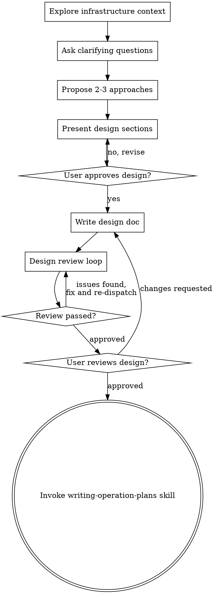

# Brainstorming Infrastructure Operations

## Overview

Help turn infrastructure operation ideas into fully formed designs through collaborative dialogue.

Start by understanding the current infrastructure state, then ask questions one at a time to refine the operation. Once you understand what you're executing, present the design in small sections (200-300 words), checking after each section whether it looks right so far.

**Announce at start:** "I'm using the brainstorming-operations skill to design this infrastructure operation."

**Save designs to:** `docs/plans/YYYY-MM-DD-<operation-name>-design.md`

<HARD-GATE>
Do NOT execute any operation, run any kubectl/terraform commands, or make any infrastructure changes until you have presented a design and the user has approved it. This applies to EVERY operation regardless of perceived simplicity.
</HARD-GATE>

## Anti-Pattern: "This Is Too Simple To Need A Design"

Every operation goes through this process. A single config tweak, a one-line Hiera change, "just restart the service", a routine cert renewal — all of them. "Simple" operations are where unexamined assumptions cause the most damage: the config tweak that restarts a pod without a PodDisruptionBudget, the "just restart" that clears a queue you needed, the cert renewal that breaks a pinned client. The design can be short (a few sentences for a genuinely low-risk operation), but you MUST present it — including the rollback and verification — and get approval.

## Process Flow

**The terminal state is invoking writing-operation-plans.** Do NOT invoke test-driven-operation, subagent-driven-operation, or any other execution skill. The ONLY skill you invoke after brainstorming is writing-operation-plans.

## Checklist

You MUST create a task for each of these items and complete them in order:

1. **Explore infrastructure context** — current state (kubectl/terraform/configs), recent changes, known issues
2. **Ask clarifying questions** — one at a time; understand purpose, scope, constraints, risk level
3. **Propose 2-3 approaches** — with trade-offs (downtime, rollback complexity, verification) and your recommendation
4. **Present design** — in sections scaled to complexity, get user approval after each section
5. **Write design doc** — save to `docs/plans/YYYY-MM-DD-<operation-name>-design.md` and commit
6. **Design review loop** — dispatch design-document-reviewer; fix and re-dispatch until Approved
7. **User reviews written design** — ask the user to review the design file before proceeding
8. **Transition to planning** — invoke writing-operation-plans skill to create the execution plan

## The Process

**Understanding the operation:**
- Check current infrastructure state (kubectl, configs, recent changes)
- Ask questions one at a time to refine the operation
- Prefer multiple choice questions when possible
- Focus on: purpose, scope, constraints, risk level

**Exploring approaches:**
- Propose 2-3 different approaches with trade-offs
- Lead with your recommended option and explain why
- Consider: downtime, rollback complexity, verification strategies

**Presenting the design:**
- Break into sections of 200-300 words
- Ask after each section whether it looks right
- Cover: current state, desired state, operation steps, verification commands, rollback plan, risk assessment

## Design Document Structure

| Section | What to Cover |
|---------|---------------|
| **Current State** | What infrastructure exists, recent changes, known issues |
| **Desired State** | What operation achieves, success criteria, rollback criteria |
| **Operation Approach** | High-level steps, verification per step, rollback per step |
| **Risk Assessment** | Risk level (L/M/H), what could go wrong, rollback triggers |
| **Prerequisites** | Tools/access needed, info to gather, dependencies |
| **Business Impact** | Services affected, expected downtime, customer impact |

## Infrastructure Operation Patterns

| Operation Type | Risk Level | Key Considerations |
|----------------|------------|-------------------|
| **K8s Deployment Update** | Medium | Rolling update, pod health, traffic disruption |
| **Database Migration** | High | Data loss potential, rollback script, checksums |
| **Keycloak/IDP Change** | High | Auth disruption, token validation, user login tests |
| **Config/Secret Update** | Low-Medium | Pod restart, config validation, ArgoCD sync |
| **Network/Ingress Change** | Medium | DNS propagation, certificate validation, LB health |

## Questions to Ask

**Understanding scope:**
- What infrastructure components are affected?
- What's the current state? What's the desired state?
- Are there dependencies or prerequisites?

**Risk assessment:**
- What's the worst-case scenario?
- How would we detect failure?
- What's the rollback strategy?

**Verification strategy:**
- How will we verify each step?
- What commands confirm success?
- What indicators show failure?

**Execution approach:**
- Can this be done incrementally?
- Are there maintenance windows?
- Who needs to be notified?

## Key Principles

| Principle | What It Means |
|-----------|---------------|
| **One question at a time** | Don't overwhelm with multiple questions |
| **Risk-focused** | Always consider what could go wrong and how to detect it |
| **Verification-first** | Design verification strategies before operation steps |
| **Rollback-aware** | Every operation should have a rollback plan |
| **Dry-run strategy** | Identify which commands support `--dry-run` |

## Visual Companion (optional)

A browser-based companion for showing topology diagrams, failure-domain maps,
dashboard layouts, and side-by-side architecture options during brainstorming.
It is a tool, not a mode — accepting it means it is *available*, not that every
question goes through the browser.

**Opt-in and dependency-scoped:** the companion needs Node.js. The core
brainstorming workflow has no runtime dependency and must stay that way — never
make the companion a prerequisite for designing an operation.

**Offering it (just-in-time):** do NOT offer it upfront. Wait until a question
would genuinely be clearer shown than told — a real topology, layout, or
comparison question, not merely an infrastructure *topic*. The first time that
happens, offer it as its own message:

> "This next part might be easier if I show you — I can put together diagrams
> and side-by-side comparisons in a browser tab as we go. It's still new and can
> be token-intensive. Want me to? I'll open it for you."

**The offer MUST be its own message.** No clarifying question, summary, or other
content alongside it. Wait for the response. If they accept, start the server
with `--open`. If they decline, continue text-only and don't offer again unless
they raise it.

**Per-question decision:** even after acceptance, decide for each question. The
test: **would the operator understand this better by seeing it than reading it?**

- **Browser:** network topology, failure-domain and blast-radius maps, cluster
  or zone layout comparisons, before/after architecture diagrams, dashboard
  mockups
- **Terminal:** requirements questions, rollback strategy, verification-command
  choices, A/B/C/D text options, scope and maintenance-window decisions

A question about a topology *topic* is not automatically a visual question.
"What counts as a failure domain here?" is conceptual — use the terminal. "Which
of these two subnet layouts is better?" is visual — use the browser.

If they agree, read the detailed guide before proceeding:
[visual-companion.md](visual-companion.md).

**Security model (do not weaken):** the server issues a per-session key,
delivered in the URL and stored as a tab-scoped cookie; every HTTP and WebSocket
request must present it. It refuses symlinks, dotfiles, and path escapes, and
writes key-bearing files owner-only. Session files live under
`.srepowers/brainstorm/` (git-ignored) when `--project-dir` is passed, and in
`/tmp` otherwise.

## Red Flags

- Proceeding without understanding current infrastructure state
- Skipping rollback planning
- Not considering verification strategies
- Ignoring dependencies between systems
- Not asking about maintenance windows

## After the Design

**Documentation:**
- Write validated design to `docs/plans/YYYY-MM-DD-<operation-name>-design.md`
- Commit the design document to git

**Design Review Loop:**
After writing the design document:
1. Dispatch design-document-reviewer subagent (see `design-document-reviewer-prompt.md`) with precisely crafted review context — never your session history. This keeps the reviewer focused on the design, not your thought process.
2. If Issues Found: fix, re-dispatch, repeat until Approved
3. If loop exceeds 3 iterations, surface to human for guidance

**User Review Gate:**
After the design review loop passes, ask the user to review the written design before proceeding:
> "Design written and committed to `<path>`. Please review it and let me know if you want to make any changes before we start writing out the operation plan."

Wait for the user's response. If they request changes, make them and re-run the design review loop. Only proceed once the user approves.

**Planning:**
- Invoke **srepowers-core:writing-operation-plans** to create detailed execution plan
- Do NOT invoke any other skill. writing-operation-plans is the next step.
