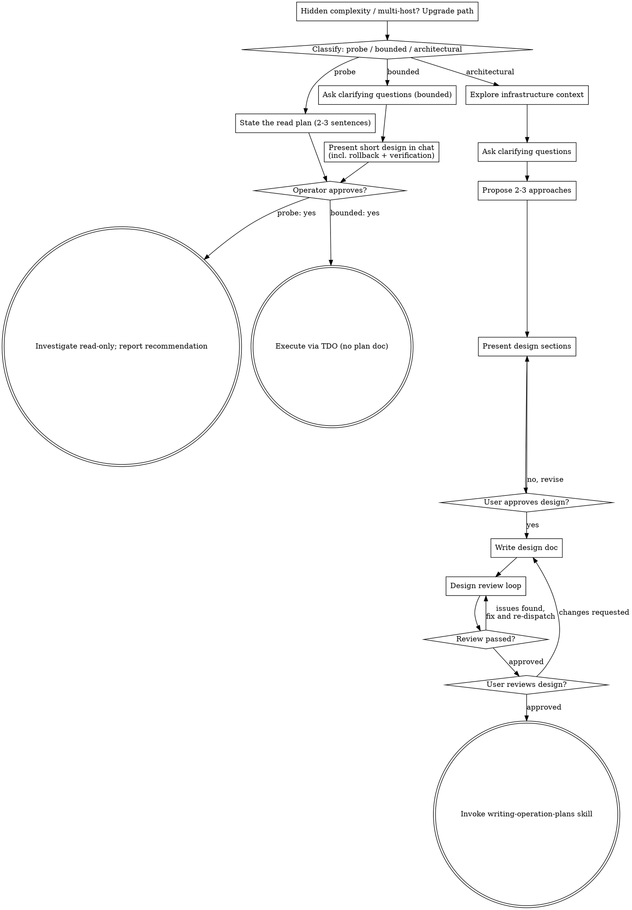

# Brainstorming Infrastructure Operations

## Overview

Help turn infrastructure operation ideas into fully formed designs through collaborative dialogue.

Start by classifying how much process the operation needs, then work through your path: understand the infrastructure state, refine the operation, present a design, and get the operator's approval.

**Announce at start:** "I'm using the brainstorming-operations skill to design this infrastructure operation."

**Save designs to:** `docs/plans/YYYY-MM-DD-<operation-name>-design.md`

<HARD-GATE>
Do NOT execute any operation, run any mutating command, or make any infrastructure change until you have told the operator what you intend and they have approved it. This applies to EVERY operation on EVERY path below — the ceremony scales with the operation; the approval gate never does.
</HARD-GATE>

## Three Paths

Before your first question, classify the request and say the classification out loud — "this is read-only, so I'll state the probe and run it rather than write a design doc" — so the operator can override it:

- **Probe** — a **read-only** investigation whose output is an answer, not a change: "is the cert expiring", "which hosts are on 9.4", "why is p99 up". State what you will read and how, in 2-3 sentences, get a nod, then find out. No design doc, no plan file. Report findings as a recommendation. A probe is defined by *reading only* — the moment a diagnostic step would mutate anything (a restart "to see if it helps", a cache flush, a test write), it is no longer a probe: stop and re-classify.
- **Bounded** — a **single mutating change to infrastructure that already exists**, with a rollback you can write in one command and a blast radius of one host or one namespace: a Hiera value, one DNS record, one manifest field. Understanding the *kind* of system is not enough — bounded means the thing you are changing is already there to read, and you have read it. Ask the clarifying questions that matter, present a short design IN CHAT (a few sentences to a few short paragraphs) **including the rollback and the verification**, and STOP. Execution starts only after the operator says yes — a bounded operation's approval is as hard a gate as an architectural one. No design doc, no plan file.
- **Architectural** — new systems, fleet-wide or multi-host changes, anything touching a quorum, a VIP, or a shared dependency; anything whose rollback takes more than a command or two; anything on production. Follow the full process: questions, approaches, sectioned design, written design doc, then `srepowers-core:writing-operation-plans`.

When in doubt between two paths, take the heavier one. **The ratchet is one-way:** hidden complexity discovered mid-operation upgrades the path — stop, say so, and step up. Nothing downgrades mid-operation. Two ops-specific forced upgrades, regardless of how small the change looks:

- **Multi-host, or a shared dependency** (quorum member, keepalived pair, shared Hiera key, a VIP) → architectural. Correctness lives *between* the hosts, not in any one change.
- **A rollback you cannot state in one or two commands** → architectural. If you cannot write the undo within about ten seconds, the blast radius is not understood yet.

## Anti-Pattern: "Too Simple To Need Approval"

Every path ends with the operator approving your intent before execution. A single config tweak, a one-line Hiera change, "just restart the service", a routine cert renewal — the design may be two sentences in chat, but you MUST present it and get approval. "Simple" operations are where unexamined assumptions cause the most damage: the config tweak that restarts a pod without a PodDisruptionBudget, the "just restart" that clears a queue you needed, the cert renewal that breaks a pinned client. What scales with simplicity is the artifact, never the approval — and never the rollback or the verification, which a bounded design states just as explicitly as an architectural one.

## Red Flags

| Thought | Reality |
|---------|---------|
| "This is too simple to need a design" | Simple means a short design, not no design. Two sentences plus rollback and verification, then approval. |
| "I'll call it bounded and skip the design doc" | Reaching for a label to skip work IS the doubt — take the heavier path. |
| "It's bounded and obvious — I'll start while they read it" | The gate is the approval, not the design's length. Present, then stop until you hear yes. |
| "I know this kind of cluster, so it's bounded" | Bounded measures the live system, not your familiarity. Unread state is architectural. |
| "It's one command per host, so it's still bounded" | Multi-host is architectural. Two correct single-host changes take down a pair. |
| "The probe showed the fix, so I'll just apply it" | A probe's output is an answer. Applying it is a new operation — classify it. |
| "A restart is just a diagnostic step" | A restart mutates. That is not a probe; re-classify before running it. |
| "It grew, but I'm almost done — no need to re-classify" | Hidden complexity upgrades the path mid-operation. Stop and say so. |
| "They approved the noop, so the apply is approved too" | Each action gets its own approval. An apply approval never carries to a reboot. |

## Process Flow

**Terminal states are path-bound.** Architectural: the ONLY skill you invoke after brainstorming is `srepowers-core:writing-operation-plans` — never test-driven-operation, subagent-driven-operation, or any other execution skill. Bounded: after approval, execution proceeds directly through `srepowers-core:test-driven-operation`; no design doc, no plan file. Probe: the terminal state is a reported recommendation.

## Checklist

Classify first, announce the path, then create a task for each item on your path and complete them in order.

**Probe:**
1. **State the read plan** — what you will read, with what commands, in 2-3 sentences
2. **Get approval** — a nod is enough
3. **Investigate** — read-only throughout; if a step would mutate, stop and re-classify
4. **Report findings** — a recommendation, with the evidence you read

**Bounded:**
1. **Read the live state you are about to change** — the current value, the resource as it exists now
2. **Ask clarifying questions** — one at a time, the ones that matter
3. **Present short design in chat** — the change, the blast radius, the rollback command, the verification
4. **Get approval** — STOP and wait for an explicit yes; presenting the design and starting in the same breath is skipping the gate
5. **Execute** — via `srepowers-core:test-driven-operation`; no plan document

**Architectural:**
1. **Explore infrastructure context** — current state (kubectl/terraform/configs), recent changes, known issues
2. **Ask clarifying questions** — one at a time; understand purpose, scope, constraints, risk level
3. **Propose 2-3 approaches** — with trade-offs (downtime, rollback complexity, verification) and your recommendation
4. **Present design** — in sections scaled to complexity, get user approval after each section
5. **Write design doc** — save to `docs/plans/YYYY-MM-DD-<operation-name>-design.md` and commit
6. **Design review loop** — dispatch design-document-reviewer; fix and re-dispatch until Approved
7. **User reviews written design** — ask the user to review the design file before proceeding
8. **Transition to planning** — invoke writing-operation-plans skill to create the execution plan

## The Process

The subsections below serve the bounded and architectural paths (a probe stops at "state the read plan, get a nod"). Sections from **Exploring approaches** onward are architectural-path depth — for bounded work, reading the live state plus a few questions plus a short in-chat design (change, blast radius, rollback, verification) is the whole process.

**Understanding the operation:**
- Check current infrastructure state (kubectl, configs, recent changes)
- Ask questions one at a time to refine the operation
- Prefer multiple choice questions when possible
- Focus on: purpose, scope, constraints, risk level

**Exploring approaches:**
- Propose 2-3 different approaches with trade-offs
- Lead with your recommended option and explain why
- Consider: downtime, rollback complexity, verification strategies

**Presenting the design:**
- Break into sections of 200-300 words
- Ask after each section whether it looks right
- Cover: current state, desired state, operation steps, verification commands, rollback plan, risk assessment

## Design Document Structure (architectural path)

| Section | What to Cover |
|---------|---------------|
| **Current State** | What infrastructure exists, recent changes, known issues |
| **Desired State** | What operation achieves, success criteria, rollback criteria |
| **Operation Approach** | High-level steps, verification per step, rollback per step |
| **Risk Assessment** | Risk level (L/M/H), what could go wrong, rollback triggers |
| **Prerequisites** | Tools/access needed, info to gather, dependencies |
| **Business Impact** | Services affected, expected downtime, customer impact |

## Infrastructure Operation Patterns

| Operation Type | Risk Level | Key Considerations |
|----------------|------------|-------------------|
| **K8s Deployment Update** | Medium | Rolling update, pod health, traffic disruption |
| **Database Migration** | High | Data loss potential, rollback script, checksums |
| **Keycloak/IDP Change** | High | Auth disruption, token validation, user login tests |
| **Config/Secret Update** | Low-Medium | Pod restart, config validation, ArgoCD sync |
| **Network/Ingress Change** | Medium | DNS propagation, certificate validation, LB health |

## Questions to Ask

**Understanding scope:**
- What infrastructure components are affected?
- What's the current state? What's the desired state?
- Are there dependencies or prerequisites?

**Risk assessment:**
- What's the worst-case scenario?
- How would we detect failure?
- What's the rollback strategy?

**Verification strategy:**
- How will we verify each step?
- What commands confirm success?
- What indicators show failure?

**Execution approach:**
- Can this be done incrementally?
- Are there maintenance windows?
- Who needs to be notified?

## Key Principles

| Principle | What It Means |
|-----------|---------------|
| **One question at a time** | Don't overwhelm with multiple questions |
| **Risk-focused** | Always consider what could go wrong and how to detect it |
| **Verification-first** | Design verification strategies before operation steps |
| **Rollback-aware** | Every operation should have a rollback plan |
| **Dry-run strategy** | Identify which commands support `--dry-run` |

## Visual Companion (optional)

A browser-based companion for showing topology diagrams, failure-domain maps,
dashboard layouts, and side-by-side architecture options during brainstorming.
It is a tool, not a mode — accepting it means it is *available*, not that every
question goes through the browser.

**Opt-in and dependency-scoped:** the companion needs Node.js. The core
brainstorming workflow has no runtime dependency and must stay that way — never
make the companion a prerequisite for designing an operation.

**Offering it (just-in-time):** do NOT offer it upfront. Wait until a question
would genuinely be clearer shown than told — a real topology, layout, or
comparison question, not merely an infrastructure *topic*. The first time that
happens, offer it as its own message:

> "This next part might be easier if I show you — I can put together diagrams
> and side-by-side comparisons in a browser tab as we go. It's still new and can
> be token-intensive. Want me to? I'll open it for you."

**The offer MUST be its own message.** No clarifying question, summary, or other
content alongside it. Wait for the response. If they accept, start the server
with `--open`. If they decline, continue text-only and don't offer again unless
they raise it.

**Per-question decision:** even after acceptance, decide for each question. The
test: **would the operator understand this better by seeing it than reading it?**

- **Browser:** network topology, failure-domain and blast-radius maps, cluster
  or zone layout comparisons, before/after architecture diagrams, dashboard
  mockups
- **Terminal:** requirements questions, rollback strategy, verification-command
  choices, A/B/C/D text options, scope and maintenance-window decisions

A question about a topology *topic* is not automatically a visual question.
"What counts as a failure domain here?" is conceptual — use the terminal. "Which
of these two subnet layouts is better?" is visual — use the browser.

If they agree, read the detailed guide before proceeding:
[visual-companion.md](visual-companion.md).

**Security model (do not weaken):** the server issues a per-session key,
delivered in the URL and stored as a tab-scoped cookie; every HTTP and WebSocket
request must present it. It refuses symlinks, dotfiles, and path escapes, and
writes key-bearing files owner-only. Session files live under
`.srepowers/brainstorm/` (git-ignored) when `--project-dir` is passed, and in
`/tmp` otherwise.

## Red Flags

- Proceeding without understanding current infrastructure state
- Skipping rollback planning
- Not considering verification strategies
- Ignoring dependencies between systems
- Not asking about maintenance windows

## After the Design

**Documentation:**
- Write validated design to `docs/plans/YYYY-MM-DD-<operation-name>-design.md`
- Commit the design document to git

**Design Review Loop:**
After writing the design document:
1. Dispatch design-document-reviewer subagent (see `design-document-reviewer-prompt.md`) with precisely crafted review context — never your session history. This keeps the reviewer focused on the design, not your thought process.
2. If Issues Found: fix, re-dispatch, repeat until Approved
3. If loop exceeds 3 iterations, surface to human for guidance

**User Review Gate:**
After the design review loop passes, ask the user to review the written design before proceeding:
> "Design written and committed to `<path>`. Please review it and let me know if you want to make any changes before we start writing out the operation plan."

Wait for the user's response. If they request changes, make them and re-run the design review loop. Only proceed once the user approves.

**Planning:**
- Invoke **srepowers-core:writing-operation-plans** to create detailed execution plan
- Do NOT invoke any other skill. writing-operation-plans is the next step.
