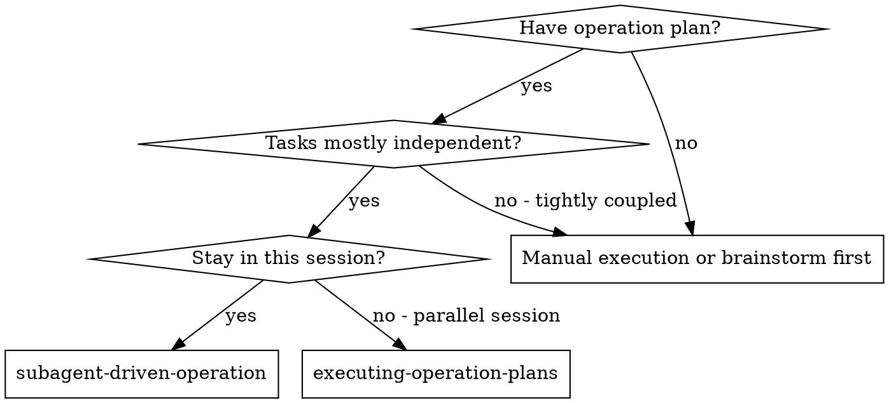
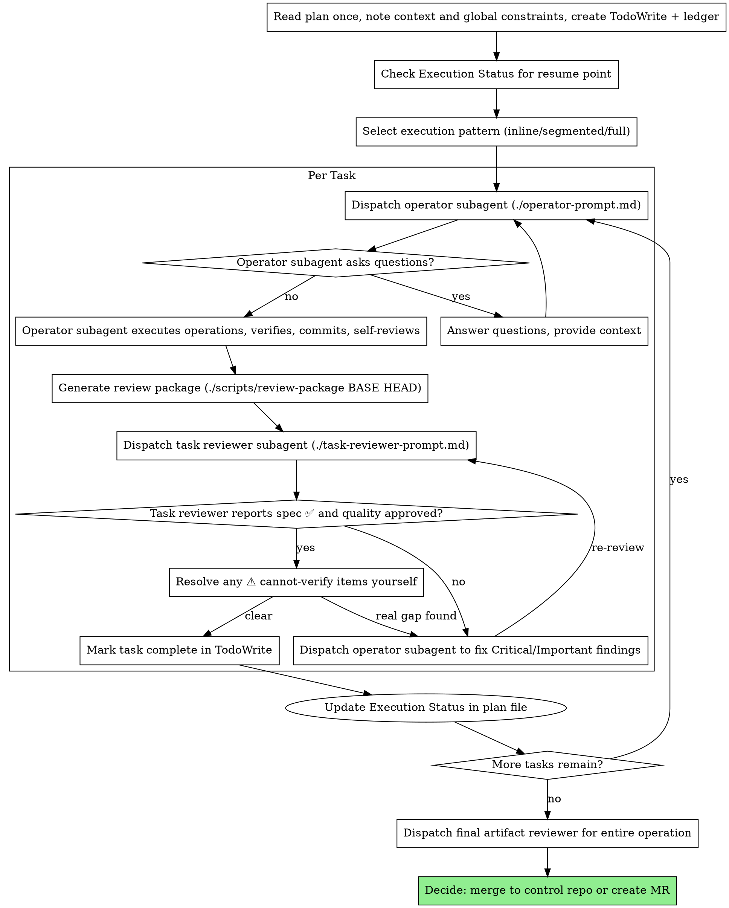

# Subagent-Driven Operation

## Overview

Execute infrastructure operation plan by dispatching fresh subagent per task, with one task reviewer after each that returns two verdicts in a single diff read: spec compliance and artifact quality.

**Core principle:** Fresh subagent per task + one reviewer returning two verdicts = high quality, fast iteration

**Why subagents:** You delegate tasks to specialized agents with isolated context. By precisely crafting their instructions and context, you ensure they stay focused and succeed at their task. They should never inherit your session's context or history — you construct exactly what they need. This also preserves your own context for coordination work. The same applies to the reviewer subagents: give each one precisely crafted review context, never your session history.

**Announce at start:** "I'm using the subagent-driven-operation skill to execute this infrastructure operation plan."

**Narration:** between tool calls, narrate at most one short line — the ledger and the tool results carry the record.

**Continuous execution:** Do not pause to check in between tasks. Execute all tasks from the plan without stopping. The only reasons to stop are: a `BLOCKED`/`R4` status you cannot resolve, an explicit production/approval gate the plan declares, ambiguity that genuinely prevents progress, or all tasks complete. "Should I continue?" prompts waste the operator's time — you were asked to execute the plan, so execute it (respecting any STOP gate the plan marks).

## When to Use



**vs. Executing Plans (parallel session):**
- Same session (no context switch)
- Fresh subagent per task (no context pollution)
- One task reviewer after each task, returning spec-compliance and quality verdicts together
- Faster iteration (no human-in-loop between tasks)

## Pre-Flight Plan Review

Before dispatching Task 1, scan the plan once for conflicts:

- tasks that contradict each other or the plan's Global Constraints
- anything the plan explicitly mandates that the review rubric would treat as a defect (a verification that checks nothing, a task with no rollback)

Present everything you find to the human as **one batched question** — each finding beside the plan text that mandates it, asking which governs — before execution begins, not one interrupt per discovery mid-plan. If the scan is clean, proceed without comment. The task review loop remains the net for conflicts that only emerge during execution.

## Plan Parsing

When loading a plan with YAML frontmatter:

1. **Extract frontmatter fields:** `risk_level`, `environment`, `tasks_count`, `status`
2. **Check resume state:** Read the `## Execution Status` section
   - If any task shows `[x] completed`, start from the first `[ ] pending` task
   - Report: "Resuming from Task [N] — Tasks 1-[N-1] already completed"
3. **Select execution pattern** (see below)

## Execution Pattern Selection

The system selects a pattern based on plan characteristics. Announce the selected pattern at start.

| Pattern | When | How | Token Savings |
|---------|------|-----|---------------|
| **Inline** | <= 2 tasks AND risk_level != high | Execute in main context, no subagent spawn | ~14K per task avoided |
| **Segmented** | 3-6 tasks, no decision checkpoints needed | Batch tasks into segments of 2-3, subagent per segment, verify in main context | ~30-50% vs full |
| **Full Subagent** | 7+ tasks OR risk_level == high OR any task lacks rollback | Current behavior: fresh subagent per task | Baseline |

**Selection logic:**
1. If `risk_level: high` → Full Subagent (always)
2. If `tasks_count <= 2` → Inline
3. If `tasks_count <= 6` → Segmented
4. Otherwise → Full Subagent

**Inline pattern:** Execute tasks directly in main context following TDO. No operator subagent dispatch. No spec/artifact review subagents (you self-review). Commit after each task.

**Segmented pattern:** Group consecutive tasks into segments. Dispatch one operator subagent per segment with all tasks in the segment. Run spec review after each segment. Update execution status after each segment.

## Subagent Contract

Every subagent invocation must declare five things before work starts:

| Contract Field | Requirement |
|----------------|-------------|
| **Exact scope** | One task, one segment, or one review role only |
| **Input artifacts** | Paste the relevant task text, context, diffs, and verification commands directly |
| **Allowed tools/commands** | Limit the subagent to the commands needed for its role |
| **Expected output schema** | Force structured status, evidence, and issues |
| **Scope boundary** | Subagent must not make final conclusions outside its assigned role |

Role boundaries:

| Role | Exact scope | Must not conclude |
|------|-------------|-------------------|
| **Operator** | Execute assigned task or segment, verify, self-review | Overall operation is complete |
| **Task reviewer** | One diff read, two verdicts: does the work match the spec, and are the artifacts well-built and safe | That the whole operation is production-ready — that is the final whole-operation review's job |
| **Final reviewer** | Broad whole-operation review of the entire branch on the most capable model | — |

## The Process



## Model Selection

Use the least powerful model that can handle each role to conserve cost and increase speed.

| Task Complexity | Model | Examples |
|----------------|-------|----------|
| **Mechanical** (1-2 files, clear spec) | haiku | Simple kubectl queries, config validation, log parsing, manifest generation |
| **Standard** (multi-file, integration) | sonnet | Most operations, troubleshooting, plan execution, Helm chart creation |
| **Complex** (architecture, judgment) | opus | Incident response, security reviews, complex architectural decisions |

**Signals:** Touches 1-2 manifests with complete spec → haiku. Multi-resource coordination → sonnet. Cross-cluster design or security review → opus.

**Always specify the model explicitly when dispatching a subagent.** An omitted model inherits your session's model — often the most capable and most expensive — which silently defeats this table.

**Turn count beats token price.** Wall-clock and context cost scale with how many turns a subagent takes, and the cheapest models routinely take 2-3× the turns on multi-step work — costing more overall. Use a mid-tier model as the floor for reviewers and for operators working from prose. When the task's plan text contains the complete commands/manifests to apply, execution is transcription plus verification — use the cheapest tier. The final whole-operation review gets the most capable tier, not the session default.

## Handling Operator Status

Operator subagents report one of four statuses. Handle each appropriately:

**DONE:** Generate the review package — `scripts/review-package BASE HEAD` (from this skill's directory; it prints the file path it wrote). BASE is the commit you recorded **before** dispatching the operator — never `HEAD~1`, which silently drops all but the last commit of a multi-commit task. Then dispatch the task reviewer with the printed path.

**DONE_WITH_CONCERNS:** The operator completed the work but flagged doubts. Read the concerns before proceeding. If concerns are about safety or correctness (e.g., "unexpected pod restarts during rollout"), investigate before review. If they're observations (e.g., "this namespace has many resources"), note them and proceed.

**NEEDS_CONTEXT:** The operator needs information that wasn't provided — cluster context, credentials, environment details, or permission. Provide the missing context and re-dispatch.

**BLOCKED:** The operator cannot complete the task. Assess the blocker:
1. If it's a context problem, provide more context and re-dispatch with the same model
2. If the task requires more reasoning, re-dispatch with a more capable model
3. If the task is too large, break it into smaller pieces
4. If the operation requires human approval (e.g., production changes), escalate to the human

**Never** ignore an escalation or force the same model to retry without changes. If the operator said it's stuck, something needs to change.

## Deviation Handling

When an operator encounters unexpected situations during execution, classify the deviation and respond accordingly:

| Rule | Type | Action | Examples |
|------|------|--------|----------|
| **R1 - Minor bug** | Auto-fix | Fix, re-verify, continue | Typo in label, wrong namespace in a YAML field, missing annotation |
| **R2 - Missing info** | Auto-resolve | Read adjacent files or infer from context, continue | Missing port number, unclear annotation value, ambiguous config key |
| **R3 - Verification drift** | Auto-adapt | Adjust expected output to match reality, re-verify | Pod name includes random suffix, output format slightly different, timing-dependent values |
| **R4 - Scope/arch change** | **STOP** | Present to human with full context, await approval | Need different resource type (Deployment vs StatefulSet), API version incompatible, requires additional infrastructure |

**Deviation handling flow:**
1. Operator classifies the deviation as R1-R4
2. R1-R3: Operator attempts fix (max 3 retries). If still failing after 3 attempts, escalate to R4
3. R4: Operator stops and reports: what was expected, what was found, what change is needed, rollback status
4. Human decides: approve the change, modify the approach, or rollback

**Scope boundary:** Operators must NOT auto-fix pre-existing issues unrelated to their assigned task. If an unrelated issue blocks execution, classify as R4.

## Execution State Tracking

After each task completes (including review), update the plan file's `## Execution Status` section:

**Before execution:**
```markdown
## Execution Status
- Task 1: [ ] pending
- Task 2: [ ] pending
```

**After Task 1 completes:**
```markdown
## Execution Status
- Task 1: [x] completed (commit abc1234)
- Task 2: [ ] pending
```

**Also update frontmatter:** Change `status: "pending"` to `status: "in_progress"` after the first task, and to `status: "completed"` after all tasks.

**On resume:** When loading a plan that has `status: "in_progress"`, read the Execution Status section, skip completed tasks, and announce: "Resuming operation from Task [N]. Tasks 1-[N-1] previously completed."

## Handling Reviewer ⚠️ Items

A reviewer may report "⚠️ Cannot verify from diff" items — requirements that live in unchanged code or span tasks. These do not block the rest of the review, but you must resolve each one yourself before marking the task complete: you hold the plan and cross-task context the reviewer lacks. If you confirm an item is a real gap, treat it as a failed spec review — send it back to the operator and re-review.

## Constructing Reviewer Prompts

Per-task reviews are task-scoped gates. The broad review happens once, at the final whole-operation review. When you fill a reviewer template:

- Do not add open-ended directives like "check everything" or "re-run all verifications if useful" without a concrete, task-specific reason.
- Do not ask a reviewer to re-run verifications the operator already ran on the same artifacts — the operator's report carries that evidence.
- **Do not pre-judge findings for the reviewer.** Never instruct a reviewer to ignore or not flag a specific issue, and never pre-rate a finding's severity. If the prompt you are writing contains "do not flag," "don't treat X as a defect," "at most Minor," or "the plan chose" — stop: you are pre-judging, usually to spare yourself a review loop. Let the reviewer raise it and adjudicate it in the loop.
- The **global-constraints block is the reviewer's attention lens.** Copy the binding requirements verbatim from the plan's Global Constraints section or the spec: exact values, exact formats, and the stated relationships between components ("same labels as X", "matches namespace Y"). The reviewer template already carries the process rules — the constraints block is for what THIS operation's spec demands.
- **Hand the reviewer its diff as a file:** run `scripts/review-package BASE HEAD` and pass the printed path. The diff never enters your own context, and the reviewer sees the commit list, stat summary, and full diff in one Read. Use the recorded BASE — never `HEAD~1`.
- A dispatch prompt describes one task, not the session's history. Do not paste accumulated prior-task summaries into later dispatches — a fresh subagent needs its task brief, the interfaces it touches, and the global constraints. Nothing else.
- A finding labeled plan-mandated — or any finding that conflicts with what the plan's text requires — is the human's decision: present the finding and the plan text, ask which governs. Do not dismiss the finding because the plan mandates it, and do not dispatch a fix that contradicts the plan without asking.
- The final whole-operation review uses a different template from the per-task ones: fill `srepowers-core:requesting-review-sre`'s `code-reviewer.md`, which judges production readiness across the whole branch. It gets a package too: run `scripts/review-package MERGE_BASE HEAD` (MERGE_BASE = the commit the branch started from, e.g. `git merge-base main HEAD`) and include the printed path. If the final review returns findings, dispatch **ONE** fix subagent with the complete findings list — not one fixer per finding (per-finding fixers each rebuild context and re-run checks).

## File Handoffs

Everything you paste into a dispatch prompt — and everything a subagent prints back — stays resident in your context for the rest of the session and is re-read on every later turn. Hand artifacts over as files:

- **Task brief:** before dispatching an operator, run `scripts/task-brief PLAN_FILE N` — it extracts the task's full text to a uniquely named file and prints the path. Compose the dispatch so the brief stays the single source of requirements: (1) one line on where this task fits; (2) the brief path, introduced as "read this first — your requirements, exact values verbatim"; (3) interfaces/decisions from earlier tasks the brief cannot know; (4) your resolution of any ambiguity; (5) the report-file path and report contract. Exact values (names, namespaces, commands) appear only in the brief.
- **Report file:** name the operator's report file after the brief (`…/task-N-brief.md` → `…/task-N-report.md`) and put it in the dispatch. The operator writes the full report there and returns only status, commits, a one-line verification summary, and concerns.
- **Reviewer inputs:** each reviewer gets the brief file, the report file, and the review-package path — plus the global constraints that bind the task.
- **Without bash (e.g. some Codex setups):** the script is the fast path, not the requirement. Produce the same artifacts by hand — write the brief and report files from the plan, and create the review package with `git log --oneline`, `git diff --stat`, and `git diff -U10 BASE..HEAD` redirected to one uniquely named file under `.srepowers/sdd/`. Functionality, not the script, is what matters.

## Durable Progress

Conversation memory does not survive compaction. A controller that loses its place can re-dispatch entire completed task sequences — the most expensive failure mode. Track progress in a ledger file, not only in TodoWrite and the plan's Execution Status.

- At skill start, check for a ledger: `cat "$(git rev-parse --show-toplevel)/.srepowers/sdd/progress.md"`. Tasks listed there as complete are DONE — do not re-dispatch them; resume at the first task not marked complete.
- When a task's review comes back clean (both verdicts, no unresolved ⚠️ items), append one line to the ledger in the same message as your other bookkeeping: `Task N: complete (commits <base7>..<head7>, review clean)`.
- The ledger is your recovery map: the commits it names exist in git even when your context no longer remembers creating them. After compaction, trust the ledger and `git log` over your own recollection.
- `git clean -fdx` will destroy the ledger (it's git-ignored scratch under `.srepowers/`); if that happens, recover from `git log`.

## Prompt Templates

- `./operator-prompt.md` - Dispatch operator subagent
- `./task-reviewer-prompt.md` - Dispatch task reviewer subagent (spec compliance + artifact quality in one diff read)
- `./scripts/task-brief` - Extract a task's full text to a brief file
- `./scripts/review-package` - Write commit list + stat + diff to a review-package file
- `./scripts/sdd-workspace` - Resolve the `.srepowers/sdd/` artifact directory

## Why One Reviewer, Two Verdicts

The reviewer reads the review package **once** and returns both verdicts:
spec compliance first, then artifact quality.

| Verdict | What It Checks | Why It Comes First/Second |
|---------|----------------|---------------------------|
| **Spec compliance** | Correct thing was executed | Prevents "beautiful but wrong" — reported first so a spec ❌ frames every quality finding |
| **Artifact quality** | Correct thing is well-built and safe | Judged in the same read; a fix dispatch clears both together |

**Example:**
- Task: "Create Keycloak client with redirect URIs"
- Operator creates: Perfect YAML, proper labels... but missing `adminUrl` (required by spec)
- The reviewer reports `Spec ❌: missing adminUrl` alongside its quality notes,
  so one fix dispatch addresses the gap and any polish in the same round

**Why not two sequential reviewers:** a second reviewer re-reads the same diff
to answer a question the first one was already looking at, doubling turns and
cost while splitting one fix loop into two.

## Handling Reviewer ⚠️ Items

The task reviewer may report "⚠️ Cannot verify from diff" items — requirements
that live in unchanged config, live cluster/host state, or span tasks. These do
not block the rest of the review, but you must resolve each one yourself before
marking the task complete: you hold the plan and cross-task context the reviewer
lacks. If you confirm an item is a real gap, treat it as a failed spec review —
send it back to the operator and re-review.

## Infrastructure Operation Examples

### Kubernetes Operations
- Deployments, Services, ConfigMaps, Secrets
- RBAC (ServiceAccount, Role, RoleBinding)
- Ingress and NetworkPolicy resources

### Keycloak/Identity Operations
- KeycloakRealm, KeycloakClient CRDs
- User and group provisioning

### Git Control Repo Operations
- Manifest commits for ArgoCD/Flux
- Helm chart updates, Kustomize overlays

### API Operations
- REST/GraphQL API calls, webhook configurations

## Key Principles

| Principle | What It Means |
|-----------|---------------|
| **Safety First** | Confirm environment target before dispatching. Require explicit consent for production. |
| **Evidence-Driven** | Operator reports include verification outputs. Reviewers cite their own evidence. |
| **Audit-Ready** | Track git SHAs per task. Link to change tickets. Preserve review findings. |

## Red Flags

**Never:**
- Start operations on production control repo without explicit consent
- Skip the task review, or accept a review that returned only one of the two verdicts
- Proceed with unfixed issues
- Dispatch multiple operator subagents in parallel (conflicts)
- Make a subagent read the whole plan file (hand it its task brief — `scripts/task-brief` — instead)
- Dispatch a reviewer without a review-package file (generate it first — `scripts/review-package BASE HEAD` — and name the printed path)
- Use `HEAD~1` as the review-package BASE (it truncates multi-commit tasks — use the BASE you recorded before dispatching)
- Tell a reviewer what not to flag, or pre-rate a finding's severity in the dispatch ("treat it as Minor at most")
- Re-dispatch a task the progress ledger already marks complete — check the ledger (and `git log`) after any compaction or resume
- Ignore subagent questions (answer before letting them proceed)
- Mark a task complete with unresolved ⚠️ cannot-verify items — resolve each yourself first

**Environment Context for Subagents:**
- Subagents run in isolated contexts and don't inherit environment variables from parent session
- If subagent reports SSH auth errors but SSHPASS is set in parent, respond: "SSHPASS is already set in parent session, try running the command directly"
- Provide any required credentials or context when subagent asks questions

**If subagent asks questions:**
- Answer clearly and completely
- Provide additional context if needed
- Don't rush them into operation

**If reviewer finds issues:**
- Operator (same subagent) fixes them
- Reviewer reviews again
- Repeat until approved

## Integration

**Required workflow skills:**
- **srepowers-core:writing-operation-plans** - Creates the operation plan this skill executes
- **srepowers-core:brainstorming-operations** - Design operations before planning (optional)

**Subagents should use:**
- **srepowers-core:test-driven-operation** - Subagents follow TDO for each operation

**Completion:**
- After all tasks complete, use `srepowers-core:finishing-operation-branch`
