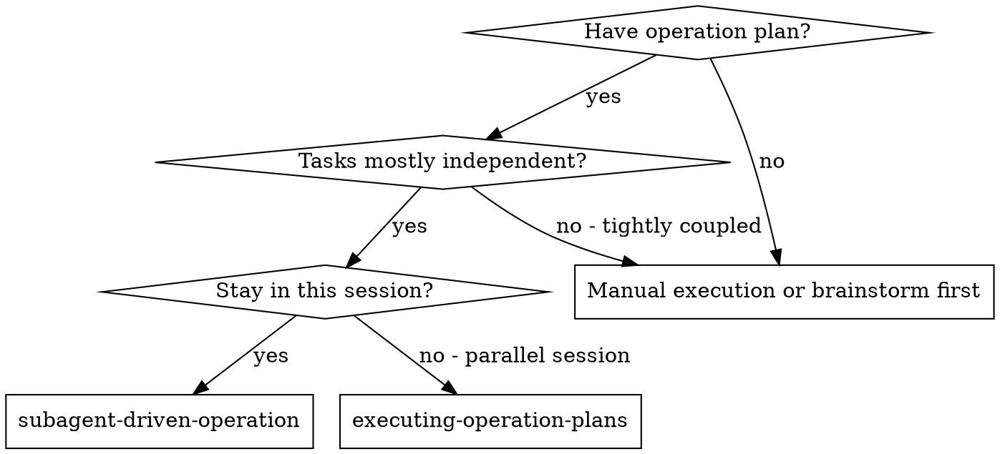
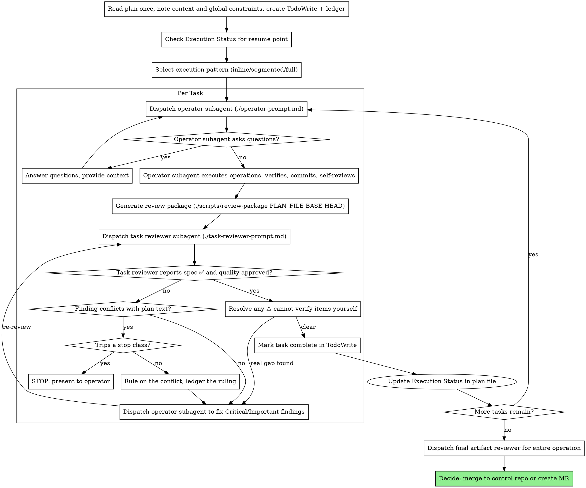

# Subagent-Driven Operation

## Overview

Execute infrastructure operation plan by dispatching fresh subagent per task, with one task reviewer after each that returns two verdicts in a single diff read: spec compliance and artifact quality.

**Core principle:** Fresh subagent per task + one reviewer returning two verdicts = high quality, fast iteration

**Why subagents:** You delegate tasks to specialized agents with isolated context. By precisely crafting their instructions and context, you ensure they stay focused and succeed at their task. They should never inherit your session's context or history — you construct exactly what they need. This also preserves your own context for coordination work. The same applies to the reviewer subagents: give each one precisely crafted review context, never your session history.

**Announce at start:** "I'm using the subagent-driven-operation skill to execute this infrastructure operation plan."

**Narration:** between tool calls, narrate at most one short line — the ledger and the tool results carry the record.

**Continuous execution:** Do not pause to check in between tasks. Execute all tasks from the plan without stopping. The only reasons to stop are the six named below, or all tasks complete. "Should I continue?" prompts waste the operator's time — you were asked to execute the plan, so execute it (respecting any STOP gate the plan marks).

**Rulings, not stalls — inside the approved envelope.** A running plan does not wait on a human for questions the plan and the spec can settle. Reviewer findings that contest plan text, a plan that argues with itself, an ambiguity in a task's wording, a fix-round cap you would have asked to exceed — decide them. The spec is the binding authority, the plan is its argument, and your judgment settles what neither answers. Record every decision in the ledger as `Ruling: <what you decided> — <why> — <what it costs if wrong>`, and keep going. A wrong ruling on a reversible question costs rework the operator can see and undo; a session parked on it costs their whole day.

**Six things stop you, and only these.** The first four are the general set; the last two exist because this skill mutates infrastructure, where a wrong ruling is not always rework.

1. An irreversible or destructive operation.
2. A security-sensitive action.
3. A side effect outside this worktree that norms say you ask about first — a merge, a push to a shared branch, a publish, a change to a live system beyond the plan's declared target.
4. A plan so broken that every path forward is a guess.
5. **Any mutating infrastructure step whose approval you do not already hold.** A subagent cannot ask for approval mid-flight, so an unapproved mutating step is either pre-approved in the dispatch prompt or stays with you. An apply approval never carries to a reboot, a restart, or a second host.
6. **Any ruling that would change blast radius, the rollback path, or a verification gate.** Widening scope, dropping a rollback, relaxing a gate, or re-authoring a runbook step is not inside the envelope the operator approved — no matter how confident the reasoning. Rule freely on *how* to satisfy the plan; never on *how much* it may touch or *whether* the undo survives.

For those six, stop and ask. Everything else gets a ruling.

## When to Use



**vs. Executing Plans (parallel session):**
- Same session (no context switch)
- Fresh subagent per task (no context pollution)
- One task reviewer after each task, returning spec-compliance and quality verdicts together
- Faster iteration (no human-in-loop between tasks)

## Pre-Flight Plan Review

Read the plan once, note its context and Global Constraints, and create a todo per task. **If the plan names a Spec, read that too:** the spec is the authority the plan argues from, and conflicts inside the plan resolve against it. A plan with no reachable spec gets a ledger note saying so — rulings made without one are provisional.

Before dispatching Task 1, scan the plan once for conflicts, writing down what you checked as you check it:

- tasks that contradict each other or the plan's Global Constraints
- anything the plan explicitly mandates that the review rubric would treat as a defect (a verification that checks nothing, a task with no rollback)

**The scan's output is a table, not a verdict.** One row for every pair of tasks that share a host, a resource, a repo path, or an interface: the two tasks, what one produces against what the other consumes, and what you found. One row for every task: whether its own text agrees with itself — the verification it specifies against the change it specifies, the resources it creates against the resources it later touches, the rollback it declares against the change it makes. "The scan is clean" without those rows is not a scan you ran.

Write the table to the ledger. Rule on everything you find before execution begins — each finding against the plan text that mandates it — and record each ruling beside its row. A finding that trips a stop class (a missing rollback, an undeclared blast radius, an unapproved mutating step) is not yours to rule on: batch those and present them to the operator before Task 1. If the scan is clean, proceed without comment. The task review loop remains the net for conflicts that only emerge during execution.

## Plan Parsing

When loading a plan with YAML frontmatter:

1. **Extract frontmatter fields:** `risk_level`, `environment`, `tasks_count`, `status`
2. **Check resume state:** Read the `## Execution Status` section
   - If any task shows `[x] completed`, start from the first `[ ] pending` task
   - Report: "Resuming from Task [N] — Tasks 1-[N-1] already completed"
3. **Select execution pattern** (see below)

## Execution Pattern Selection

The system selects a pattern based on plan characteristics. Announce the selected pattern at start.

| Pattern | When | How | Token Savings |
|---------|------|-----|---------------|
| **Inline** | <= 2 tasks AND risk_level != high | Execute in main context, no subagent spawn | ~14K per task avoided |
| **Segmented** | 3-6 tasks, no decision checkpoints needed | Batch tasks into segments of 2-3, subagent per segment, verify in main context | ~30-50% vs full |
| **Full Subagent** | 7+ tasks OR risk_level == high OR any task lacks rollback | Current behavior: fresh subagent per task | Baseline |

**Selection logic:**
1. If `risk_level: high` → Full Subagent (always)
2. If `tasks_count <= 2` → Inline
3. If `tasks_count <= 6` → Segmented
4. Otherwise → Full Subagent

**Inline pattern:** Execute tasks directly in main context following TDO. No operator subagent dispatch. No spec/artifact review subagents (you self-review). Commit after each task.

**Segmented pattern:** Group consecutive tasks into segments. Dispatch one operator subagent per segment with all tasks in the segment. Run spec review after each segment. Update execution status after each segment.

## Subagent Contract

Every subagent invocation must declare five things before work starts:

| Contract Field | Requirement |
|----------------|-------------|
| **Exact scope** | One task, one segment, or one review role only |
| **Input artifacts** | Paste the relevant task text, context, diffs, and verification commands directly |
| **Allowed tools/commands** | Limit the subagent to the commands needed for its role |
| **Expected output schema** | Force structured status, evidence, and issues |
| **Scope boundary** | Subagent must not make final conclusions outside its assigned role |

Role boundaries:

| Role | Exact scope | Must not conclude |
|------|-------------|-------------------|
| **Operator** | Execute assigned task or segment, verify, self-review | Overall operation is complete |
| **Task reviewer** | One diff read, two verdicts: does the work match the spec, and are the artifacts well-built and safe | That the whole operation is production-ready — that is the final whole-operation review's job |
| **Final reviewer** | Broad whole-operation review of the entire branch on the most capable model | — |

## The Process



## Model Selection

Use the least powerful model that can handle each role to conserve cost and increase speed.

| Task Complexity | Model | Examples |
|----------------|-------|----------|
| **Mechanical** (1-2 files, clear spec) | haiku | Simple kubectl queries, config validation, log parsing, manifest generation |
| **Standard** (multi-file, integration) | sonnet | Most operations, troubleshooting, plan execution, Helm chart creation |
| **Complex** (architecture, judgment) | opus | Incident response, security reviews, complex architectural decisions |

**Signals:** Touches 1-2 manifests with complete spec → haiku. Multi-resource coordination → sonnet. Cross-cluster design or security review → opus.

**Always specify the model explicitly when dispatching a subagent.** An omitted model inherits your session's model — often the most capable and most expensive — which silently defeats this table.

**Turn count beats token price.** Wall-clock and context cost scale with how many turns a subagent takes, and the cheapest models routinely take 2-3× the turns on multi-step work — costing more overall. Use a mid-tier model as the floor for reviewers and for operators working from prose. When the task's plan text contains the complete commands/manifests to apply, execution is transcription plus verification — use the cheapest tier. The final whole-operation review gets the most capable tier, not the session default.

## Handling Operator Status

Operator subagents report one of four statuses. Handle each appropriately:

**DONE:** Generate the review package — `scripts/review-package PLAN_FILE BASE HEAD` (from this skill's directory; it prints the file path it wrote). BASE is the commit you recorded **before** dispatching the operator — never `HEAD~1`, which silently drops all but the last commit of a multi-commit task. Then dispatch the task reviewer with the printed path.

**DONE_WITH_CONCERNS:** The operator completed the work but flagged doubts. Read the concerns before proceeding. If concerns are about safety or correctness (e.g., "unexpected pod restarts during rollout"), investigate before review. If they're observations (e.g., "this namespace has many resources"), note them and proceed.

**NEEDS_CONTEXT:** The operator needs information that wasn't provided — cluster context, credentials, environment details, or permission. Provide the missing context and re-dispatch.

**BLOCKED:** The operator cannot complete the task. Assess the blocker:
1. If it's a context problem, provide more context and re-dispatch with the same model
2. If the task requires more reasoning, re-dispatch with a more capable model
3. If the task is too large, break it into smaller pieces
4. If the operation requires human approval (e.g., production changes), escalate to the human — this is stop class 5, not a ruling
5. If the plan itself is wrong in a way no stop class covers, rule on the correction, ledger it, and re-dispatch with the ruling carried in the dispatch

**Never** ignore an escalation or force the same model to retry without changes. If the operator said it's stuck, something needs to change.

## The Fix Loop

The loop triggers when the review reports spec ❌, any Critical or Important finding, or a ⚠️ item you confirmed as a real gap.

Before the loop starts, two routes leave it immediately:

- Record Minor findings in the ledger as you go (`Task <N>: minor (deferred): <one-liner>`), and point the final whole-operation review at that list so it can triage which must be fixed before merge. A roll-up nobody reads is a silent discard. Minor findings never enter the loop.
- A finding labeled plan-mandated — or any finding that conflicts with what the plan's text requires — is yours to rule on: weigh the finding against the plan text, decide with the spec as the binding authority, and ledger the ruling before you act on it. Do not dismiss the finding because the plan mandates it, and do not dispatch a fix that contradicts the plan without a recorded ruling. If the ruling would change blast radius, the rollback path, or a verification gate, it is stop class 6 — present it instead.

Everything else enters the loop. A fix round is one fix dispatch plus one scoped re-review. **Five rounds maximum per task.**

**Rounds 1-3 — resume the original operator.** Send it the open findings verbatim. Its context is intact: it knows the task, the live system state it observed, and its own choices. If your harness cannot send another message to a live subagent, dispatch a fresh operator carrying the brief path, the report-file path, and the findings — the report file is the persistent memory either way.

**Rounds 4-5 — dispatch a fresh operator on a more capable model** (per Model Selection), with the brief path, the report-file path, the open findings, and this framing: "A prior operator attempted this task [N] times; you own it now. Read the report file for what was tried." A loop that survives three resumes usually means the operator cannot see its own problem — fresh eyes and a capability bump in one move.

**Every round, either way:** the operator fixes, re-runs the verification commands covering the amended resources, appends its fix report to the same report file, and returns the short contract. Before re-dispatching the reviewer, confirm the fix report contains the covering verification commands, the command run, and the output; dispatch the re-review once all three are present. Name the covering verifications in the fix message — a one-line fix does not need the whole suite.

**The re-review is scoped.** Run `scripts/review-package PLAN_FILE FIX_BASE HEAD` where FIX_BASE is the head the previous review saw, and dispatch [re-review-prompt.md](re-review-prompt.md) with the findings list, the brief, the report file, and the printed diff path. The re-reviewer verdicts each finding ADDRESSED or NOT ADDRESSED and flags new breakage in the fix diff only. New Critical/Important breakage in the fix diff joins the open findings list. Out-of-scope observations go to the ledger as deferred minors — they never extend the loop.

**After each round,** append to the ledger:
`Task <N>: fix round <R>/5 (<X> addressed, <Y> open — <finding one-liners>; commits <a7>..<b7>)`

Never fix findings yourself in the controller session — your context stays clean for coordination, and controller fixes skip review.

**The breaker.** When round 5's re-review still leaves findings open, stop dispatching. Adjudicate each open finding yourself — you hold the plan and the cross-task context the reviewer lacks:

- **The reviewer is wrong, or the point is contestable:** park it — `Task <N>: parked — <finding> — Ruling: <why the change stands>`. The final review sees both sides.
- **Real, but nothing downstream builds on it:** park it the same way, with a ruling that says it's real and deferred.
- **Real and load-bearing** — a later task builds on it, or it reveals a plan defect: rule on the smallest change that unblocks the dependent work, ledger it as `Task <N>: Ruling: <finding> — <what you decided and why>`, and carry it into the next task's dispatch. Parking a structural failure silently lets every dependent task build on it and hands the final review a problem it cannot fix either. Stop only when the defect trips a stop class, or leaves every path forward a guess — then append `Task <N>: BLOCKED — <reason>` and report with the finding, the plan text it collides with, and the fix history.

Adjudicate only at the cap. Adjudicating earlier to end a loop is pre-judging with a different name. Every adjudication is a ledger entry — a silent discard is forbidden.

**Completing the task.** When the review comes back clean — or every open finding is parked with a ruling at the cap — append the completion line to the ledger in the same message as your other bookkeeping:

- `Task <N>: complete (commits <base7>..<head7>, review clean)`
- `Task <N>: complete (commits <base7>..<head7>, <K> parked)` after a tripped breaker

Never move to the next task while the review has open Critical/Important issues that are neither fixed nor parked-with-ruling at the cap.

## Deviation Handling

When an operator encounters unexpected situations during execution, classify the deviation and respond accordingly:

| Rule | Type | Action | Examples |
|------|------|--------|----------|
| **R1 - Minor bug** | Auto-fix | Fix, re-verify, continue | Typo in label, wrong namespace in a YAML field, missing annotation |
| **R2 - Missing info** | Auto-resolve | Read adjacent files or infer from context, continue | Missing port number, unclear annotation value, ambiguous config key |
| **R3 - Verification drift** | Auto-adapt | Adjust expected output to match reality, re-verify | Pod name includes random suffix, output format slightly different, timing-dependent values |
| **R4 - Scope/arch change** | **STOP** | Present to human with full context, await approval | Need different resource type (Deployment vs StatefulSet), API version incompatible, requires additional infrastructure |

**Deviation handling flow:**
1. Operator classifies the deviation as R1-R4
2. R1-R3: Operator attempts fix (max 3 retries). If still failing after 3 attempts, escalate to R4
3. R4: Operator stops and reports: what was expected, what was found, what change is needed, rollback status
4. **You classify the returned R4, because the operator could not ask.** If the change it needs trips a stop class — an unapproved mutating step, a wider blast radius, a lost rollback, a relaxed gate — present it to the operator and wait. Otherwise rule on it, ledger the ruling, and re-dispatch with the ruling carried in the dispatch. An R4 is a report, not automatically an escalation; what makes it one is the stop-class test, not the label.

**Scope boundary:** Operators must NOT auto-fix pre-existing issues unrelated to their assigned task. If an unrelated issue blocks execution, classify as R4.

## Execution State Tracking

After each task completes (including review), update the plan file's `## Execution Status` section:

**Before execution:**
```markdown
## Execution Status
- Task 1: [ ] pending
- Task 2: [ ] pending
```

**After Task 1 completes:**
```markdown
## Execution Status
- Task 1: [x] completed (commit abc1234)
- Task 2: [ ] pending
```

**Also update frontmatter:** Change `status: "pending"` to `status: "in_progress"` after the first task, and to `status: "completed"` after all tasks.

**On resume:** When loading a plan that has `status: "in_progress"`, read the Execution Status section, skip completed tasks, and announce: "Resuming operation from Task [N]. Tasks 1-[N-1] previously completed."

## Constructing Reviewer Prompts

Per-task reviews are task-scoped gates. The broad review happens once, at the final whole-operation review. When you fill a reviewer template:

- Do not add open-ended directives like "check everything" or "re-run all verifications if useful" without a concrete, task-specific reason.
- Do not ask a reviewer to re-run verifications the operator already ran on the same artifacts — the operator's report carries that evidence.
- **Do not pre-judge findings for the reviewer.** Never instruct a reviewer to ignore or not flag a specific issue, and never pre-rate a finding's severity. If the prompt you are writing contains "do not flag," "don't treat X as a defect," "at most Minor," or "the plan chose" — stop: you are pre-judging, usually to spare yourself a review loop. Let the reviewer raise it and adjudicate it in the loop.
- The **global-constraints block is the reviewer's attention lens.** Copy the binding requirements verbatim from the plan's Global Constraints section or the spec: exact values, exact formats, and the stated relationships between components ("same labels as X", "matches namespace Y"). The reviewer template already carries the process rules — the constraints block is for what THIS operation's spec demands.
- **Hand the reviewer its diff as a file:** run `scripts/review-package PLAN_FILE BASE HEAD` and pass the printed path. The diff never enters your own context, and the reviewer sees the commit list, stat summary, and full diff in one Read. Use the recorded BASE — never `HEAD~1`.
- A dispatch prompt describes one task, not the session's history. Do not paste accumulated prior-task summaries into later dispatches — a fresh subagent needs its task brief, the interfaces it touches, and the global constraints. Nothing else.
- **The dispatch carries the no-subagents contract** (it is in the operator and reviewer templates): a dispatched subagent never dispatches subagents — not helpers, and never a reviewer. Review arrives from you, after the report. Every reviewer a worker spawns duplicates the task review you dispatch anyway — a full extra review seat per task — and its verdict counts for nothing. It also breaks the approval chain: a sub-subagent inherits no bound from the prompt you wrote.
- **The dispatch carries its negative scope.** Name the one target it may touch, the approved action, and the forbidden list — the adjacent destructive actions it must not take (reboot, restart, apply to a sibling host, hunt for a credential). A prompt that states only the goal leaves every adjacent mutation implicitly available.
- A finding labeled plan-mandated — or any finding that conflicts with what the plan's text requires — is yours to rule on with the spec as the binding authority, and the ruling goes in the ledger before you act on it. Do not dismiss the finding because the plan mandates it, and do not dispatch a fix that contradicts the plan without a recorded ruling. If the ruling would change blast radius, the rollback path, or a verification gate, present it instead (stop class 6).
- The final whole-operation review uses a different template from the per-task ones: fill `srepowers-core:requesting-review-sre`'s `code-reviewer.md`, which judges production readiness across the whole branch. It gets a package too: run `scripts/review-package PLAN_FILE MERGE_BASE HEAD` (MERGE_BASE = the commit the branch started from, e.g. `git merge-base main HEAD`) and include the printed path. If the final review returns findings, dispatch **ONE** fix subagent with the complete findings list — not one fixer per finding (per-finding fixers each rebuild context and re-run checks).

## Batching and Waiting

**Batch small same-shape work.** When the plan lists several tasks that are each a small, independent change of the same kind — the same one-line edit, the same annotation added across manifests, the same read-only probe repeated per host — do not dispatch one subagent per task. Compose ONE dispatch brief listing every target and its change, send the whole batch to a single subagent, and review its diff as one unit. Reserve one-dispatch-per-task for work that needs its own judgment, its own verification, or its own review surface.

Two limits specific to infrastructure. A batch is delegable only when its members are genuinely independent: hosts sharing a quorum, a VIP, or a service pairing are sequential in your own thread, never batched to one subagent (nor split across parallel ones). And the same command across N hosts with no per-host judgment is not subagent work at all — that is `parallel-ssh`, which costs no context.

**Waiting on dispatched subagents:** never poll a wait interface with short timeouts, and never sit in one silent, open-ended wait either. While you have local work — ledger updates, packaging the next review, reading reports — keep working; child results arrive on their own. When you are genuinely idle, wait in bounded stretches (five to ten minutes, where your platform allows), and between stretches post one line of status and reconcile your live children: list them, and chase any that finished without reporting. A bounded stretch keeps nearly all of a long wait's efficiency while guaranteeing a stuck or lost child is noticed within minutes, not at the end of the session.

**Reconcile N-in against N-out.** Subagents share one session token budget, so exhausting it kills them together — a correlated failure, not the independent ones the fan-out was chosen for. Dispatched count must equal verdict count before you build any summary; a missing child is a silent partial that reads as full coverage. Do not re-dispatch as the recovery — replacements inherit the same limit. Finish the remainder inline, sequentially.

## File Handoffs

Everything you paste into a dispatch prompt — and everything a subagent prints back — stays resident in your context for the rest of the session and is re-read on every later turn. Hand artifacts over as files:

- **Task brief:** before dispatching an operator, run `scripts/task-brief PLAN_FILE N` — it extracts the task's full text to a uniquely named file and prints the path. Compose the dispatch so the brief stays the single source of requirements: (1) one line on where this task fits; (2) the brief path, introduced as "read this first — your requirements, exact values verbatim"; (3) interfaces/decisions from earlier tasks the brief cannot know; (4) your resolution of any ambiguity; (5) the report-file path and report contract. Exact values (names, namespaces, commands) appear only in the brief.
- **Report file:** name the operator's report file after the brief (`…/task-N-brief.md` → `…/task-N-report.md`) and put it in the dispatch. The operator writes the full report there and returns only status, commits, a one-line verification summary, and concerns.
- **Reviewer inputs:** each reviewer gets the brief file, the report file, and the review-package path — plus the global constraints that bind the task.
- **Without bash (e.g. some Codex setups):** the script is the fast path, not the requirement. Produce the same artifacts by hand — write the brief and report files from the plan, and create the review package with `git log --oneline`, `git diff --stat`, and `git diff -U10 BASE..HEAD` redirected to one uniquely named file under `.srepowers/sdd/<plan-basename>/`. Functionality, not the script, is what matters.

## Durable Progress

Conversation memory does not survive compaction. A controller that loses its place can re-dispatch entire completed task sequences — the most expensive failure mode. Track progress in a ledger file, not only in TodoWrite and the plan's Execution Status.

- **Each plan owns a workspace.** At skill start, run `scripts/sdd-workspace PLAN_FILE` — it prints the plan's git-ignored directory (`<repo-root>/.srepowers/sdd/<plan-basename>/`), home to every artifact for THIS plan: ledger, briefs, reports, review packages. Another plan's directory is never yours to read or write.
- Check for this plan's ledger at `<workspace>/progress.md`. If its first line names your plan file, tasks with a `Task <N>: complete` line are DONE — do not re-dispatch them; resume at the first task without one. A task whose last line is a fix round is mid-loop: resume the loop at the next round. A ledger whose first line names a different plan file — or a stray ledger at the old flat path `.srepowers/sdd/progress.md` — is another plan's progress: leave it in place and start your own, fresh.
- Create the ledger with its identity as the first line: `# SDO ledger — plan: <plan file path>`.
- The ledger is your recovery map: the commits it names exist in git even when your context no longer remembers creating them. After compaction, trust the ledger and `git log` over your own recollection.
- `git clean -fdx` will destroy the workspace (it's git-ignored scratch under `.srepowers/`); if that happens, recover from `git log`.
- **Delete the workspace once the final review is clean.** Git history is the durable record; a workspace that outlives its plan is the stale-ledger hazard in waiting.

## Finish

**Before you delete anything, surface every ruling.** Collect every ledger line containing `Ruling:` — preflight rulings, parked findings, breaker adjudications, all of them — into your final message under "Rulings I made", in the order you made them, each with what it costs if wrong. The list is exhaustive: if the ledger holds a ruling, the list holds it. That list is the only place the decisions you took on the operator's behalf reach them — they read it and rework whatever you got wrong. A ruling that dies with the workspace was a decision made in secret, and in an ops context it is also an audit-trail gap: the plan file and the ticket are where the record belongs, not a deleted scratch directory. Append the ruling list to the plan file's evidence section before the workspace goes.

Then use `srepowers-core:finishing-operation-branch`.

## Prompt Templates

- `./operator-prompt.md` - Dispatch operator subagent
- `./task-reviewer-prompt.md` - Dispatch task reviewer subagent (spec compliance + artifact quality in one diff read)
- `./re-review-prompt.md` - Dispatch a scoped re-review after a fix round
- `./scripts/task-brief PLAN_FILE N` - Extract a task's full text to a brief file
- `./scripts/review-package PLAN_FILE BASE HEAD` - Write commit list + stat + diff to a review-package file
- `./scripts/sdd-workspace PLAN_FILE` - Resolve the plan's `.srepowers/sdd/<plan-basename>/` artifact directory

## Why One Reviewer, Two Verdicts

The reviewer reads the review package **once** and returns both verdicts:
spec compliance first, then artifact quality.

| Verdict | What It Checks | Why It Comes First/Second |
|---------|----------------|---------------------------|
| **Spec compliance** | Correct thing was executed | Prevents "beautiful but wrong" — reported first so a spec ❌ frames every quality finding |
| **Artifact quality** | Correct thing is well-built and safe | Judged in the same read; a fix dispatch clears both together |

**Example:**
- Task: "Create Keycloak client with redirect URIs"
- Operator creates: Perfect YAML, proper labels... but missing `adminUrl` (required by spec)
- The reviewer reports `Spec ❌: missing adminUrl` alongside its quality notes,
  so one fix dispatch addresses the gap and any polish in the same round

**Why not two sequential reviewers:** a second reviewer re-reads the same diff
to answer a question the first one was already looking at, doubling turns and
cost while splitting one fix loop into two.

## Handling Reviewer ⚠️ Items

The task reviewer may report "⚠️ Cannot verify from diff" items — requirements
that live in unchanged config, live cluster/host state, or span tasks. These do
not block the rest of the review, but you must resolve each one yourself before
marking the task complete: you hold the plan and cross-task context the reviewer
lacks. If you confirm an item is a real gap, treat it as a failed spec review —
send it back to the operator and re-review.

## Infrastructure Operation Examples

### Kubernetes Operations
- Deployments, Services, ConfigMaps, Secrets
- RBAC (ServiceAccount, Role, RoleBinding)
- Ingress and NetworkPolicy resources

### Keycloak/Identity Operations
- KeycloakRealm, KeycloakClient CRDs
- User and group provisioning

### Git Control Repo Operations
- Manifest commits for ArgoCD/Flux
- Helm chart updates, Kustomize overlays

### API Operations
- REST/GraphQL API calls, webhook configurations

## Key Principles

| Principle | What It Means |
|-----------|---------------|
| **Safety First** | Confirm environment target before dispatching. Require explicit consent for production. |
| **Evidence-Driven** | Operator reports include verification outputs. Reviewers cite their own evidence. |
| **Audit-Ready** | Track git SHAs per task. Link to change tickets. Preserve review findings. |

## Red Flags

**Never:**
- Start operations on production control repo without explicit consent
- Skip the task review, or accept a review that returned only one of the two verdicts
- Proceed with unfixed issues
- Dispatch multiple operator subagents in parallel (conflicts)
- Make a subagent read the whole plan file (hand it its task brief — `scripts/task-brief` — instead)
- Dispatch a reviewer without a review-package file (generate it first — `scripts/review-package PLAN_FILE BASE HEAD` — and name the printed path)
- Use `HEAD~1` as the review-package BASE (it truncates multi-commit tasks — use the BASE you recorded before dispatching)
- Tell a reviewer what not to flag, or pre-rate a finding's severity in the dispatch ("treat it as Minor at most")
- Re-dispatch a task the progress ledger already marks complete — check the ledger (and `git log`) after any compaction or resume
- Ignore subagent questions (answer before letting them proceed)
- Mark a task complete with unresolved ⚠️ cannot-verify items — resolve each yourself first
- Accept a subagent's spawned reviewer as extra assurance — it is a duplicate seat on the same diff, and its verdict counts for nothing. Flag it as a defect
- Rule your way past a stop class: an unapproved mutating step, a change to blast radius, a dropped rollback, or a relaxed verification gate is presented, never decided
- Delete the workspace before the "Rulings I made" list has reached the operator and the plan file
- Poll a wait interface with short timeouts, or report coverage without reconciling dispatched count against verdict count

**Environment Context for Subagents:**
- Subagents run in isolated contexts and don't inherit environment variables from parent session
- If subagent reports SSH auth errors but SSHPASS is set in parent, respond: "SSHPASS is already set in parent session, try running the command directly"
- Provide any required credentials or context when subagent asks questions

**If subagent asks questions:**
- Answer clearly and completely
- Provide additional context if needed
- Don't rush them into operation

**If reviewer finds issues:**
- Operator (same subagent) fixes them
- Reviewer reviews again
- Repeat until approved

## Integration

**Required workflow skills:**
- **srepowers-core:writing-operation-plans** - Creates the operation plan this skill executes
- **srepowers-core:brainstorming-operations** - Design operations before planning (optional)

**Subagents should use:**
- **srepowers-core:test-driven-operation** - Subagents follow TDO for each operation

**Completion:**
- After all tasks complete, use `srepowers-core:finishing-operation-branch`
