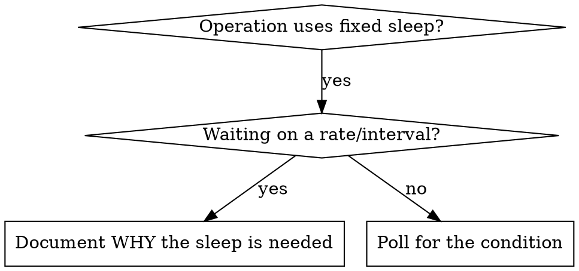

# Condition-Based Waiting

## Overview

Infrastructure operations often guess at timing with arbitrary delays — `sleep 30` after a deploy, "wait a minute for DNS to propagate", a fixed pause after `kubectl apply`. This creates race conditions: the check passes on a fast cluster but fails under load, in a different region, or when the control plane is busy. Worst case, the operation reports success before the system has actually converged.

Infrastructure is eventually consistent. A `kubectl apply` returns before the pod is Ready. A Puppet apply exits before the service has finished restarting. A DNS record change returns before it has propagated to all resolvers. A load balancer registers a target before health checks pass. Fixed sleeps bet on how long convergence takes; the bet is wrong the moment conditions change.

**Core principle:** Poll for the actual condition you care about, not a guess about how long it takes.

## When to Use



**Use when:**
- Scripts have arbitrary delays (`sleep 30`, "give it a minute")
- Verification is flaky (passes sometimes, fails under load or on slow clusters)
- Waiting for eventual-consistency convergence:
  - A pod becoming Ready after a rollout
  - A service endpoint becoming healthy
  - A DNS record propagating to resolvers
  - A Puppet apply settling (service restarted and back up)
  - A load balancer target passing health checks
  - A certificate being issued by cert-manager
  - An ArgoCD/Flux sync reaching `Synced/Healthy`

**Don't use when:**
- You are deliberately observing rate-limited behavior (e.g., waiting one full scrape interval to see a metric appear, or one TTL to expire before re-querying)
- Always document WHY if you use a fixed sleep

## Core Pattern

```bash
# ❌ BEFORE: Guessing at convergence time
kubectl --context "$CTX" apply -f deploy.yaml
sleep 30                                    # hope it's Ready in 30s
kubectl --context "$CTX" get pods -l app=api   # may still be Pending

# ✅ AFTER: Waiting for the actual condition
kubectl --context "$CTX" apply -f deploy.yaml
kubectl --context "$CTX" rollout status deploy/api --timeout=120s
# rollout status polls until Ready or times out with a clear error
```

## Quick Patterns

| Scenario | Native tool (prefer) | Generic poll |
|----------|----------------------|--------------|
| Pod/Deployment Ready | `kubectl rollout status deploy/<n> --timeout=120s` | `wait_for "pods Ready" 'kubectl get pods -l app=<n> -o jsonpath="{..status.conditions[?(@.type==\"Ready\")].status}" \| grep -q True'` |
| Arbitrary K8s condition | `kubectl wait --for=condition=Ready pod/<n> --timeout=120s` | — |
| Service health endpoint | — | `wait_for "api healthy" 'curl -fsS https://api.example.com/healthz'` |
| DNS record propagated | — | `wait_for "DNS propagated" 'dig +short @8.8.8.8 svc.example.com \| grep -q 10.0.0.5'` |
| Cert issued (cert-manager) | `kubectl wait --for=condition=Ready certificate/<n> --timeout=180s` | — |
| ArgoCD app synced | `argocd app wait <app> --health --timeout 300` | — |
| Puppet service settled | — | `wait_for "nginx active" 'systemctl is-active --quiet nginx'` |
| TCP port open | — | `wait_for "db reachable" 'nc -z db-host 5432'` |

**Prefer the native waiter** (`kubectl rollout status`, `kubectl wait`, `argocd app wait`) when the tool provides one — they poll correctly and report clear errors. Use a generic poll loop only when no native waiter exists (health endpoints, DNS propagation, raw TCP).

## Implementation

Generic polling function for shell operations:

```bash
# wait_for <description> <command>  [timeout_s] [interval_s]
# Polls <command> until it exits 0, or fails after timeout.
wait_for() {
  local desc="$1" cmd="$2" timeout="${3:-120}" interval="${4:-5}"
  local start; start=$(date +%s)
  while true; do
    if eval "$cmd" >/dev/null 2>&1; then
      return 0
    fi
    if (( $(date +%s) - start > timeout )); then
      echo "Timeout waiting for ${desc} after ${timeout}s" >&2
      return 1
    fi
    sleep "$interval"
  done
}
```

See `condition-based-waiting-example.sh` in this directory for a complete, runnable implementation with domain-specific helpers (`wait_for_rollout`, `wait_for_health`, `wait_for_dns`) drawn from real deploy/verification workflows.

## Common Mistakes

**❌ Polling too fast:** `interval=0` hammers the API server / DNS resolver
**✅ Fix:** Poll every 2–5s for cluster resources, 1–2s for local checks

**❌ No timeout:** Loop forever if the condition never converges (masks a real failure)
**✅ Fix:** Always include a timeout with a clear error message

**❌ Stale data:** Capture state once before the loop and re-check the cached copy
**✅ Fix:** Re-run the query inside the loop for fresh state each iteration

**❌ Checking the wrong condition:** `sleep` then `kubectl get pods` shows Running, not Ready
**✅ Fix:** Poll the condition that actually matters (Ready, health 200, resolver returns new IP)

## When a Fixed Sleep IS Correct

```bash
# Prometheus scrapes every 30s; a new metric can't appear until one scrape lands.
kubectl --context "$CTX" rollout status deploy/api --timeout=120s  # First: wait for the real condition
sleep 35   # Then: wait one scrape interval (30s) + margin so the metric is guaranteed scraped
curl -fsS "http://prometheus/api/v1/query?query=up{job=\"api\"}"
```

**Requirements:**
1. First wait for the triggering condition (don't sleep blind)
2. The sleep duration is based on a known rate/interval, not a guess
3. A comment explains WHY the fixed duration is correct

## Real-World Impact

Replacing fixed sleeps with condition polling in deploy/verification scripts:
- Flaky post-deploy checks stop failing on slow or busy clusters
- Verification completes as soon as the system converges — no wasted fixed wait
- Failures surface as a clear "Timeout waiting for X" instead of a downstream check passing against a not-yet-converged system
