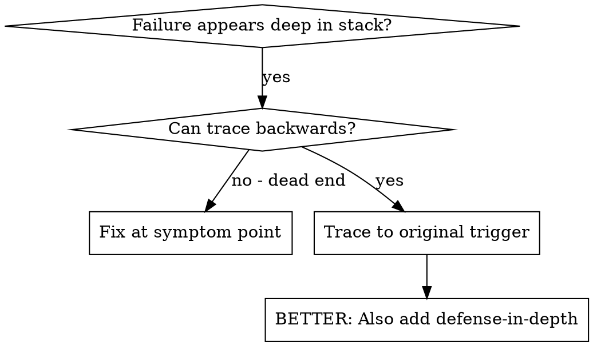
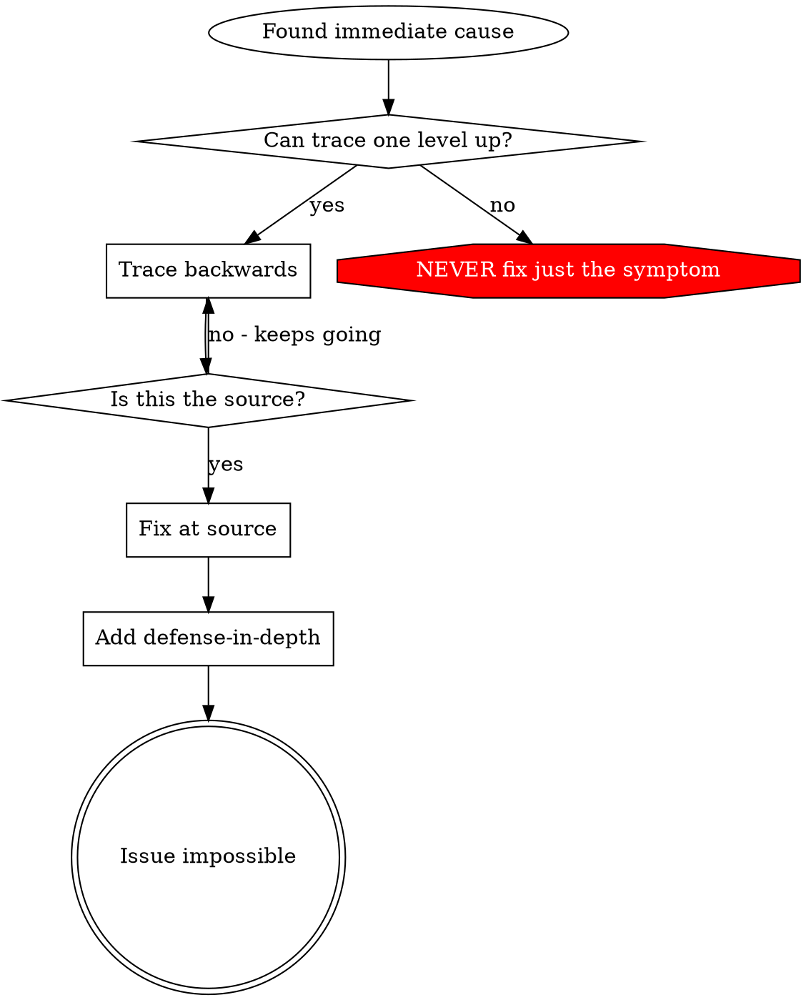

# Root Cause Tracing (Infrastructure)

## Overview

Infrastructure failures often manifest far from their origin. A pod OOMKill might trace back to a misconfigured resource limit set three layers up. A 503 in the ingress might originate in a misconfigured readiness probe deep in a Helm values file.

**Core principle:** Trace backward through the causation chain until you find the original trigger, then fix at the source.

## When to Use



**Use when:**
- Error appears in a downstream service/component (not at the entry point)
- Stack trace or event chain shows multiple hops
- Unclear where the bad configuration/data originated
- Same issue keeps recurring after symptomatic fixes

## The Tracing Process

### 1. Observe the Symptom
```
Pod CrashLoopBackOff in namespace production
Error: OOMKilled
```

### 2. Find Immediate Cause
**What directly caused this?**
```bash
kubectl describe pod <name> -n production
# → Last State: OOMKilled, memory limit: 128Mi
```

### 3. Ask: What Set This Value?
```
Deployment spec → Helm release → values.yaml in GitOps repo
→ values file sets resources.limits.memory: 128Mi
→ Value was copied from staging values (low-memory environment)
```

### 4. Keep Tracing Up
**Where did the value originate?**
```
values-production.yaml overrides resources
→ Override was added 3 months ago for "memory optimization"
→ Application load has tripled since then
→ No alert existed for memory usage approaching limit
```

### 5. Find Original Trigger
**Root cause:** Static resource limits not reviewed as application load grew + no memory utilization alerting

## Adding Diagnostic Instrumentation

When you can't trace manually, add temporary instrumentation:

```bash
# Capture full event chain for a failing pod
kubectl get events -n <namespace> --sort-by='.lastTimestamp' | grep <pod-name>

# Check all resource versions to see what changed when
kubectl get deployment <name> -n <namespace> -o json | jq '.metadata.resourceVersion, .metadata.annotations'

# Correlate with GitOps commits
git log --oneline --since="48 hours ago" -- environments/production/
```

**Critical:** Capture timestamps at every hop — this is your causal chain.

## Finding Which Change Caused the Issue

If something broke but you don't know which change:

```bash
# Kubernetes audit log (if available)
kubectl get events -n <namespace> --sort-by='.lastTimestamp' | tail -50

# GitOps repo history
git log --oneline --since="2 hours ago" -- path/to/affected/

# Helm release history
helm history <release> -n <namespace>
```

Bisect: deploy the last known-good state, then binary search forward to the breaking commit.

## Real Example: Certificate Expiry Cascade

**Symptom:** Multiple services returning 502 in production

**Trace chain:**
1. Ingress returns 502 ← upstream connection failure
2. Backend pod returns connection refused ← TLS handshake failure
3. TLS handshake fails ← certificate expired
4. Certificate expired ← cert-manager failed to renew
5. cert-manager failed ← ACME challenge blocked by network policy change
6. Network policy changed ← "security hardening" PR merged 3 days ago

**Root cause:** Network policy change blocked ACME HTTP-01 challenge traffic
**Fix at source:** Allow cert-manager ACME challenge traffic in network policy
**Also added defense-in-depth:**
- Alert: certificate expiry < 30 days
- Alert: cert-manager renewal failures
- CI policy check: network policy changes reviewed by platform team

## Key Principle



**NEVER fix just where the error appears.** Trace back to find the original trigger.

## Diagnostic Tips

- **Timestamps are causal chains** — correlate across logs, events, git history
- **Check what changed** — `helm history`, `git log`, Kubernetes events
- **Follow the data** — track the misconfigured value from source to consumption
- **Include context in logs** — namespace, image, triggered-by, Git SHA

## See Also

- `defense-in-depth.md` — After finding root cause, prevent recurrence at every layer
