# Test-Driven Operation (TDO)

## Overview

Define the verification command before execution. When the target state is absent or broken, run it first and watch it fail. When a failing verification is not meaningful, capture the current baseline, execute the smallest safe operation, then verify the target state.

**Core principle:** Verification is designed before the change, and success is claimed only from fresh evidence.

**When a RED failure is meaningful:** If you didn't watch the verification fail, you don't know if it verifies the right thing.

**Announce at start:** "I'm using the test-driven-operation skill to execute this infrastructure operation."

## When to Use

**Use for state-changing work:**
- API operations (REST, GraphQL, gRPC)
- Kubernetes operations (kubectl, helm)
- Keycloak/Identity provider operations (CRDs, admin APIs)
- Git control repo operations (MRs, commits)
- Linux server operations (configuration changes, deployments)
- Database migrations and schema changes
- Infrastructure provisioning (Terraform, CloudFormation)

**Exceptions (ask your human partner):**
- Emergency incident response (time-critical)
- Read-only diagnostic operations
- Dry-run exploration (first pass only)

Thinking "skip verification just this once"? Stop. That's rationalization.

## Verification Model

```
DEFINE VERIFICATION BEFORE EVERY STATE-CHANGING INFRASTRUCTURE OPERATION
```

For state-changing infrastructure work:

- Define the verification command before execution
- When the target state is currently absent or broken, run the verification first and observe the expected failure
- When a failing verification is not meaningful, capture the current baseline first, execute the smallest safe change, then verify the target state
- Do not adapt verification after the fact to match an unexpected result

Execute operation before defining verification? Rollback if safe and material. Otherwise stop, record the deviation, capture current state, and ask your human partner how to proceed.

## Red-Green-Refactor for Operations

```dot
digraph tdo_cycle {
    rankdir=LR;
    red [label="RED\nWrite verification or baseline", shape=box, style=filled, fillcolor="#ffcccc"];
    verify_red [label="Fails correctly\nor baseline captured", shape=diamond];
    green [label="GREEN\nMinimal operation", shape=box, style=filled, fillcolor="#ccffcc"];
    verify_green [label="Verify passes\nExpected output", shape=diamond];
    refactor [label="REFACTOR\nDocument and clean", shape=box, style=filled, fillcolor="#ccccff"];
    next [label="Next", shape=ellipse];

    red -> verify_red;
    verify_red -> green [label="yes"];
    verify_red -> red [label="wrong\nfailure"];
    green -> verify_green;
    verify_green -> refactor [label="yes"];
    verify_green -> green [label="no"];
    refactor -> verify_green [label="stay\ngreen"];
    verify_green -> next;
    next -> red;
}
```



### RED - Write Verification or Capture Baseline

Write one minimal verification showing what should exist or happen. Run it before the operation when it should currently fail. If the current state is valid and the operation advances or refreshes it, capture a baseline instead.

**Kubernetes:**
```bash
kubectl get pod -n production -l app=api-server -o jsonpath='{.items[0].status.phase}'
```

**API:**
```bash
curl -s https://api.example.com/users/123 | jq '.email'
```

**Keycloak CRD:**
```bash
kubectl get keycloakrealm/example-realm -o jsonpath='{.status.ready}'
```

**Linux server:**
```bash
ssh prod-server "systemctl is-active nginx"
```

**Requirements:**
- One verifiable outcome
- Clear expected result
- Uses real verification commands (no mocks)

### Verify RED - Watch It Fail

**MANDATORY when the desired state is absent or broken.**

```bash
kubectl get pod -n production -l app=api-server
# Error: No resources found in production namespace
```

Confirm:
- Verification fails (not errors)
- Failure reason is expected (resource doesn't exist)
- Fails because operation not executed (not typos)

**Verification passes?** If the target state already exists, capture baseline evidence and switch to baseline-delta verification. If the verification is wrong, fix it before executing.

**Verification errors?** Fix command, re-run until it fails correctly.

### Baseline Path - When Failure Is Not Meaningful

Use this path for operations such as service restarts, security updates, certificate rotation before expiry, or configuration refreshes where the current state is valid.

```bash
systemctl is-active nginx
# Expected baseline: active
```

Confirm:
- Baseline captures the current state before change
- Target state is explicit
- Post-check can prove the operation completed

### GREEN - Minimal Operation

Execute simplest operation to pass verification.

**Kubernetes:**
```bash
kubectl apply -f - <<EOF
apiVersion: v1
kind: Pod
metadata:
  name: api-server
  namespace: production
  labels:
    app: api-server
spec:
  containers:
  - name: api
    image: api-server:v1.0.0
EOF
```

**API:**
```bash
curl -X PATCH https://api.example.com/users/123 \
  -H "Content-Type: application/json" \
  -d '{"email": "user@example.com"}'
```

**Git control repo:**
```bash
git add manifests/production/app-config.yaml
git commit -m "Add production database config"
git push
# Wait for ArgoCD/Flux sync
```

Don't add features, refactor other resources, or "improve" beyond the verification.

### Verify GREEN - Watch It Pass

**MANDATORY.**

```bash
kubectl get pod -n production -l app=api-server -o jsonpath='{.items[0].status.phase}'
# Output: Running
```

Confirm:
- Verification passes
- Output matches expected
- No errors in logs/events
- Other resources still healthy

**Verification fails?** Fix operation, not verification.

**Other resources broken?** Fix now.

### REFACTOR - Document and Clean

After green only:
- Document the operation in runbook
- Add to Git commit message
- Extract reusable patterns
- Update DR plans

Keep verification passing. Don't add behavior.

## Good Verifications

| Quality | Good | Bad |
|---------|------|-----|
| **Minimal** | One thing. "and" in description? Split it. | `kubectl get pod,svc,configmap` |
| **Clear** | Command describes expected state | `kubectl get all` |
| **Shows intent** | Demonstrates desired outcome | Obscures what operation should achieve |

## Async and Eventual-Consistency Verification

Some operations cannot produce immediate, deterministic results:

| Category | Examples | Strategy |
|----------|----------|----------|
| **Poll-until-ready** | ArgoCD sync, Terraform apply, DNS propagation | Polling loop with timeout |
| **Event-based** | Kafka consumer lag, async job completion | Event log or queue depth query |
| **Baseline-delta** | Route53 propagation, S3 eventual consistency | Before/after comparison with wait |

### Strategy 1: Poll-Until-Ready

```bash
# RED: show condition not met
kubectl get deployment -n production api-server -o jsonpath='{.status.readyReplicas}' 2>&1
# Expected: Error: not found OR 0

# GREEN: execute operation
kubectl apply -f deployment-api-server.yaml

# Verify GREEN: poll with timeout (max 3 minutes)
for i in $(seq 1 18); do
  READY=$(kubectl get deployment -n production api-server -o jsonpath='{.status.readyReplicas}' 2>/dev/null)
  [ "$READY" = "3" ] && echo "PASS: readyReplicas=3" && break
  echo "Attempt $i/18: readyReplicas=${READY:-0}, waiting 10s..."
  sleep 10
done
[ "$READY" != "3" ] && echo "FAIL: timed out" && exit 1
```

### Strategy 2: Event-Based Verification

```bash
# RED: show lag is high
kafka-consumer-groups.sh --bootstrap-server kafka:9092 --group my-consumer --describe | awk '{print $6}'
# Expected: 50000

# GREEN: trigger reprocessing

# Verify GREEN: confirm lag reaches 0 within window
END=$((SECONDS + 300))
while [ $SECONDS -lt $END ]; do
  LAG=$(kafka-consumer-groups.sh --bootstrap-server kafka:9092 --group my-consumer --describe | awk 'NR>1{sum+=$6} END{print sum}')
  [ "$LAG" -le "100" ] && echo "PASS: lag=$LAG" && break
  echo "Lag: $LAG, waiting..."
  sleep 15
done
```

### Strategy 3: Baseline-Delta

```bash
# RED: capture baseline
BASELINE=$(dig +short api.example.com @8.8.8.8)
echo "Baseline: '${BASELINE}'"
# Expected: empty or old IP

# GREEN: update DNS

# Verify GREEN: wait for propagation
EXPECTED_IP="203.0.113.42"
END=$((SECONDS + 600))
while [ $SECONDS -lt $END ]; do
  CURRENT=$(dig +short api.example.com @8.8.8.8)
  [ "$CURRENT" = "$EXPECTED_IP" ] && echo "PASS: DNS=$CURRENT" && break
  echo "Current: '${CURRENT}', waiting for $EXPECTED_IP..."
  sleep 30
done
```

### Async TDO Rules

- **Always set a timeout.** No infinite polling. Timeouts are failures.
- **Always log progress.** Each poll prints current state.
- **Watch it fail first.** Run polling loop RED — must time out before operation.
- **Treat timeout as failure.** If loop times out in Verify GREEN, operation failed.
- **Human approval for long waits.** If timeout > 15 minutes, ask before proceeding.

### When TDO Cannot Apply

| Situation | Action |
|-----------|--------|
| Visual inspection required (UI) | Pause TDO. Document human checkpoint. Resume after confirm. |
| Success = absence of alerts over N hours | Document expected alert state, set reminder, close loop later. |
| Cross-system trace required | Use distributed tracing (Jaeger, Tempo) to correlate spans. |
| Legacy system with no query API | Add monitoring/logging first; then run TDO. |

For these: **document the human checkpoint explicitly.** Do not claim automated verification where none exists.

## Why Order Matters

**"I'll verify after to confirm it worked"**

Verifications written after operations pass immediately. Passing immediately proves nothing:
- Might verify wrong thing
- Might verify side effect, not actual change
- You never saw it catch the failure

Verification-first forces you to see the verification fail, proving it actually verifies something.

**"kubectl apply succeeded, that's verification enough"**

kubectl apply succeeding ≠ resource working. Apply only submits manifests.

- `kubectl apply -f deployment.yaml` succeeds (exit 0)
- But: Pods in CrashLoopBackOff, missing ConfigMap, insufficient quota
- Verification: `kubectl get deployment -n production app -o jsonpath='{.status.readyReplicas}'`

Apply success = valid YAML. Verification = working infrastructure.

**"Rolling back X hours of work is wasteful"**

Sunk cost fallacy. The time is already gone. Your choice:
- Rollback and re-execute with TDO (X more hours, high confidence)
- Keep it and verify after (30 min, low confidence, likely issues)

Working changes without verification are technical debt.

## Common Rationalizations

| Excuse | Reality |
|--------|---------|
| "Too simple to verify" | Simple ops fail. Verification takes 30 seconds. |
| "I'll verify after" | Passing immediately proves nothing. |
| "Already manually checked" | Ad-hoc ≠ systematic. No record, can't re-run. |
| "kubectl apply succeeded" | Apply success ≠ resource ready. |
| "API returned 200" | 200 ≠ correct response body. |
| "Dashboard shows it's up" | Dashboard ≠ verification. Dashboards lag, cache data. |
| "ArgoCD will deploy it" | Verify deployment happened. Sync can fail silently. |
| "The script has checks" | Script output ≠ verification. Read and confirm output. |
| "Production is down, no time" | Verification confirms fix works. Without it, you're guessing. |
| "Rolling back X hours is wasteful" | Sunk cost fallacy. Unverified changes are debt. |
| "TDO is dogmatic, I'm pragmatic" | TDO is pragmatic. Debugging incidents is slower. |

## Red Flags - STOP and Rollback

- Operation before verification
- Verification passes immediately
- Can't explain why verification failed
- Rationalizing "just this once"
- "Keep as reference" or "adapt existing operation"
- "Already spent X hours, rolling back is wasteful"
- "This is different because..."

**All of these mean: Rollback operation. Start over with TDO.**

## SRE Principles

| Principle | What It Means |
|-----------|---------------|
| **Safety First** | Run `--dry-run` between RED and GREEN. Mandatory rollback plan before every GREEN. |
| **Evidence-Driven** | Every verification includes exact command and actual output (not paraphrased). |
| **Audit-Ready** | Record operator, timestamp, ticket in commits. Preserve verification outputs as artifacts. |
| **Communication** | Summarize changes in business-impact terms. Provide escalation context for failures. |

## Verification Checklist

Before marking operation complete:

- [ ] Every operation has a verification command
- [ ] Watched each verification fail before executing operation
- [ ] Each verification failed for expected reason (resource missing, not typo)
- [ ] Executed minimal operation to pass each verification
- [ ] All verifications pass
- [ ] No errors in logs/events
- [ ] Verifications use real commands (no mocks)
- [ ] Documented in runbook/commit message

Can't check all boxes? You skipped TDO. Rollback and start over.

## When Stuck

| Problem | Solution |
|---------|----------|
| Don't know how to verify | Write desired end state. Query for it first. Ask your human partner. |
| Verification too complicated | Operation too complicated. Break into smaller ops. |
| Must verify everything manually | Operation not observable. Add metrics/labels. |

## Anti-Patterns Reference

See `testing-anti-patterns.md` in this skill directory for detailed examples of what to avoid:
- Command success ≠ actual state verified
- Ignoring eventual consistency (CRDs, controllers)
- Skipping rollback testing
- Hardcoded `sleep` instead of condition-based waiting
- Environment-specific verification that breaks in prod
- Incomplete verification (pod exists ≠ pod healthy)

## Incident Response Integration

Incident detected? Write verification that reproduces or measures the symptom before mitigation. Follow TDO cycle. Verification proves fix and prevents regression.

Never fix incidents without verification.

## Final Rule

```
Infrastructure change → verification defined before execution
Absent or broken target state → verification failed first
Valid current state → baseline captured first
Otherwise → not TDO
```

No exceptions without your human partner's permission.
