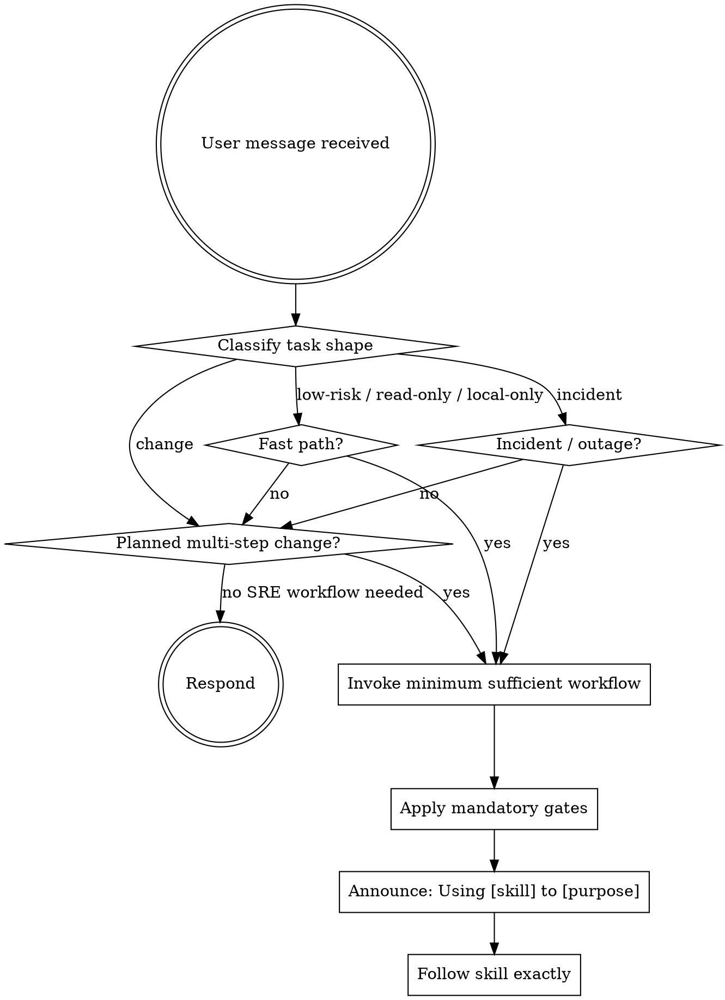

<EXTREMELY-IMPORTANT>
Choose the MINIMUM SUFFICIENT workflow for the task.

Use the smallest set of SREPowers skills that preserves safety, evidence, and rollback discipline.

Do not stack extra workflow skills "just in case." Over-process is a failure mode too.
</EXTREMELY-IMPORTANT>

## How to Access Skills

**In Claude Code:** Use the `Skill` tool. When you invoke a skill, its content is loaded and presented to you — follow it directly.

**In Codex:** Use repo or plugin-discovered skills through `/skills` or by mentioning `$skill-name`. Codex may also activate a skill implicitly when the task matches its description.

**Skill namespace:** Skills live in four plugins — prefix with the owning plugin, not a bare `srepowers:`. Use `<plugin>:<skill>`:
- `srepowers-core:` — workflow spine, mandatory gates, incident response (e.g. `srepowers-core:test-driven-operation`)
- `srepowers-domain:` — language/architecture/security expertise (e.g. `srepowers-domain:kubernetes-specialist`)
- `srepowers-infra:` — infrastructure administration (e.g. `srepowers-infra:pve-admin`)
- `srepowers-private:` — Puppet/Ansible/Hiera operations (e.g. `srepowers-private:puppet-deploy`)

# Using SRE Skills

## The Rule

**Route first, then invoke only the minimum sufficient skills before acting.**

Every infrastructure task should be classified into one of three layers:

1. **Mandatory gates** — safety and evidence rules that apply whenever the situation matches
2. **Workflow skills** — the smallest process needed for the task shape
3. **Domain helpers** — platform-specific guidance only after the workflow is chosen

## Available Skills

For the full skill catalog organized by category, load `references/skill-catalog.md`.

## Mandatory Gates

Apply these whenever the trigger matches, regardless of workflow:

| Gate | Trigger | Purpose |
|------|---------|---------|
| `verification-before-completion` | Before any success, health, fix, or completion claim | Fresh evidence before claims |
| `safety-validator` | Risky, destructive, broad-scope, or production commands | Catch dangerous operations before execution |
| `evidence-first-reporting` | Status updates, handoffs, incident summaries, or ambiguous findings | Separate observations, inference, unknowns, and next checks |

## Workflow Router

Pick the minimum sufficient route:

| Situation | Required workflow | Notes |
|-----------|-------------------|-------|
| Active incident or unclear failure | `systematic-troubleshooting` first | Use `incident-commander` only when coordination scope is large |
| Major incident, multi-team, customer-facing, or long-running outage | `incident-commander` + `systematic-troubleshooting` | Command structure on top, troubleshooting underneath |
| Planned multi-step infrastructure change | `brainstorming-operations` → `writing-operation-plans` → execution skill | Default route for meaningful changes |
| Small known-safe change with local validation | `test-driven-operation` directly | Skip brainstorming and full plan only if risk is truly low |
| Read-only review or diagnosis with no mutation | Relevant domain skill + `evidence-first-reporting` | Do not invent an execution plan for read-only work |
| High-risk or production change | Add `safety-validator` before execution | High-risk prod changes do not get a fast path |

## Fast Path

Use the fast path only when **all** are true:

- Task is low-risk
- Scope is read-only or a single-file/local-only change
- Validation is local and exact
- Rollback is trivial or not needed because no remote state changes
- No production or destructive commands

Fast path rules:

- Skip `brainstorming-operations`
- Skip `writing-operation-plans`
- Still use `test-driven-operation` or the relevant read-only/domain skill
- Still apply `verification-before-completion`
- Still use `evidence-first-reporting` when reporting findings or status
- Keep output compact

## Standard Workflow

Use this when the task is not eligible for the fast path:

`brainstorming-operations` → `writing-operation-plans` → (`subagent-driven-operation` OR `executing-operation-plans`) → `verification-before-completion` → `finishing-operation-branch`

**Key categories:** Safety & Review, Incident Response, SRE Practices, Platform & Infrastructure, Architecture & Cloud, Languages & Development, Security & Quality

## Red Flags — You Are Rationalizing

| Thought | Reality |
|---------|---------|
| "This is just a quick operation" | Quick ops can use the fast path, not no process. |
| "I need all the workflow skills to be safe" | Use the minimum sufficient workflow, not the biggest one. |
| "Let me just run the command" | Route first. Risky commands require `safety-validator`. |
| "I remember this skill" | Skills evolve. Invoke the current version. |
| "This doesn't need planning" | Maybe true for fast path only. Prove it from the criteria. |
| "I'll verify after" | Verification-first is the rule. |
| "The skill is overkill here" | If it is overkill, choose a smaller workflow, not zero workflow. |
| "Exit 0 means success" | Exit code ≠ correct result. Use verification-before-completion. |
| "This doesn't count as a task" | Action = task. Route it. |
| "Agent reported success" | Verify independently. Trust output, not reports. |
| "The log line proves the cause" | One signal is not root cause. Use evidence-first reporting. |
| "Let me re-read the skill file to be sure" | The Skill tool already loaded its full content — follow that. Do not `Read` the SKILL.md from the plugin cache again. |
| "I'll apply the gate's principles inline" | A gate is invoked, not paraphrased. If `evidence-first-reporting` or `verification-before-completion` is triggered, call the Skill — don't just imitate its spirit. |

## Skill Priority

1. **Mandatory gates first** — `safety-validator`, `evidence-first-reporting`, `verification-before-completion`
2. **Workflow skill second** — choose one route, not several overlapping ones
3. **Domain skill third** — use platform depth only after the route is clear

## Anti-Patterns

Never:

- Claim success from exit code alone
- Propose root cause from one signal
- Edit before restating blast radius and rollback path
- Generalize from stale output
- Mix observation and inference in the same sentence without labeling them
- Force a full planning workflow onto a read-only or trivial local task
- Skip gates just because the workflow is short
- Treat a triggered gate as "applied inline" without actually invoking the Skill
- Re-`Read` a skill's SKILL.md after the Skill tool already presented its content

## Skill Types

**Rigid** (test-driven-operation, executing-operation-plans): Follow exactly. The discipline is the point.

**Flexible** (architecture-designer, cost-optimizer): Adapt principles to context.

The skill itself tells you which type it is.
