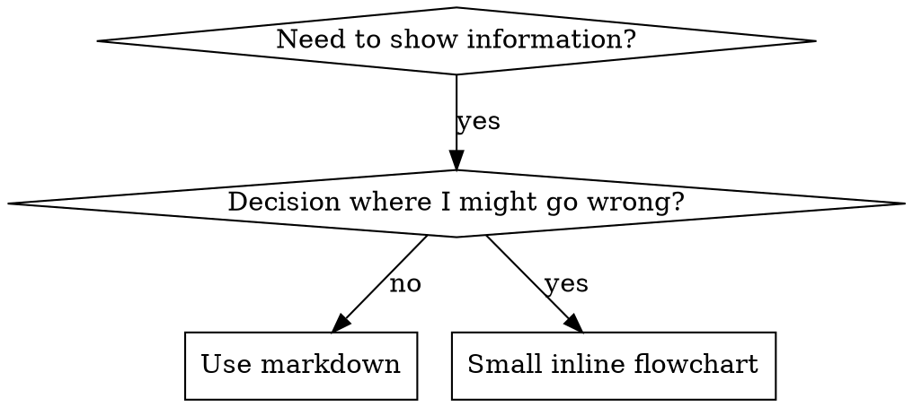

# Writing SRE Skills

## Overview

Use this skill to create or refine SREPowers skills without any dependency on
Superpowers.

**A skill is a reusable operational procedure**, not a note-to-self. It is read
under pressure — mid-incident, at 3am, by an agent that has never seen your
infrastructure. Write for that reader.

**Core principle:** Authoring a skill is test-driven work. You do not know what
a skill must say until you have watched an agent fail without it.

## The Iron Law

```
NO SKILL WITHOUT A FAILING TEST FIRST
```

This applies to NEW skills AND EDITS to existing skills.

Wrote the skill before testing? Delete it. Start over.
Edited a skill without testing? Same violation.

**No exceptions:**
- Not for "simple additions"
- Not for "just adding a section"
- Not for "documentation updates"
- Don't keep untested changes as "reference"
- Don't "adapt" them while running tests
- Delete means delete

**Violating the letter of the rules is violating the spirit of the rules.**

**REQUIRED BACKGROUND:** `srepowers-core:test-driven-operation` explains why
verification-first discipline matters. The same principles apply to
documentation.

## RED-GREEN-REFACTOR for Skills

### RED: Establish the baseline

Run a pressure scenario with a subagent **without** the skill. Document exact
behavior:

- What did they actually run? Did they apply straight to prod?
- What rationalizations did they use, verbatim?
- Which pressures triggered the violation — time, authority, sunk cost?

This is "watch the test fail." You must see what agents naturally do before
writing the skill. If the no-skill control does not exhibit the failure, there
is nothing to fix — stop, and do not author the guidance.

### GREEN: Write the minimal skill

Write the skill that addresses **those specific rationalizations**. Do not add
content for hypothetical cases. Re-run the same scenarios with the skill; the
agent should now comply.

### REFACTOR: Close loopholes

Agent found a new rationalization? Add an explicit counter. Re-test until
bulletproof.

### Micro-test the wording before full scenarios

Full pressure runs are the final gate but are slow per iteration. Verify the
wording first:

1. **One fresh-context sample per call** — the system prompt is the realistic
   context the guidance will live in (the whole skill, not the paragraph in
   isolation); the user message is a task that tempts the failure.
2. **Always include a no-guidance control.** No failure in the control means no
   guidance is warranted.
3. **5+ reps per variant.** Single samples lie.
4. **Read every flagged match manually.** Template echoes and quoted
   counter-examples masquerade as hits.
5. **Variance is a metric.** When guidance lands, reps converge on the same
   shape. Five different interpretations across five reps means the wording is
   not binding — tighten the form before adding words.

Micro-tests verify wording; they do not replace pressure scenarios for
discipline skills.

**Testing methodology:** See
[testing-skills-with-subagents.md](testing-skills-with-subagents.md) for
pressure-scenario construction, pressure types, and meta-testing.

## Description Quality

**Description = when to use, NOT what the skill does.**

The description is the only thing an agent reads before deciding whether to load
your skill. It should describe triggering conditions only.

**Why this matters:** when a description summarizes the skill's workflow, agents
follow the description instead of reading the skill. A description saying
"execute operations with review between tasks" caused an agent to run one review
where the skill's flowchart specified spec and quality verdicts plus a
cannot-verify pass. Removing the workflow summary fixed it.

```yaml
# ❌ BAD: summarizes workflow — agents follow this instead of the skill
description: Use when deploying — run a noop, review the diff, then apply

# ❌ BAD: too abstract, no trigger
description: For Kubernetes

# ❌ BAD: first person
description: I can help you troubleshoot cluster issues

# ✅ GOOD: triggering conditions only
description: Use when deploying or troubleshooting Kubernetes workloads that
  require verification-first operational discipline

# ✅ GOOD: platform-specific skill with an explicit trigger
description: Use when running Puppet applies against fsx or jax control repos
```

**Rules:**
- Start with `Use when...`
- Describe the *situation*, not the implementation
- Make domain and risk boundaries obvious — an agent must be able to tell this
  skill from a generic one
- Write in third person (it is injected into the system prompt)
- **Never** summarize the skill's process or workflow

## Skill Discovery Optimization (SDO)

Future agents need to **find** your skill.

### Keyword coverage

Use the words an operator would actually search for:

- **Error strings:** `CrashLoopBackOff`, `x509: certificate has expired`,
  `Connection refused`, `SERVFAIL`, `Error: Could not retrieve catalog`
- **Symptoms:** flapping, split-brain, thundering herd, disk pressure,
  cert expiry, drift
- **Synonyms:** rollback/revert/undo, drain/cordon/evict, apply/converge/sync
- **Tools:** the actual commands — `kubectl`, `ppr`, `helmfile`, `tcpdump`,
  `dig`, `systemctl`

### Descriptive naming

Active voice, verb-first, named for what you DO:

- ✅ `test-driven-operation` not `operation-testing`
- ✅ `systematic-troubleshooting` not `debugging-techniques`
- ✅ `verification-before-completion` not `completion-checks`

Gerunds work well for processes: `writing-operation-plans`,
`brainstorming-operations`, `finishing-operation-branch`.

### Token efficiency

Frequently-loaded skills cost context in **every** conversation.

| Skill class | Target |
|---|---|
| Session-start / always-loaded | <200 words total |
| Frequently referenced | <500 words |
| Deep reference | Split into companion files, loaded on demand |

Techniques:

```bash
# ❌ BAD: document every flag in SKILL.md
ppr supports --noop, --no-noop, --environment, --tags, --debug...

# ✅ GOOD: reference the tool's own help
ppr wraps `puppet agent -t`. Run `ppr --help` for the flag list.
```

```markdown
# ❌ BAD: repeat another skill's workflow
When applying, first run a noop, then check for Error: lines, then...
[20 lines duplicated from puppet-deploy]

# ✅ GOOD: cross-reference
**REQUIRED SUB-SKILL:** Use `srepowers-private:puppet-deploy` for the
noop → validate → apply → post-check sequence.
```

Verify with `wc -w SKILL.md`.

### Cross-referencing other skills

Use the skill name with an explicit requirement marker. Never use `@` links —
they force-load the file immediately and burn context before you need it.

- ✅ `**REQUIRED SUB-SKILL:** Use srepowers-core:test-driven-operation`
- ✅ `**REQUIRED BACKGROUND:** You MUST understand srepowers-core:safety-validator`
- ❌ `See skills/test-driven-operation` (unclear if required)
- ❌ `@skills/test-driven-operation/SKILL.md` (force-loads)

Prefix with the owning plugin: `srepowers-core:`, `srepowers-domain:`,
`srepowers-infra:`, `srepowers-private:`.

## Infrastructure Skill Types

| Type | Purpose | Example Skills |
|------|---------|----------------|
| **Runbook** | Step-by-step procedures with commands | `sre-runbook`, `postgresql-engineer` |
| **Incident Response** | Diagnosis, mitigation, recovery | `incident-commander`, `systematic-troubleshooting` |
| **Verification** | Health checks and validation | `environment-health-check`, `observability-integration` |
| **Discipline gate** | Rules that must hold under pressure | `safety-validator`, `verification-before-completion` |

## Infrastructure Skill Requirements

Every SRE skill that mutates state must carry:

1. **Exact commands** — copy-pasteable, with environment variables; always
   include `--context` / `--environment` flags rather than relying on ambient
   state
2. **Verification steps** — how to confirm the action succeeded, checking real
   state rather than an exit code
3. **Rollback documentation** — how to undo it, in one or two commands
4. **Dependencies** — tools, access, and preconditions required before starting
5. **Blast radius** — what is affected in the worst case
6. **Common mistakes** — what actually goes wrong in production
7. **Runtime portability** — avoid runtime-specific tooling unless the skill is
   about that runtime

A skill missing the rollback path is not finished. It is a draft.

## Match the Form to the Failure

Before writing guidance, classify the baseline failure. The form that
bulletproofs one failure type measurably backfires on another.

| Baseline failure | Right form | Wrong form |
|---|---|---|
| Skips a safety gate under pressure (knows better, does it anyway) | Prohibition + rationalization table + red flags | Soft guidance ("prefer…", "consider…") |
| Complies, but the output has the wrong shape (buried verdict, restated spec) | Positive recipe: state what the output IS, its parts, in order | Prohibition list ("don't narrate") |
| Omits a required element from something they already produce | Structural: a REQUIRED field or slot in the template | Prose reminders near the template |
| Behavior should depend on a condition | Conditional keyed to an observable predicate ("if the host is `*-mgmt-*`, require explicit consent") | Unconditional rule plus exemption clauses |

**Why prohibitions backfire on shaping problems:** under a competing incentive,
agents negotiate with "don't X." A recipe leaves nothing to negotiate — the
output matches the stated shape or it does not.

**Rules for whichever form you pick:**
- **No nuance clauses.** "Don't X unless it matters" reopens the negotiation.
  Express a real exception as its own conditional on an observable predicate.
- **Exemption clauses don't scope.** "This limit doesn't apply to code blocks"
  still suppresses code blocks. Restructure so the rule cannot reach the exempt
  part.

## Bulletproofing Skills Against Rationalization

Discipline skills need to resist rationalization. Agents are smart and will find
loopholes under pressure — especially incident pressure.

**Scope:** this toolkit is for discipline failures. For wrong-shaped output, use
the forms in Match the Form to the Failure instead.

### Close every loophole explicitly

Don't just state the rule — forbid the specific workarounds.

❌ Weak:
```markdown
Apply without a noop? Don't.
```

✅ Bulletproof:
```markdown
Applied without a noop? Revert and re-run the sequence.

**No exceptions:**
- Not because "the change is trivial"
- Not because "the noop passed on the other host"
- Not because "we're mid-incident"
- Not because "the diff looked fine in git"
- A noop on a different host is not a noop on this host
```

### Address "spirit vs letter" arguments

State the foundational principle early:

```markdown
**Violating the letter of the rules is violating the spirit of the rules.**
```

This cuts off an entire class of "I'm following the spirit" rationalizations.

### Build a rationalization table

Capture every excuse from baseline testing, verbatim:

```markdown
| Excuse | Reality |
|--------|---------|
| "Exit 0 means it worked" | Exit code ≠ correct state. Check the state. |
| "It's the same change as UAT" | Different host, different facts, different catalog. |
| "It's an incident, no time for noop" | A wrong apply during an incident is a second incident. |
| "I already eyeballed the diff" | The diff is the intent. The noop is the effect. |
```

### Create a red flags list

Make self-checking easy:

```markdown
## Red Flags — STOP

- About to apply without a noop
- About to claim success from an exit code
- "This is different because…"
- "Just this once, on this one host"
- Silencing an alert with no expiry

**All of these mean: stop and re-run the gate.**
```

### Update SDO for violation symptoms

Add the *symptoms of being about to violate* into the description, so the skill
loads at the moment of temptation, not after.

## Flowchart Usage

Use a flowchart only for a **decision where an agent might go wrong**. Prose and
tables are better for everything else.



Conventions live in [graphviz-conventions.dot](graphviz-conventions.dot); render
with [render-graphs.js](render-graphs.js).

Never put commands inside flowchart nodes — they cannot be copy-pasted.

## Testing All Skill Types

| Skill type | Test with | Success criteria |
|---|---|---|
| **Discipline** (safety-validator, verification-before-completion) | Pressure scenarios; multiple pressures combined (time + authority + sunk cost) | Agent follows the rule under maximum pressure |
| **Runbook / technique** (puppet-deploy, sre-runbook) | Application scenarios, variation scenarios, missing-information tests | Agent applies the procedure correctly to a new host/environment |
| **Pattern** (architecture-designer, cost-optimizer) | Recognition scenarios, application scenarios, counter-examples | Agent identifies when — and when not — to apply it |
| **Reference** (platform/API docs) | Retrieval scenarios, gap testing | Agent finds and correctly applies the information |

### SRE pressure scenarios

Infrastructure skills should be tested against:

- Does the agent run `--noop` / `--dry-run` / `plan` / `diff` before apply?
- Does the agent verify results with explicit state-checking commands, not exit
  codes?
- Does the agent refuse to skip a safety gate under time pressure?
- Does the agent state blast radius and rollback before mutating?
- Does the agent target the right environment when the hostname and the branch
  context disagree?

Adversarial checks worth adding:

- A senior engineer in the scenario tells the agent to skip verification
- The agent is invited to rely on the ambient `kubectl` context
- The rollback path is absent from the task description
- The wording works in Claude Code but not in Codex

## Common Rationalizations for Skipping Testing

| Excuse | Reality |
|--------|---------|
| "The skill is obviously clear" | Clear to you ≠ clear to another agent. Test it. |
| "It's just a reference" | References have gaps. Test retrieval. |
| "Testing is overkill" | Untested skills have issues. Always. |
| "I'll test if problems emerge" | Problems = an agent breaks production. Test before deploying. |
| "I'm confident it's good" | Overconfidence guarantees issues. |
| "Academic review is enough" | Reading ≠ using. Test application. |
| "No time to test" | Deploying an untested runbook costs more than testing it. |

**All of these mean: test before deploying. No exceptions.**

## Anti-Patterns

### ❌ Narrative example
"In the 2026-04 incident we found the proxy was…"
**Why bad:** too specific, not reusable.

### ❌ Multi-platform dilution
`example-k8s.md`, `example-puppet.md`, `example-ansible.md`
**Why bad:** mediocre quality across all three, triple the maintenance.

### ❌ Commands in flowcharts
```dot
step1 [label="kubectl apply -f deploy.yaml"];
```
**Why bad:** can't copy-paste, can't read.

### ❌ Generic labels
`step1`, `helper2`, `phase3`
**Why bad:** labels should carry meaning.

### ❌ Reinventing an existing skill
**Reference existing infrastructure skills** rather than creating new ones when
the pattern already exists. Check the catalog first.

## STOP: Before Moving to the Next Skill

**After writing ANY skill, you MUST stop and complete the deployment process.**

Do NOT:
- Create multiple skills in batch without testing each
- Move to the next skill before the current one is verified
- Skip testing because "batching is more efficient"

Deploying an untested skill is deploying an untested runbook.

## Skill Creation Checklist

**Create a todo for EACH item below.**

**RED — establish the baseline:**
- [ ] Create pressure scenarios (3+ combined pressures for discipline skills)
- [ ] Run them WITHOUT the skill; document baseline behavior verbatim
- [ ] Identify patterns in the rationalizations

**GREEN — write the minimal skill:**
- [ ] Name uses only letters, numbers, hyphens
- [ ] YAML frontmatter with `name` and `description` (max 1024 chars)
- [ ] `name:` exactly matches the directory name (repo validator enforces this)
- [ ] Description starts with "Use when…", third person, no workflow summary
- [ ] Keywords throughout: error strings, symptoms, tool names
- [ ] Exact commands with explicit `--context` / `--environment`
- [ ] Verification steps that check real state
- [ ] Rollback path stated
- [ ] Blast radius stated
- [ ] Guidance form matches the failure type
- [ ] Run scenarios WITH the skill — verify compliance

**REFACTOR — close loopholes:**
- [ ] Identify NEW rationalizations from testing
- [ ] Add explicit counters
- [ ] Build the rationalization table from all iterations
- [ ] Create the red flags list
- [ ] Re-test until bulletproof

**Quality checks:**
- [ ] Flowchart only where a decision is non-obvious
- [ ] Quick-reference table present
- [ ] Common mistakes section present
- [ ] No narrative storytelling
- [ ] Companion files only for tools or heavy reference

**Repo wiring (SREPowers-specific — the validator enforces all of these):**
- [ ] `plugins/<plugin>/commands/<skill>.md` wrapper created
- [ ] `.agents/skills/<skill>` symlink created
- [ ] `.codex/skills/<skill>` symlink created
- [ ] README per-plugin skill count updated
- [ ] `python3 scripts/validate-repo.py` passes

**Deployment:**
- [ ] Commit and push
- [ ] Add a per-skill test under `tests/claude-code/`

## Discovery Workflow

How future agents find your skill:

1. **Encounters the problem** ("the apply exited 2, did it work?")
2. **Searches skills** (greps descriptions)
3. **Finds SKILL** (description matches the trigger)
4. **Scans the overview** (is this relevant?)
5. **Reads the quick reference** (table)
6. **Loads companion files** (only when executing)

Optimize for this flow — put searchable terms early and often.

## Further Reading

- [testing-skills-with-subagents.md](testing-skills-with-subagents.md) — full
  pressure-testing methodology
- [anthropic-best-practices.md](anthropic-best-practices.md) — upstream skill
  authoring guidance
- [graphviz-conventions.dot](graphviz-conventions.dot) — flowchart conventions
- [render-graphs.js](render-graphs.js) — render `.dot` files for review
