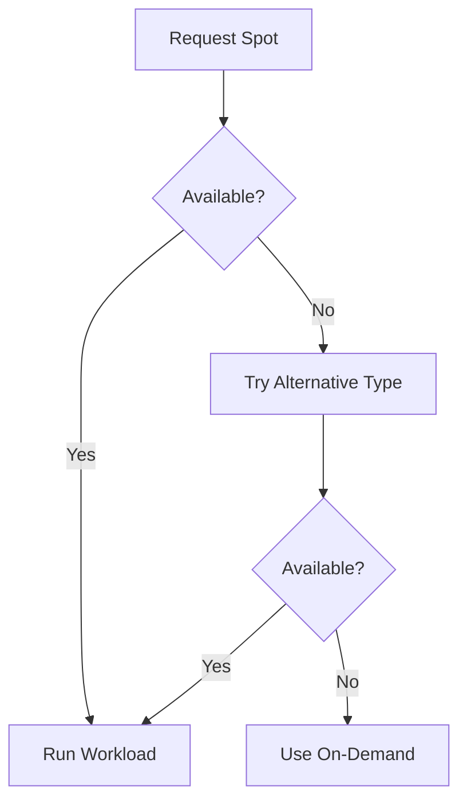

# Spot Instance Strategies

## Overview

Spot instances (AWS), Preemptible VMs (GCP), and Spot VMs (Azure) offer deep discounts for interruptible workloads.

## Discount Comparison

| Provider | Term | Max Discount | Interruption |
|----------|------|--------------|--------------|
| AWS Spot | On-demand | Up to 90% | 2-min notice |
| GCP Preemptible | 24h max | Up to 91% | 30-sec notice |
| Azure Spot | On-demand | Up to 90% | 30-sec notice |

## Suitable Workloads

| Workload Type | Good Candidate? | Reason |
|---------------|-----------------|--------|
| Batch jobs | ✅ Yes | Can restart |
| CI/CD pipelines | ✅ Yes | Fault-tolerant |
| Dev/test | ✅ Yes | Non-critical |
| Data processing | ✅ Yes | Checkpointable |
| Web servers | ⚠️ Maybe | Needs fallback |
| Databases | ❌ No | State persistence |
| Production APIs | ❌ No | Availability critical |

## AWS Spot Best Practices

### Spot Fleet

```bash
# Create spot fleet request
aws ec2 request-spot-fleet \
  --spot-fleet-request-config file://spot-fleet-config.json
```

### Spot Instance Advisor

- Check interruption rates: https://spot-instance-advisor.ec2.aws.dev
- Choose instance types with < 5% interruption rate

### Diversification Strategy

```json
{
  "LaunchTemplateConfigs": [
    {"InstanceType": "m5.large", "AvailabilityZone": "us-east-1a"},
    {"InstanceType": "m5a.large", "AvailabilityZone": "us-east-1b"},
    {"InstanceType": "m5d.large", "AvailabilityZone": "us-east-1c"}
  ]
}
```

## GCP Preemptible Best Practices

```bash
# Create managed instance group with preemptibles
gcloud compute instance-groups managed create my-group \
  --template my-preemptible-template \
  --size 10 \
  --zone us-central1-a
```

## Azure Spot Best Practices

```bash
# Create VM scale set with spot instances
az vmss create \
  --name my-scale-set \
  --resource-group myRG \
  --image Ubuntu2204 \
  --priority Spot \
  --max-price -1 \
  --eviction-policy Deallocate
```

## Interruption Handling

### Graceful Shutdown

```python
# AWS Spot interruption notice
import requests
import time

def check_spot_interruption():
    try:
        response = requests.get(
            'http://169.254.169.254/latest/meta-data/spot/instance-action',
            timeout=2
        )
        if response.status_code == 200:
            # 2-minute warning received
            action = response.json()
            if action['action'] == 'terminate':
                return True, action['time']
    except:
        pass
    return False, None
```

### Checkpointing

- Save state to S3/GCS/Azure Blob every N minutes
- Use message queues for job coordination
- Design for idempotent restarts

## Fallback Strategy



## Cost Modeling

```
Effective Rate = (Spot Hours × Spot Rate + On-Demand Hours × On-Demand Rate) / Total Hours

Example:
- 80% spot at $0.03/hr
- 20% on-demand at $0.10/hr
- Effective rate: (0.8 × 0.03) + (0.2 × 0.10) = $0.044/hr
- Savings: 56% vs pure on-demand
```
