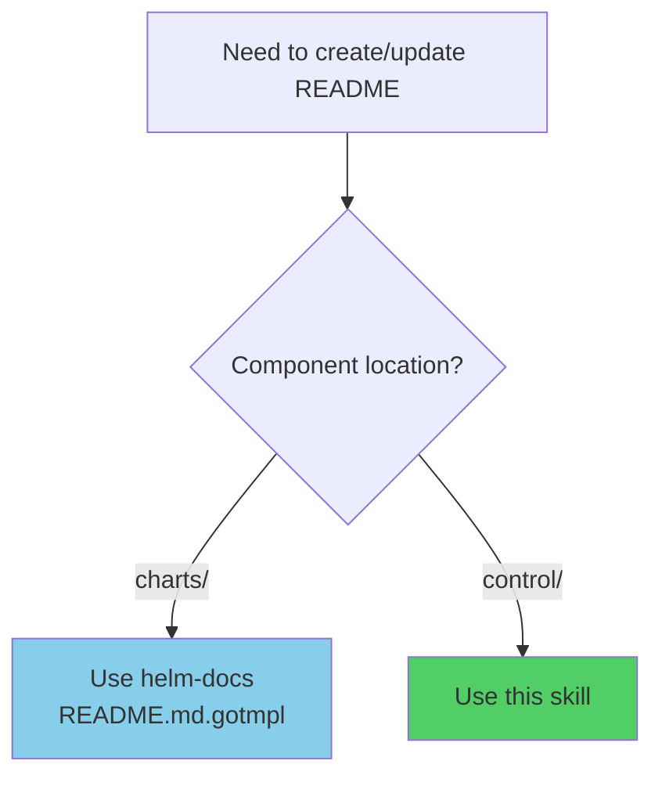
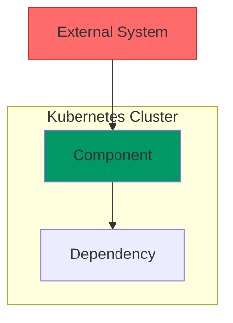
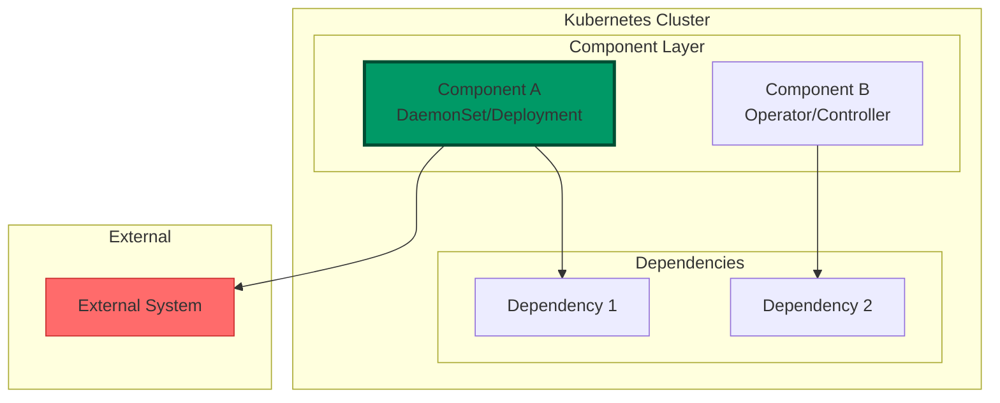

# Kubernetes Control README

## Overview

Standardized README structure for `control/` components in Kubernetes infrastructure. Control components include helmfile-based deployments and operator/CR-based manifest deployments.

**Core principle:** Follow the template structure consistently across all control components for discoverability and maintainability.

## When to Use



**Use for:**
- New control/ components being added
- Existing control/ components needing documentation updates
- Components with helmfile-based deployments
- Components with kubectl manifest-based deployments (CR/Operator)

**Do NOT use for:**
- charts/ components (use helm-docs with README.md.gotmpl instead)

## Quick Reference

| Section | Required? | Content |
|---------|:--------:|---------|
| **Title + Key Features** | ✅ | Component name + 3-4 bullet features |
| **Architecture** | ✅ | Mermaid diagram + Component Overview table |
| **Environment Configuration** | ✅ | d8/t8/m8/p8 matrix table |
| **Deployment** | ✅ | Directory structure + deployment method + steps |
| **Configuration** | ✅ | Common + environment-specific YAML |
| **Verification** | ✅ | Health + functionality + config checks |
| **Troubleshooting** | ✅ | 3-5 issues with Symptoms/Diagnosis/Solutions |
| **References** | ✅ | External docs links |
| **Quick Reference** | ✅ | Command cheat sheet table |
| **Footer** | ✅ | Last Updated + Maintainer |

## Required Sections Structure

### 1. Title and Key Features

```markdown
# [Component Name]

[Brief 1-2 sentence description of what this component does.]

**Key Features:**
- **Feature 1** - Brief description
- **Feature 2** - Brief description
- **Feature 3** - Brief description
```

**Critical:** Key Features bullets are REQUIRED, not optional.

### 2. Architecture (Mermaid Diagram)

Always include a Mermaid diagram showing component relationships:



**Color coding:**
- Control plane components: `fill:#009966`
- External systems: `fill:#ff6b6b,stroke:#c92a2a`
- Data sources: `fill:#e1f5ff`
- Storage/state: `fill:#ffd43b`

Include **Component Overview** table for multi-component systems:
| Component | Type | Purpose |
|-----------|------|---------|
| **Component A** | DaemonSet | Data plane: ... |
| **Component B** | Deployment | Control plane: ... |

### 3. Environment Configuration

Include ALL environments, even if planned:

| Environment | kubeContext | Namespace | Domain | [Config columns] | Notes |
|-------------|-------------|-----------|--------|------------------|-------|
| **sit** | sit | namespace | sit.example.com | [...] | [notes] |
| **dev** | dev | namespace | dev.example.com | [...] | Suspended (if applicable) |
| **uat** | uat | namespace | uat.example.com | [...] | [notes] |
| **mgmt** | mgmt | namespace | mgmt.example.com | - | Planned |
| **prod** | prod | namespace | prod.example.com | - | Planned |

**Notes column:** Include environment-specific differences (resource limits, memory_limiter, etc.)

### 4. Deployment

**Directory Structure** - Use relative paths from repository root:
```markdown
control/<component>/
├── helmfile.yaml            # Helmfile release declaration
├── environments.yaml        # Environment configuration
├── values/
│   ├── <component>.yaml     # Base values
│   └── env/
│       ├── d8.yaml
│       └── t8.yaml
└── README.md
```

**CRITICAL:** Use relative paths like `control/<component>/` to keep documentation generic and portable.

**Deployment Method** - Explicitly state if NOT helmfile:
```markdown
All environments use **OpenTelemetry Operator Custom Resources** for declarative management via kubectl manifest deployment (not helmfile).
```

**Initial Deployment** - Use relative paths and `<env>` placeholder:
```bash
cd control/<component>

# Deploy to SIT (d8)
kubectl --context=d8 apply -f manifests/<component>-d8-cr.yaml

# Deploy to UAT (t8)
kubectl --context=t8 apply -f manifests/<component>-t8-cr.yaml
```

### 5. Configuration

**Common Configuration:**
- Shared receivers/processors/exporters (for operators)
- Common values.yaml settings (for helmfile)

**Environment-Specific Configuration:**
- Show REAL YAML snippets (not pseudo-code)
- Include file paths in bold (e.g., **manifests/otelcol-d8-cr.yaml**)
- Document key differences between environments

### 6. Verification

Always include expected output:

```bash
kubectl --context=<env> get pods -n <namespace> -l <app-label>

# Expected output:
# NAME                      READY   STATUS    RESTARTS   AGE
# pod-xxxxx                 1/1     Running   0          10d
```

### 7. Troubleshooting

Use **Symptoms → Diagnosis → Solutions** format:

```markdown
### Issue: [Problem Name]

**Symptoms:**
- Symptom 1
- Symptom 2

**Diagnosis:**
```bash
# Diagnostic command
kubectl --context=<env> <command>
```

**Solutions:**
- **Solution 1:** Description
  ```bash
  # Fix command
  ```
- **Solution 2:** Description
```

Target 3-5 common issues for standard components, 5-10 for complex ones.

### 8. Footer (REQUIRED)

```markdown
---

**Last Updated:** YYYY-MM-DD
**Maintainer:** SRE Team
```

## Common Mistakes

| Mistake | Fix |
|---------|-----|
| Missing Key Features bullets | Add 3-4 feature bullets after title - REQUIRED, not optional |
| No Mermaid diagram | Always include architecture diagram with proper color coding |
| Missing m8/p8 environments | Include ALL environments (d8/d9/t8/m8/p8), mark planned ones |
| Absolute paths in directory structure | Use relative paths from repository root like `control/<component>/` |
| Missing expected output | Show what success looks like in all verification commands |
| Forgetting Last Updated footer | Add date and maintainer at end - REQUIRED |
| Pseudo-code instead of real YAML | Use actual configuration snippets, not templates |

## Component Types

### Helmfile-Based Components

**Structure:**
- `helmfile.yaml` - Release declaration
- `environments.yaml` - Environment kubeContexts
- `values/<component>.yaml` - Base values
- `values/env/d8.yaml`, `t8.yaml` - Overrides

**Deployment:**
```bash
cd control/<component>
helmfile -e <env> diff    # Preview changes
helmfile -e <env> sync    # Deploy
```

### Manifest-Based Components (Operator/CR)

**Structure:**
- `manifests/<component>-<env>-cr.yaml` - Custom Resources
- `manifests/<component>-<env>-rbac.yaml` - RBAC (if needed)

**Deployment:**
```bash
cd control/<component>
kubectl --context=<env> apply -f manifests/<component>-<env>-cr.yaml
```

## Full Template

```markdown
# [Component Name]

[Brief 1-2 sentence description of what this component does and its purpose in the Kubernetes infrastructure.]

**Key Features:**
- **Feature 1** - Brief description
- **Feature 2** - Brief description
- **Feature 3** - Brief description

## Table of Contents

- [Architecture](#architecture)
- [Environment Configuration](#environment-configuration)
- [Deployment](#deployment)
- [Configuration](#configuration)
- [Verification](#verification)
- [Troubleshooting](#troubleshooting)
- [References](#references)

## Architecture

[High-level overview paragraph explaining what the component does and how it fits into the FSX Kubernetes infrastructure.]



### Component Overview

| Component | Type | Purpose |
|-----------|------|---------|
| **Component A** | DaemonSet | Data plane: runs on all nodes |
| **Component B** | Deployment | Control plane: manages resources |
| **Operator** | CRD Controller | Lifecycle management (if applicable) |

## Environment Configuration

| Environment | kubeContext | Namespace | Domain | Specific Config | Notes |
|-------------|-------------|-----------|--------|-----------------|-------|
| **sit** | sit | namespace | sit.example.com | [config] | [notes] |
| **dev** | dev | namespace | dev.example.com | [config] | Suspended (if applicable) |
| **uat** | uat | namespace | uat.example.com | [config] | [notes] |
| **mgmt** | mgmt | namespace | mgmt.example.com | - | Planned |
| **prod** | prod | namespace | prod.example.com | - | Planned |

> **Note:** Document any important configuration differences between environments.

## Deployment

### Directory Structure

```
control/<component>/
├── helmfile.yaml            # Helmfile release declaration
├── environments.yaml        # Environment configuration (d8, t8)
├── values/
│   ├── <component>.yaml     # Base/common values
│   └── env/
│       ├── d8.yaml          # SIT environment overrides
│       └── t8.yaml          # UAT environment overrides
├── manifests/               # Additional Kubernetes manifests (if any)
│   └── *.yaml
└── README.md
```

### Prerequisites

1. **Kubernetes Cluster** - v1.33.3+ with kubectl configured
   ```bash
   kubectl --context=<env> get nodes
   ```

2. **Helmfile** - v1.2.0+
   ```bash
   helmfile version
   ```

3. **[Specific Dependency]** - Description
   ```bash
   # Verification command
   kubectl --context=<env> get <resource>
   ```

### Initial Deployment

```bash
cd control/<component>

# Deploy to SIT (d8)
helmfile -e d8 diff    # Preview changes
helmfile -e d8 sync    # Deploy

# Deploy to UAT (t8)
helmfile -e t8 sync
```

### Updating Configuration

```bash
helmfile -e <env> diff    # Preview changes
helmfile -e <env> sync    # Apply changes
```

## Configuration

### Common Configuration

**values/<component>.yaml**
```yaml
# Base configuration shared across all environments
replicaCount: 2

image:
  repository: docker.example.com/app
  tag: "1.0.0"
  pullPolicy: IfNotPresent

resources:
  requests:
    memory: "256Mi"
    cpu: "100m"
  limits:
    memory: "512Mi"
    cpu: "500m"
```

### Environment-Specific Configuration

#### d8 (SIT)

**values/env/d8.yaml**
```yaml
# SIT-specific overrides
environment: sit
domain: sit.example.com
endpoint: https://sit-endpoint.example.com
```

#### t8 (UAT)

**values/env/t8.yaml**
```yaml
# UAT-specific overrides
environment: uat
domain: uat.example.com
endpoint: https://uat-endpoint.example.com
```

## Verification

### Component Health

```bash
kubectl --context=<env> get pods -n <namespace> -l <app-label>

# Expected output:
# NAME           READY   STATUS    RESTARTS   AGE
# pod-xxxxx      1/1     Running   0          10d

kubectl --context=<env> get deployment -n <namespace>
```

### Functionality Verification

```bash
# Check logs for errors
kubectl --context=<env> logs -n <namespace> -l <app-label> --tail=100

# Test endpoint (if applicable)
kubectl --context=<env> port-forward -n <namespace> svc/<service> <local-port>:<service-port>
curl http://localhost:<local-port>/health
```

## Troubleshooting

### Issue: Pods Not Starting

**Symptoms:**
- Pods stuck in `Pending` or `CrashLoopBackOff` state
- No pods appear after deployment

**Diagnosis:**
```bash
kubectl --context=<env> describe pod -n <namespace> -l <app-label>
kubectl --context=<env> get nodes -o wide
```

**Solutions:**
- **Pending (insufficient resources):** Scale down other workloads or add nodes
- **CrashLoopBackOff:** Check logs for application errors
- **ImagePullBackOff:** Verify image exists and credentials are correct

### Issue: Configuration Not Applied

**Symptoms:**
- Component running with old configuration
- Expected behavior not observed after `helmfile sync`

**Diagnosis:**
```bash
helm --kube-context=<env> history <release-name> -n <namespace>
helm --kube-context=<env> get values <release-name> -n <namespace>
```

**Solutions:**
- **Restart pods:** `kubectl --context=<env> rollout restart deployment -n <namespace> <deployment-name>`
- **Force upgrade:** `helmfile -e <env> sync --force`

## References

- [Official Documentation](https://example.com/docs)
- [Upstream Chart Repository](https://github.com/org/chart)
- [Internal Documentation](link-to-google-docs-or-confluence)
- [Related Components](link-to-other-READMEs)

## Quick Reference

| Command | Purpose |
|---------|---------|
| `helmfile -e d8 sync` | Deploy to SIT |
| `helmfile -e t8 sync` | Deploy to UAT |
| `helmfile -e <env> diff` | Preview changes |
| `kubectl --context=<env> get pods -n <ns>` | Check pod status |
| `kubectl --context=<env> logs -n <ns> -l <label>` | View logs |

---

**Last Updated:** YYYY-MM-DD
**Maintainer:** SRE Team
```

## Section Selection by Complexity

| Section | Simple (<100 lines) | Standard (100-400) | Complex (400+) |
|---------|:------------------:|:------------------:|:--------------:|
| Title + Key Features | Required | Required | Required |
| Architecture diagram | Optional | Required | Required |
| Component Overview table | Skip | Optional | Required |
| Environment table | Required | Required | Required |
| Prerequisites | Brief | Required | Required |
| Deployment Order diagram | Skip | Optional | Required |
| Troubleshooting issues | Skip | 3-5 issues | 5-10 issues |
| Quick Reference | Skip | Optional | Required |
