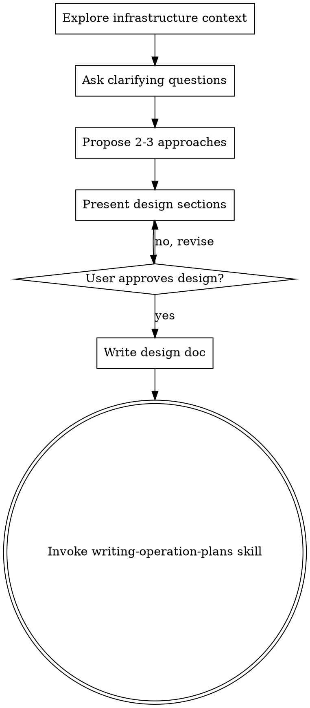

# Brainstorming Infrastructure Operations

## Overview

Help turn infrastructure operation ideas into fully formed designs through collaborative dialogue.

Start by understanding the current infrastructure state, then ask questions one at a time to refine the operation. Once you understand what you're executing, present the design in small sections (200-300 words), checking after each section whether it looks right so far.

**Announce at start:** "I'm using the brainstorming-operations skill to design this infrastructure operation."

**Save designs to:** `docs/plans/YYYY-MM-DD-<operation-name>-design.md`

<HARD-GATE>
Do NOT execute any operation, run any kubectl/terraform commands, or make any infrastructure changes until you have presented a design and the user has approved it. This applies to EVERY operation regardless of perceived simplicity.
</HARD-GATE>

## Process Flow

**The terminal state is invoking writing-operation-plans.** Do NOT invoke test-driven-operation, subagent-driven-operation, or any other execution skill. The ONLY skill you invoke after brainstorming is writing-operation-plans.

## The Process

**Understanding the operation:**
- Check current infrastructure state (kubectl, configs, recent changes)
- Ask questions one at a time to refine the operation
- Prefer multiple choice questions when possible
- Focus on: purpose, scope, constraints, risk level

**Exploring approaches:**
- Propose 2-3 different approaches with trade-offs
- Lead with your recommended option and explain why
- Consider: downtime, rollback complexity, verification strategies

**Presenting the design:**
- Break into sections of 200-300 words
- Ask after each section whether it looks right
- Cover: current state, desired state, operation steps, verification commands, rollback plan, risk assessment

## Design Document Structure

| Section | What to Cover |
|---------|---------------|
| **Current State** | What infrastructure exists, recent changes, known issues |
| **Desired State** | What operation achieves, success criteria, rollback criteria |
| **Operation Approach** | High-level steps, verification per step, rollback per step |
| **Risk Assessment** | Risk level (L/M/H), what could go wrong, rollback triggers |
| **Prerequisites** | Tools/access needed, info to gather, dependencies |
| **Business Impact** | Services affected, expected downtime, customer impact |

## Infrastructure Operation Patterns

| Operation Type | Risk Level | Key Considerations |
|----------------|------------|-------------------|
| **K8s Deployment Update** | Medium | Rolling update, pod health, traffic disruption |
| **Database Migration** | High | Data loss potential, rollback script, checksums |
| **Keycloak/IDP Change** | High | Auth disruption, token validation, user login tests |
| **Config/Secret Update** | Low-Medium | Pod restart, config validation, ArgoCD sync |
| **Network/Ingress Change** | Medium | DNS propagation, certificate validation, LB health |

## Questions to Ask

**Understanding scope:**
- What infrastructure components are affected?
- What's the current state? What's the desired state?
- Are there dependencies or prerequisites?

**Risk assessment:**
- What's the worst-case scenario?
- How would we detect failure?
- What's the rollback strategy?

**Verification strategy:**
- How will we verify each step?
- What commands confirm success?
- What indicators show failure?

**Execution approach:**
- Can this be done incrementally?
- Are there maintenance windows?
- Who needs to be notified?

## Key Principles

| Principle | What It Means |
|-----------|---------------|
| **One question at a time** | Don't overwhelm with multiple questions |
| **Risk-focused** | Always consider what could go wrong and how to detect it |
| **Verification-first** | Design verification strategies before operation steps |
| **Rollback-aware** | Every operation should have a rollback plan |
| **Dry-run strategy** | Identify which commands support `--dry-run` |

## Red Flags

- Proceeding without understanding current infrastructure state
- Skipping rollback planning
- Not considering verification strategies
- Ignoring dependencies between systems
- Not asking about maintenance windows

## After the Design

**Documentation:**
- Write validated design to `docs/plans/YYYY-MM-DD-<operation-name>-design.md`
- Commit the design document to git

**Planning:**
- Invoke **srepowers:writing-operation-plans** to create detailed execution plan
- Do NOT invoke any other skill. writing-operation-plans is the next step.
