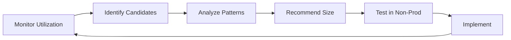

# Right-Sizing Resources

## Overview

Right-sizing matches instance types and sizes to workload requirements, eliminating waste from over-provisioning.

## Right-Sizing Process



## Utilization Thresholds

| Resource | Under-Utilized | Right-Sized | Over-Utilized |
|----------|----------------|-------------|---------------|
| CPU | < 10% | 40-70% | > 80% |
| Memory | < 20% | 50-75% | > 85% |
| Network | < 5% | 30-60% | > 70% |
| Disk I/O | < 10% | 40-70% | > 80% |

## Analysis Commands

### AWS EC2

```bash
# Get CPU utilization (last 14 days)
aws cloudwatch get-metric-statistics \
  --namespace AWS/EC2 \
  --metric-name CPUUtilization \
  --dimensions Name=InstanceId,Value=i-xxx \
  --statistics Average Maximum \
  --period 86400 \
  --start-time $(date -d '14 days ago' -Is) \
  --end-time $(date -Is) \
  --query 'Datapoints[*].{Date:Timestamp, Avg:Average, Max:Maximum}' \
  --output table
```

### AWS RDS

```bash
# Get RDS CPU and memory metrics
aws cloudwatch get-metric-statistics \
  --namespace AWS/RDS \
  --metric-name CPUUtilization \
  --dimensions Name=DBInstanceIdentifier,Value=my-db \
  --statistics Average \
  --period 3600 \
  --start-time $(date -d '7 days ago' -Is) \
  --end-time $(date -Is)
```

### Kubernetes

```bash
# Get pod resource requests vs usage
kubectl top pods --all-namespaces
kubectl describe pods -n <namespace> | grep -A 5 "Limits:\|Requests:"
```

## Instance Family Selection

### AWS General Purpose

| Family | Use Case | vCPU:Memory |
|--------|----------|-------------|
| t3/t4g | Burst workloads | 1:2 |
| m5/m6i | Balanced | 1:4 |
| m6a | AMD-based balanced | 1:4 |

### AWS Compute Optimized

| Family | Use Case | vCPU:Memory |
|--------|----------|-------------|
| c5/c6i | CPU-intensive | 1:2 |
| c6g | Graviton ARM | 1:2 |

### AWS Memory Optimized

| Family | Use Case | vCPU:Memory |
|--------|----------|-------------|
| r5/r6i | Memory-intensive | 1:8 |
| x2ie | Extreme memory | 1:12+ |

## Right-Sizing Checklist

- [ ] Collect 14+ days of utilization data
- [ ] Identify instances with < 40% average CPU
- [ ] Identify instances with < 50% memory usage
- [ ] Check for burstable instances (t3/t4g) running at high CPU credits
- [ ] Review database connection counts and query performance
- [ ] Test recommended size in non-production
- [ ] Plan for rollback if performance degrades
- [ ] Document changes and cost impact
