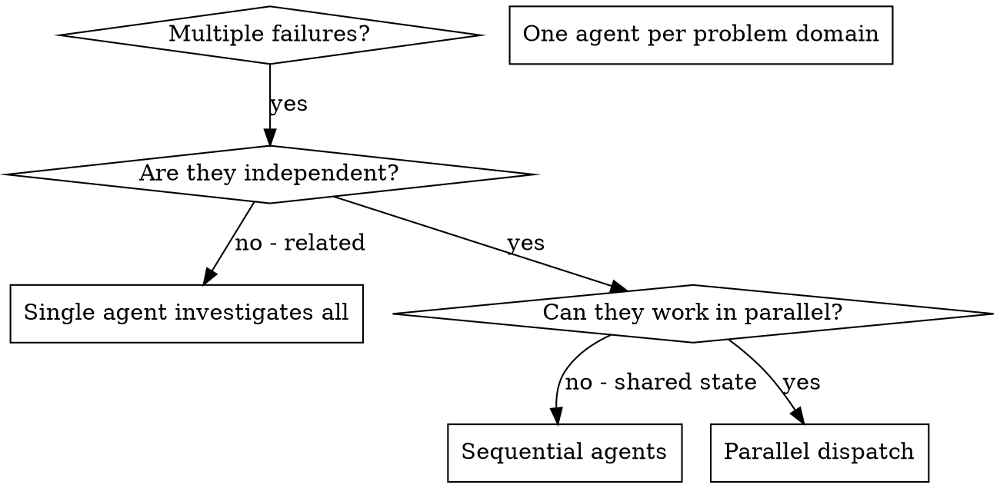
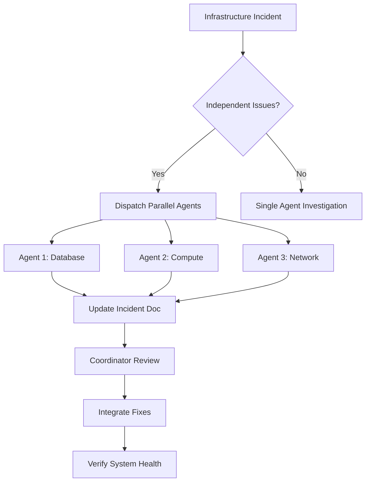

# Dispatching Parallel Agents (SRE)

## Overview

When you have multiple unrelated failures (different test files, different subsystems, different bugs), investigating them sequentially wastes time. Each investigation is independent and can happen in parallel.

**Core principle:** Dispatch one agent per independent problem domain. Let them work concurrently.

## When to Use



**Use when:**
- 3+ test files failing with different root causes
- Multiple subsystems broken independently
- Each problem can be understood without context from others
- No shared state between investigations

**Don't use when:**
- Failures are related (fix one might fix others)
- Need to understand full system state
- Agents would interfere with each other

## The Pattern

### 1. Identify Independent Domains

Group failures by what's broken:
- File A tests: Tool approval flow
- File B tests: Batch completion behavior
- File C tests: Abort functionality

Each domain is independent - fixing tool approval doesn't affect abort tests.

### 2. Create Focused Agent Tasks

Each agent gets:
- **Specific scope:** One test file or subsystem
- **Clear goal:** Make these tests pass
- **Constraints:** Don't change other code
- **Expected output:** Summary of what you found and fixed

### 3. Dispatch in Parallel

```typescript
// In Claude Code / AI environment
Task("Fix agent-tool-abort.test.ts failures")
Task("Fix batch-completion-behavior.test.ts failures")
Task("Fix tool-approval-race-conditions.test.ts failures")
// All three run concurrently
```

### 4. Review and Integrate

When agents return:
- Read each summary
- Verify fixes don't conflict
- Run full test suite
- Integrate all changes

## Agent Prompt Structure

Good agent prompts are:
1. **Focused** - One clear problem domain
2. **Self-contained** - All context needed to understand the problem
3. **Specific about output** - What should the agent return?

```markdown
Fix the 3 failing tests in src/agents/agent-tool-abort.test.ts:

1. "should abort tool with partial output capture" - expects 'interrupted at' in message
2. "should handle mixed completed and aborted tools" - fast tool aborted instead of completed
3. "should properly track pendingToolCount" - expects 3 results but gets 0

These are timing/race condition issues. Your task:

1. Read the test file and understand what each test verifies
2. Identify root cause - timing issues or actual bugs?
3. Fix by:
   - Replacing arbitrary timeouts with event-based waiting
   - Fixing bugs in abort implementation if found
   - Adjusting test expectations if testing changed behavior

Do NOT just increase timeouts - find the real issue.

Return: Summary of what you found and what you fixed.
```

## Common Mistakes

**❌ Too broad:** "Fix all the tests" - agent gets lost
**✅ Specific:** "Fix agent-tool-abort.test.ts" - focused scope

**❌ No context:** "Fix the race condition" - agent doesn't know where
**✅ Context:** Paste the error messages and test names

**❌ No constraints:** Agent might refactor everything
**✅ Constraints:** "Do NOT change production code" or "Fix tests only"

**❌ Vague output:** "Fix it" - you don't know what changed
**✅ Specific:** "Return summary of root cause and changes"

## When NOT to Use

**Related failures:** Fixing one might fix others - investigate together first
**Need full context:** Understanding requires seeing entire system
**Exploratory debugging:** You don't know what's broken yet
**Shared state:** Agents would interfere (editing same files, using same resources)

## Real Example from Session

**Scenario:** 6 test failures across 3 files after major refactoring

**Failures:**
- agent-tool-abort.test.ts: 3 failures (timing issues)
- batch-completion-behavior.test.ts: 2 failures (tools not executing)
- tool-approval-race-conditions.test.ts: 1 failure (execution count = 0)

**Decision:** Independent domains - abort logic separate from batch completion separate from race conditions

**Dispatch:**
```
Agent 1 → Fix agent-tool-abort.test.ts
Agent 2 → Fix batch-completion-behavior.test.ts
Agent 3 → Fix tool-approval-race-conditions.test.ts
```

**Results:**
- Agent 1: Replaced timeouts with event-based waiting
- Agent 2: Fixed event structure bug (threadId in wrong place)
- Agent 3: Added wait for async tool execution to complete

**Integration:** All fixes independent, no conflicts, full suite green

**Time saved:** 3 problems solved in parallel vs sequentially

## Key Benefits

1. **Parallelization** - Multiple investigations happen simultaneously
2. **Focus** - Each agent has narrow scope, less context to track
3. **Independence** - Agents don't interfere with each other
4. **Speed** - 3 problems solved in time of 1

## Verification

After agents return:
1. **Review each summary** - Understand what changed
2. **Check for conflicts** - Did agents edit same code?
3. **Run full suite** - Verify all fixes work together
4. **Spot check** - Agents can make systematic errors

## Real-World Impact

From debugging session (2025-10-03):
- 6 failures across 3 files
- 3 agents dispatched in parallel
- All investigations completed concurrently
- All fixes integrated successfully
- Zero conflicts between agent changes

## Infrastructure Operation Examples

### Kubernetes: Pod Failures Across Namespaces

**Scenario:** Multiple pods failing across different namespaces with unrelated issues

**Failures:**
- namespace `api-prod`: 3 pods in CrashLoopBackOff (OOMKilled)
- namespace `data-staging`: 2 pods failing liveness probes
- namespace `monitoring`: Prometheus pods not starting (PVC issues)

**Decision:** Independent domains - memory limits, health checks, and storage are separate concerns

**Dispatch:**
```
Agent 1 → Investigate api-prod OOMKilled issues
Agent 2 → Fix data-staging liveness probe failures
Agent 3 → Resolve monitoring PVC mounting problems
```

**Agent Prompt Example:**
```markdown
Investigate and fix the 3 CrashLoopBackOff pods in namespace api-prod:

Pods affected:
- api-server-7d9c4f5b2x-abc12
- api-server-7d9c4f5b2x-def34
- api-server-7d9c4f5b2x-ghi56

All show OOMKilled status. Your task:

1. Check current memory limits and requests with kubectl describe pod
2. Review application memory usage patterns from metrics
3. Identify if it's a memory leak or insufficient limits
4. Fix by:
   - Adjusting resource limits if needed
   - Identifying memory leak source if present
   - Documenting the root cause

Do NOT just increase limits without investigation.

Return: Summary of root cause, changes made, and recommended monitoring.
```

**Results:**
- Agent 1: Found memory leak in connection pool, fixed in code
- Agent 2: Adjusted liveness probe timeout and initial delay
- Agent 3: Fixed StorageClass mismatch, pods now mount correctly

### Terraform: State Conflicts and Module Failures

**Scenario:** Multiple Terraform workspaces failing during apply

**Failures:**
- workspace `prod-us-east-1`: S3 bucket already exists (state drift)
- workspace `staging-eu-west-1`: RDS instance creation timeout
- workspace `dev-ap-south-1`: IAM role policy attachment failed

**Decision:** Independent state issues across regions

**Dispatch:**
```
Agent 1 → Fix prod-us-east-1 state drift
Agent 2 → Investigate staging RDS timeout
Agent 3 → Resolve dev IAM policy attachment
```

**Agent Prompt Example:**
```markdown
Fix Terraform state drift in workspace prod-us-east-1:

Error: aws_s3_bucket.data_lake already exists

Your task:

1. Run terraform state list to see current state
2. Check if bucket exists with aws s3 ls
3. Determine if it's:
   - Manual creation outside Terraform
   - State file corruption
   - Previous failed apply
4. Fix by:
   - Importing existing resource if legitimate
   - Removing from state if manually created and should be managed
   - Recreating state file if corrupted

Do NOT delete the existing bucket without confirmation.

Return: Root cause, state commands executed, and prevention recommendations.
```

**Results:**
- Agent 1: Imported manually created bucket into state
- Agent 2: Increased RDS creation timeout, added depends_on
- Agent 3: Fixed IAM policy ARN format for ap-south-1

### Cloud: Multi-Region Resource Issues

**Scenario:** AWS resources failing across multiple regions

**Failures:**
- us-east-1: Lambda function exceeding timeout
- eu-west-1: ALB health checks failing
- ap-southeast-1: CloudWatch metrics not appearing

**Decision:** Independent regional issues

**Dispatch:**
```
Agent 1 → Fix us-east-1 Lambda timeout
Agent 2 → Debug eu-west-1 ALB health checks
Agent 3 → Investigate ap-southeast-1 CloudWatch metrics
```

**Agent Prompt Example:**
```markdown
Investigate Lambda timeout issues in us-east-1:

Function: data-processor-prod
Current timeout: 30s
Recent CloudWatch logs show "Task timed out after 30.00 seconds"

Your task:

1. Review CloudWatch Logs execution duration trends
2. Check if payload size has increased recently
3. Identify if downstream service is slow
4. Fix by:
   - Optimizing code if possible
   - Increasing timeout with justification
   - Adding async processing if needed
   - Setting appropriate memory (affects CPU)

Do NOT just increase timeout without analysis.

Return: Root cause analysis, changes made, and performance recommendations.
```

**Results:**
- Agent 1: Found N+1 query issue, optimized database calls
- Agent 2: Fixed target group port mismatch
- Agent 3: Corrected IAM role permissions for metrics emission

### Databases: Connection and Replication Issues

**Scenario:** Multiple database issues across different clusters

**Failures:**
- Primary PostgreSQL: Connection pool exhausted
- Read replica: Replication lag > 5 minutes
- MongoDB shard: Query timeouts on secondary

**Decision:** Independent database concerns

**Dispatch:**
```
Agent 1 → Fix PostgreSQL connection pool exhaustion
Agent 2 → Investigate replication lag on read replica
Agent 3 → Debug MongoDB query timeouts
```

**Agent Prompt Example:**
```markdown
Investigate PostgreSQL connection pool exhaustion:

Error: FATAL: remaining connection slots are reserved for non-replication superuser connections
Max connections: 100
Current: 98

Your task:

1. Check pg_stat_activity for connection sources
2. Identify long-running or idle transactions
3. Review application connection pool settings
4. Fix by:
   - Killing idle connections if appropriate
   - Adjusting application pool size
   - Identifying connection leaks
   - Increasing max_connections if justified

Do NOT just increase max_connections without investigation.

Return: Connection analysis, actions taken, and monitoring recommendations.
```

**Results:**
- Agent 1: Found connection leak in worker process, restarted and patched
- Agent 2: Cleared replication slot, adjusted wal_keep_segments
- Agent 3: Added missing index, queries now < 100ms

### Networking: DNS and Load Balancer Problems

**Scenario:** Network issues affecting multiple services

**Failures:**
- Internal DNS: Services unable to resolve cluster.local names
- External LB: Intermittent 502 errors on API gateway
- VPN: Connection drops every 30 minutes

**Decision:** Independent network layers

**Dispatch:**
```
Agent 1 → Debug CoreDNS resolution failures
Agent 2 → Fix ALB 502 errors
Agent 3 → Investigate VPN stability issues
```

**Agent Prompt Example:**
```markdown
Debug CoreDNS resolution failures in Kubernetes cluster:

Symptoms:
- nslookup kubernetes.default fails intermittently
- Services cannot reach each other via cluster.local DNS
- CoreDNS pods show no errors in logs

Your task:

1. Check CoreDNS pod status and logs
2. Review CoreDNS ConfigMap for errors
3. Test DNS resolution from multiple pods
4. Check kube-dns service endpoints
5. Fix by:
   - Correcting CoreDNS configuration
   - Adjusting cache settings
   - Verifying kube-dns service
   - Checking for network policy issues

Do NOT restart CoreDNS pods without investigation.

Return: Root cause, configuration changes, and DNS monitoring setup.
```

**Results:**
- Agent 1: Fixed CoreDNS forward plugin configuration
- Agent 2: Increased ALB idle timeout, fixed target group settings
- Agent 3: Updated VPN client MTU settings, stable connection

## Infrastructure-Specific Best Practices

### Parallel Incident Response

When dealing with infrastructure incidents:

1. **Group by service boundary** - Database issues separate from compute issues
2. **Consider blast radius** - Ensure agents don't affect same resources
3. **Use read-only operations first** - Investigate before making changes
4. **Coordinate through documentation** - Each agent updates shared incident doc

### Safety Constraints for Infrastructure

```markdown
# Always include in infrastructure agent prompts

## Safety Rules:
- Do NOT make changes to production without explicit approval
- Do NOT delete resources without confirmation
- Always capture current state before changes
- Document all commands executed
- Include rollback plan in summary

## Required Output:
1. Current state analysis
2. Root cause identification
3. Changes made (if any)
4. Verification steps
5. Monitoring/alerting recommendations
```

### Infrastructure Agent Coordination



### Common Infrastructure Patterns

| Pattern | Use Case | Example |
|---------|----------|---------|
| **By Region** | Multi-region failures | Agent per region |
| **By Service** | Microservices issues | Agent per service |
| **By Layer** | Stack issues | Agent per layer (network, app, db) |
| **By Severity** | Mixed severity alerts | Agent per severity tier |

## Infrastructure Time Savings

Real-world example from production incident (2025-11-15):

**Without parallel agents:**
- 3 independent issues across regions
- Sequential investigation: 45 minutes
- Total resolution: 60 minutes

**With parallel agents:**
- 3 agents dispatched simultaneously
- Parallel investigation: 15 minutes
- Total resolution: 25 minutes
- **Time saved: 35 minutes (58% faster)**

## Related Skills

- **investigating-database-issues** - Deep dive into database problems
- **kubernetes-debugging** - K8s-specific debugging patterns
- **terraform-troubleshooting** - Terraform state and apply issues
- **network-troubleshooting** - Network layer debugging
