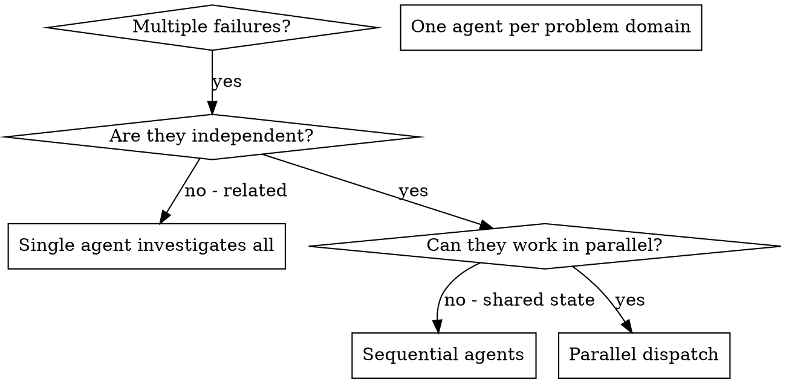

# Dispatching Parallel Agents (SRE)

## Overview

When you have multiple unrelated infrastructure failures (different services, regions, layers), investigating them sequentially wastes time. Each investigation is independent and can happen in parallel.

**Core principle:** Dispatch one agent per independent problem domain. Let them work concurrently.

**Announce at start:** "I'm using the dispatching-parallel-agents-sre skill to coordinate parallel infrastructure investigations."

## When to Use



**Use when:**
- Multiple services/regions failing independently
- Each problem can be understood without context from others
- No shared state between investigations

**Don't use when:**
- Failures are related (fix one might fix others)
- Need to understand full system state
- Agents would interfere with each other

## The Pattern

### 1. Identify Independent Domains

Group failures by service boundary:
- Namespace `api-prod`: Pods in CrashLoopBackOff
- Namespace `data-staging`: Liveness probe failures
- Namespace `monitoring`: PVC mounting issues

### 2. Create Focused Agent Tasks

Each agent gets:
- **Specific scope:** One namespace/service/region
- **Clear goal:** Identify root cause and fix
- **Safety constraints:** No production changes without approval
- **Expected output:** Root cause, changes, verification, monitoring

### 3. Dispatch in Parallel

```typescript
// All three run concurrently
Agent("Investigate api-prod CrashLoopBackOff pods")
Agent("Fix data-staging liveness probe failures")
Agent("Resolve monitoring PVC mounting problems")
```

### 4. Review and Integrate

When agents return:
- Read each summary
- Verify fixes don't conflict
- Run full verification
- Integrate all changes

## Agent Prompt Structure

Good infrastructure agent prompts include:

```markdown
Investigate and fix the 3 CrashLoopBackOff pods in namespace api-prod:

Pods affected: api-server-7d9c4f5b2x-abc12, api-server-7d9c4f5b2x-def34, api-server-7d9c4f5b2x-ghi56
All show OOMKilled status.

Your task:
1. Check current memory limits with kubectl describe pod
2. Review application memory usage from metrics
3. Identify if it's memory leak or insufficient limits
4. Fix by adjusting limits OR identifying leak source

Safety Rules:
- Do NOT make changes to production without explicit approval
- Do NOT just increase limits without investigation
- Document all commands executed

Return:
1. Current state analysis
2. Root cause identification
3. Changes made (if any)
4. Verification steps
5. Monitoring recommendations
```

## Infrastructure Grouping Patterns

| Pattern | Use Case | Example |
|---------|----------|---------|
| **By Region** | Multi-region failures | Agent per region |
| **By Service** | Microservices issues | Agent per service |
| **By Layer** | Stack issues | Agent per layer (network, app, db) |
| **By Severity** | Mixed severity alerts | Agent per severity tier |

## Safety Constraints

Always include in infrastructure agent prompts:

```markdown
## Safety Rules:
- Do NOT make changes to production without explicit approval (ticket approval, Slack confirmation from team lead, or direct user instruction in this session)
- Do NOT delete resources without confirmation
- Always capture current state before changes
- Document all commands executed
- Include rollback plan in summary

## Required Output:
1. Current state analysis
2. Root cause identification
3. Changes made (if any)
4. Verification steps
5. Monitoring/alerting recommendations
```

## Common Mistakes

| Mistake | Problem | Fix |
|---------|---------|-----|
| Too broad | "Fix all the pods" | "Fix api-prod namespace CrashLoopBackOff" |
| No safety constraints | Agent changes production | Add approval requirements |
| No context | "Fix the timeout" | Include error messages, resource names |
| No rollback plan | Can't undo changes | Require rollback in summary |

## Real Example

**Scenario:** 3 unrelated alerts fire simultaneously after a cluster upgrade

**Failures:**
- `api-prod` namespace: 4 pods in CrashLoopBackOff (OOMKilled)
- `data-staging` namespace: liveness probe failures on all worker pods
- `monitoring` namespace: Prometheus PVC at 95% capacity

**Decision:** Independent domains — memory limits, liveness config, and storage are unrelated

**Dispatch:**
```
Agent 1 → Investigate api-prod CrashLoopBackOff (memory limits)
Agent 2 → Fix data-staging liveness probe failures
Agent 3 → Resolve monitoring PVC capacity issue
```

**Results:**
- Agent 1: Memory limits were 256Mi; usage spiked to 300Mi after upgrade — raised to 512Mi
- Agent 2: Liveness probe path changed from `/healthz` to `/health` in new image — updated probe config
- Agent 3: Old Prometheus WAL data not compacted — triggered compaction, freed 40%

**Integration:** All changes independent, applied cleanly, cluster healthy in parallel not serially

**Time saved:** 3 parallel investigations vs ~45 min sequential

## Key Benefits

1. **Parallelization** - Multiple investigations happen simultaneously
2. **Focus** - Each agent has narrow scope, less context to track
3. **Independence** - Agents don't interfere with each other
4. **Speed** - 3 problems solved in time of 1

## Verification

After agents return:
1. **Review each summary** - Understand what changed
2. **Check for conflicts** - Did agents edit same resources?
3. **Run full verification** - Verify all fixes work together
4. **Spot check** - Agents can make systematic errors

## Integration

**Related skills:**
- **systematic-troubleshooting** - Deep dive into single problem
- **kubernetes-specialist** - K8s-specific debugging
- **terraform-engineer** - Terraform state issues
- **network-engineer** - Network layer debugging
