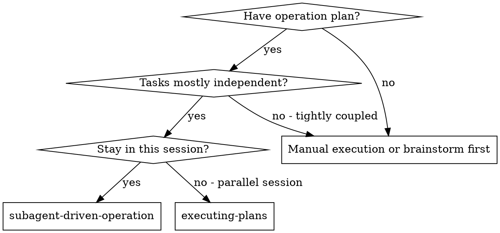
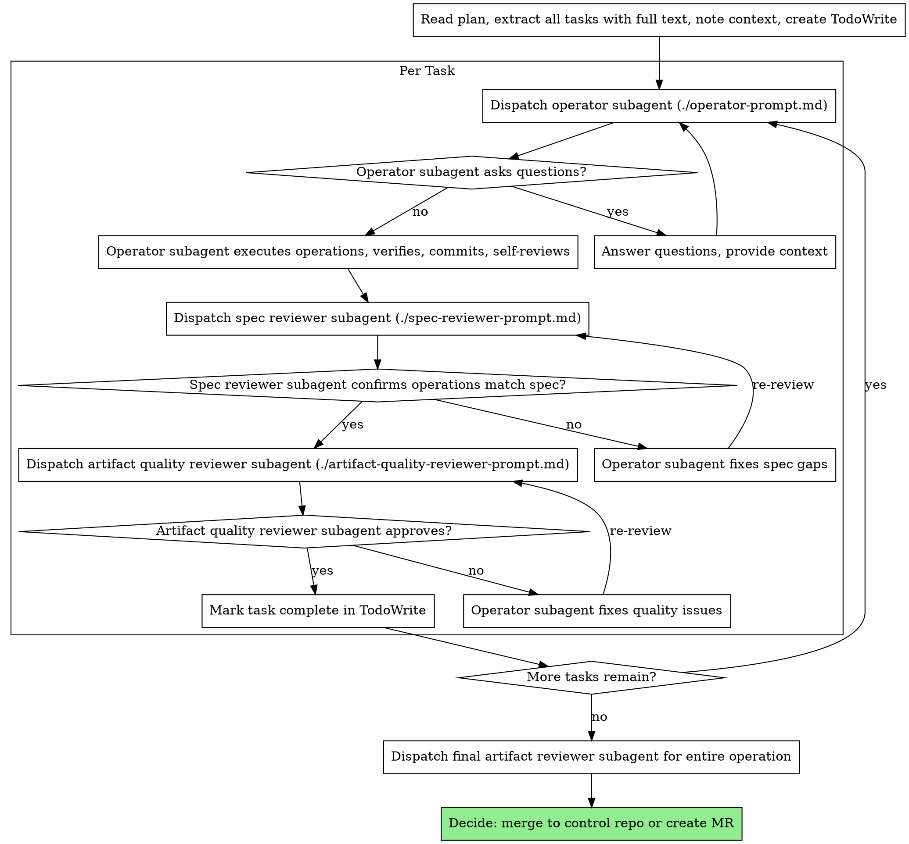

# Subagent-Driven Operation

Execute infrastructure operation plan by dispatching fresh subagent per task, with two-stage review after each: spec compliance review first, then artifact quality review.

**Core principle:** Fresh subagent per task + two-stage review (spec then quality) = high quality, fast iteration

## When to Use



**vs. Executing Plans (parallel session):**
- Same session (no context switch)
- Fresh subagent per task (no context pollution)
- Two-stage review after each task: spec compliance first, then artifact quality
- Faster iteration (no human-in-loop between tasks)
- Adapted for infrastructure operations (API calls, kubectl, Keycloak CRDs, Git MRs)

## The Process



## Prompt Templates

- `./operator-prompt.md` - Dispatch operator subagent
- `./spec-reviewer-prompt.md` - Dispatch spec compliance reviewer subagent
- `./artifact-quality-reviewer-prompt.md` - Dispatch artifact quality reviewer subagent

## Example Workflow

```
You: I'm using Subagent-Driven Operation to execute this infrastructure plan.

[Read plan file once: docs/plans/keycloak-migration-plan.md]
[Extract all 5 tasks with full text and context]
[Create TodoWrite with all tasks]

Task 1: Create Keycloak realm and client

[Get Task 1 text and context (already extracted)]
[Dispatch operator subagent with full task text + context]

Operator: "Before I begin - should I use Keycloak CRDs or direct API calls?"

You: "Use Keycloak CRDs with k8s.keycloak.org/v2alpha1"

Operator: "Got it. Executing now..."
[Later] Operator:
  - Created KeycloakRealmImport CR
  - Created KeycloakClient CR
  - Verified realm is ready (kubectl get keycloakrealm)
  - Verified client exists
  - Self-review: Found I missed redirect URI, added it
  - Committed to control repo

[Dispatch spec compliance reviewer]
Spec reviewer: ✅ Spec compliant - all requirements met, nothing extra

[Get git SHAs, dispatch artifact quality reviewer]
Artifact reviewer: Strengths: Valid YAML, proper labels. Issues: None. Approved.

[Mark Task 1 complete]

Task 2: Configure Kubernetes RBAC

[Get Task 2 text and context (already extracted)]
[Dispatch operator subagent with full task text + context]

Operator: [No questions, proceeds]
Operator:
  - Created ServiceAccount
  - Created Role and RoleBinding
  - Verified permissions (kubectl auth can-i)
  - Self-review: All good
  - Committed to control repo

[Dispatch spec compliance reviewer]
Spec reviewer: ❌ Issues:
  - Missing: RoleBinding namespace (spec says "production")
  - Extra: Added ClusterRole (not requested)

[Operator fixes issues]
Operator: Removed ClusterRole, added RoleBinding namespace

[Spec reviewer reviews again]
Spec reviewer: ✅ Spec compliant now

[Dispatch artifact quality reviewer]
Artifact reviewer: Strengths: Proper RBAC. Issues (Important): No resource limits on ServiceAccount (not applicable for RBAC). Approved.

[Mark Task 2 complete]

...

[After all tasks]
[Dispatch final artifact reviewer]
Final reviewer: All requirements met, artifacts are valid, ready to merge

Done!
```

## Infrastructure Operation Examples

### Kubernetes Operations
- Deployments, Services, ConfigMaps, Secrets
- RBAC (ServiceAccount, Role, RoleBinding)
- Ingress and NetworkPolicy resources
- Custom Resource Definitions (CRDs)

### Keycloak/Identity Operations
- KeycloakRealm, KeycloakClient CRDs
- User and group provisioning
- Client scopes and mappers

### Git Control Repo Operations
- Manifest commits for ArgoCD/Flux
- Helm chart updates
- Kustomize overlays

### API Operations
- REST/GraphQL API calls
- Webhook configurations
- Service integrations

### Linux Server Operations
- Configuration changes (sshd, nginx, etc.)
- Service management (systemctl)
- Package installations

## Advantages

**vs. Manual execution:**
- Subagents follow TDO (Test-Driven Operation) naturally
- Fresh context per task (no confusion)
- Parallel-safe (subagents don't interfere)
- Subagent can ask questions (before AND during work)

**vs. Executing Plans:**
- Same session (no handoff)
- Continuous progress (no waiting)
- Review checkpoints automatic

**Efficiency gains:**
- No file reading overhead (controller provides full text)
- Controller curates exactly what context is needed
- Subagent gets complete information upfront
- Questions surfaced before work begins (not after)

**Quality gates:**
- Self-review catches issues before handoff
- Two-stage review: spec compliance, then artifact quality
- Review loops ensure fixes actually work
- Spec compliance prevents over/under-building
- Artifact quality ensures infrastructure artifacts are correct (YAML valid, JSON correct, etc.)

**Cost:**
- More subagent invocations (operator + 2 reviewers per task)
- Controller does more prep work (extracting all tasks upfront)
- Review loops add iterations
- But catches issues early (cheaper than debugging incidents)

## SRE Principles

### Safety First
- Before dispatching the first operator subagent, confirm environment target and require explicit user consent for production operations
- Each operator subagent must follow TDO with dry-run validation before live execution
- Phase structure: **Pre-check** (validate plan, confirm environment) → **Execute** (dispatch operators with TDO) → **Verify** (spec compliance review, then artifact quality review)

### Structured Output
- Present operation progress using task status tables (task #, name, operator status, spec review, quality review)
- Use two-stage review summaries: spec compliance verdict followed by artifact quality assessment
- Include final operation summary with all tasks, their verification results, and review outcomes

### Evidence-Driven
- Operator reports must include specific verification command outputs, not just pass/fail claims
- Spec reviewers must independently run verification commands and cite their own output as evidence
- Artifact reviewers must reference specific file:line locations and git diff output

### Audit-Ready
- Maintain an operation log with timestamps, subagent IDs, task outcomes, and reviewer decisions
- Track git SHAs (BASE_SHA → HEAD_SHA) per task for complete change traceability
- Link operations to change tickets and preserve review findings as audit artifacts

### Communication
- After all tasks complete, generate an operation summary suitable for incident channels or change management boards
- Translate technical operation outcomes into business impact (services affected, users impacted, downtime)
- Communicate review findings clearly: what passed, what was flagged, what was remediated

## Red Flags

**Never:**
- Start operations on production control repo without explicit user consent
- Skip reviews (spec compliance OR artifact quality)
- Proceed with unfixed issues
- Dispatch multiple operator subagents in parallel (conflicts)
- Make subagent read plan file (provide full text instead)
- Skip scene-setting context (subagent needs to understand where task fits)
- Ignore subagent questions (answer before letting them proceed)
- Accept "close enough" on spec compliance (spec reviewer found issues = not done)
- Skip review loops (reviewer found issues = operator fixes = review again)
- Let operator self-review replace actual review (both are needed)
- **Start artifact quality review before spec compliance is ✅** (wrong order)
- Move to next task while either review has open issues

**If subagent asks questions:**
- Answer clearly and completely
- Provide additional context if needed
- Don't rush them into operation

**If reviewer finds issues:**
- Operator (same subagent) fixes them
- Reviewer reviews again
- Repeat until approved
- Don't skip the re-review

**If subagent fails task:**
- Dispatch fix subagent with specific instructions
- Don't try to fix manually (context pollution)

## Common Rationalizations

| Excuse | Reality |
|--------|---------|
| "Spec reviewer can just read my report" | Reports are incomplete and optimistic. Code/artifact inspection required. |
| "I know what this task requires" | Knowing ≠ doing. Review catches missed requirements and over-building. |
| "Artifact quality review is enough" | Beautiful implementation of wrong requirements = failure. Spec first. |
| "Let me just fix this one thing" | Reviewer finds issues. Operator fixes. Loop until approved. |
| "Reviews waste time" | Review loops prevent rework. One review cycle = faster than redirect. |
| "Self-review is enough" | Self-review catches obvious issues. Reviewers catch subtle problems. |
| "Spec compliance is obvious" | Obvious to you ≠ in the plan. Reviewer verifies against plan text. |
| "Reviews are too formal" | Two-stage review prevents "beautiful but wrong" implementations. |
| "I'll catch issues in final review" | Late issues = more rework. Per-task reviews catch issues early. |
| "Review order doesn't matter" | Spec compliance first prevents wasting time on wrong implementations. |

## Why Order Matters

**Review Order: Spec Compliance Before Artifact Quality**

The two-stage review order is critical: spec compliance review MUST pass before artifact quality review begins.

**Why this order?**

**Spec compliance first:**
- Verifies correct thing was built
- Prevents "beautiful but wrong" implementations
- Artifact quality of wrong code = wasted effort
- Missing requirements are more expensive than YAML syntax errors

**Artifact quality second:**
- Only runs after spec confirmed
- Ensures correct thing is well-built
- Checks YAML/JSON syntax, labels, annotations, security
- Validates infrastructure artifacts are correct

**Real infrastructure example:**

Task: "Create Keycloak client with redirect URIs for app.example.com"

Operator creates:
```yaml
apiVersion: k8s.keycloak.org/v2alpha1
kind: KeycloakClient
metadata:
  name: my-app
  namespace: keycloak
spec:
  enabled: true
  clientId: my-app
  redirectUris:
    - https://app.example.com/callback
  # ... (perfect YAML, proper labels)
```

**Spec compliance review finds:**
- ❌ Missing: adminUrl (required by plan)
- ❌ Extra: webOrigins (not in plan)
- ✅ Artifact quality: Perfect YAML, proper labels

**If artifact quality review ran first:**
- Would approve (beautiful YAML, proper labels)
- Then spec compliance review would fail (missing/extra fields)
- Wasted time reviewing beautiful but wrong implementation

**Correct order (spec compliance first):**
- Spec compliance review immediately identifies missing/extra fields
- Operator fixes before artifact quality review
- Artifact quality review only runs on spec-compliant implementation
- Efficient: no time wasted on wrong implementations

**Review Loops: Both Reviews Loop Until Approval**

When reviewers find issues:
1. Operator (same subagent) fixes issues
2. Reviewer reviews again
3. Repeat until approved
4. No "good enough" - approval required

**Why loops matter:**

**Without loops:**
- Reviewer: "Missing adminUrl"
- Operator: "Got it, I'll add it"
- Task marked complete
- Operator forgot to add adminUrl (no re-verification)

**With loops:**
- Reviewer: "Missing adminUrl"
- Operator: Adds adminUrl
- Reviewer reviews again: "✅ adminUrl present, spec compliant"
- Then artifact quality review runs
- Task marked complete

Loops ensure fixes actually happen and reviewers confirm them.

## Integration

**Required workflow skills:**
- **srepowers:writing-operation-plans** - Creates the operation plan this skill executes
- **srepowers:brainstorming-operations** - Design operations before planning (optional but recommended)

**Subagents should use:**
- **srepowers:test-driven-operation** - Subagents follow TDO for each operation

**Completion:**
- After all tasks complete, decide: merge directly to control repo or create MR for review
- For high-risk operations, create MR and require peer review before merging

**Alternative workflow:**
- For parallel session execution, create operation plan and execute in separate session
