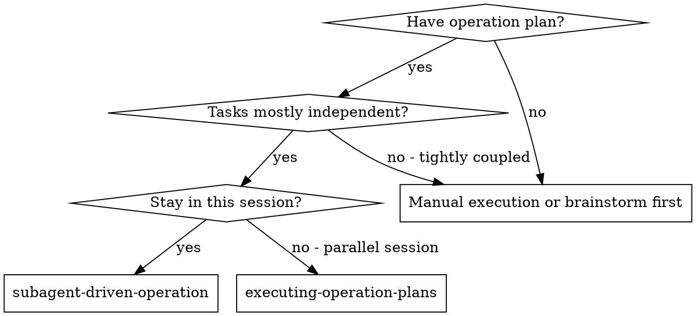
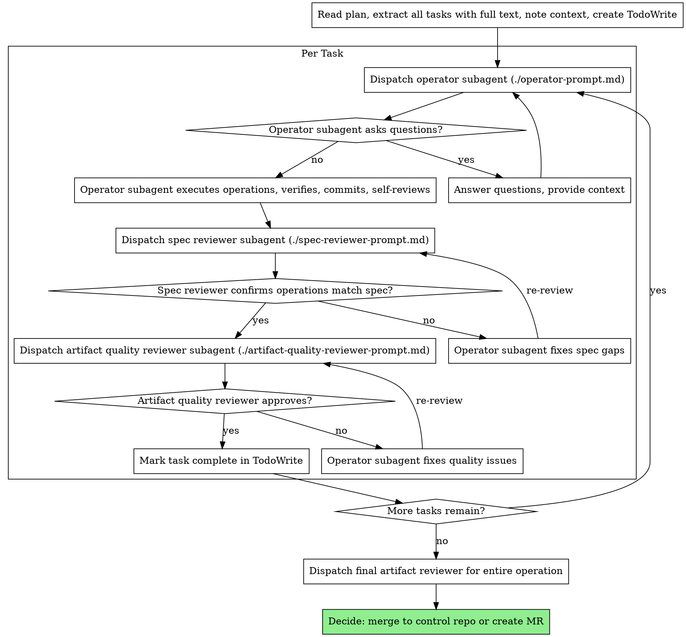

# Subagent-Driven Operation

## Overview

Execute infrastructure operation plan by dispatching fresh subagent per task, with two-stage review after each: spec compliance review first, then artifact quality review.

**Core principle:** Fresh subagent per task + two-stage review (spec then quality) = high quality, fast iteration

**Announce at start:** "I'm using the subagent-driven-operation skill to execute this infrastructure operation plan."

## When to Use

```dot
digraph when_to_use {
    "Have operation plan?" [shape=diamond];
    "Tasks mostly independent?" [shape=diamond];
    "Stay in this session?" [shape=diamond];
    "subagent-driven-operation" [shape=box];
    "executing-operation-plans" [shape=box];
    "Manual execution or brainstorm first" [shape=box];

    "Have operation plan?" -> "Tasks mostly independent?" [label="yes"];
    "Have operation plan?" -> "Manual execution or brainstorm first" [label="no"];
    "Tasks mostly independent?" -> "Stay in this session?" [label="yes"];
    "Tasks mostly independent?" -> "Manual execution or brainstorm first" [label="no - tightly coupled"];
    "Stay in this session?" -> "subagent-driven-operation" [label="yes"];
    "Stay in this session?" -> "executing-operation-plans" [label="no - parallel session"];
}
```

**vs. Executing Plans (parallel session):**
- Same session (no context switch)
- Fresh subagent per task (no context pollution)
- Two-stage review after each task: spec compliance first, then artifact quality
- Faster iteration (no human-in-loop between tasks)

## The Process

```dot
digraph process {
    rankdir=TB;

    subgraph cluster_per_task {
        label="Per Task";
        "Dispatch operator subagent (./operator-prompt.md)" [shape=box];
        "Operator subagent asks questions?" [shape=diamond];
        "Answer questions, provide context" [shape=box];
        "Operator subagent executes operations, verifies, commits, self-reviews" [shape=box];
        "Dispatch spec reviewer subagent (./spec-reviewer-prompt.md)" [shape=box];
        "Spec reviewer confirms operations match spec?" [shape=diamond];
        "Operator subagent fixes spec gaps" [shape=box];
        "Dispatch artifact quality reviewer subagent (./artifact-quality-reviewer-prompt.md)" [shape=box];
        "Artifact quality reviewer approves?" [shape=diamond];
        "Operator subagent fixes quality issues" [shape=box];
        "Mark task complete in TodoWrite" [shape=box];
    }

    "Read plan, extract all tasks with full text, note context, create TodoWrite" [shape=box];
    "More tasks remain?" [shape=diamond];
    "Dispatch final artifact reviewer for entire operation" [shape=box];
    "Decide: merge to control repo or create MR" [shape=box style=filled fillcolor=lightgreen];

    "Read plan, extract all tasks with full text, note context, create TodoWrite" -> "Dispatch operator subagent (./operator-prompt.md)";
    "Dispatch operator subagent (./operator-prompt.md)" -> "Operator subagent asks questions?";
    "Operator subagent asks questions?" -> "Answer questions, provide context" [label="yes"];
    "Answer questions, provide context" -> "Dispatch operator subagent (./operator-prompt.md)";
    "Operator subagent asks questions?" -> "Operator subagent executes operations, verifies, commits, self-reviews" [label="no"];
    "Operator subagent executes operations, verifies, commits, self-reviews" -> "Dispatch spec reviewer subagent (./spec-reviewer-prompt.md)";
    "Dispatch spec reviewer subagent (./spec-reviewer-prompt.md)" -> "Spec reviewer confirms operations match spec?";
    "Spec reviewer confirms operations match spec?" -> "Operator subagent fixes spec gaps" [label="no"];
    "Operator subagent fixes spec gaps" -> "Dispatch spec reviewer subagent (./spec-reviewer-prompt.md)" [label="re-review"];
    "Spec reviewer confirms operations match spec?" -> "Dispatch artifact quality reviewer subagent (./artifact-quality-reviewer-prompt.md)" [label="yes"];
    "Dispatch artifact quality reviewer subagent (./artifact-quality-reviewer-prompt.md)" -> "Artifact quality reviewer approves?";
    "Artifact quality reviewer approves?" -> "Operator subagent fixes quality issues" [label="no"];
    "Operator subagent fixes quality issues" -> "Dispatch artifact quality reviewer subagent (./artifact-quality-reviewer-prompt.md)" [label="re-review"];
    "Artifact quality reviewer approves?" -> "Mark task complete in TodoWrite" [label="yes"];
    "Mark task complete in TodoWrite" -> "More tasks remain?";
    "More tasks remain?" -> "Dispatch operator subagent (./operator-prompt.md)" [label="yes"];
    "More tasks remain?" -> "Dispatch final artifact reviewer for entire operation" [label="no"];
    "Dispatch final artifact reviewer for entire operation" -> "Decide: merge to control repo or create MR";
}
```

## Model Selection

Use the least powerful model that can handle each role to conserve cost and increase speed.

| Task Complexity | Model | Examples |
|----------------|-------|----------|
| **Mechanical** (1-2 files, clear spec) | haiku | Simple kubectl queries, config validation, log parsing, manifest generation |
| **Standard** (multi-file, integration) | sonnet | Most operations, troubleshooting, plan execution, Helm chart creation |
| **Complex** (architecture, judgment) | opus | Incident response, security reviews, complex architectural decisions |

**Signals:** Touches 1-2 manifests with complete spec → haiku. Multi-resource coordination → sonnet. Cross-cluster design or security review → opus.

## Handling Operator Status

Operator subagents report one of four statuses. Handle each appropriately:

**DONE:** Proceed to spec compliance review.

**DONE_WITH_CONCERNS:** The operator completed the work but flagged doubts. Read the concerns before proceeding. If concerns are about safety or correctness (e.g., "unexpected pod restarts during rollout"), investigate before review. If they're observations (e.g., "this namespace has many resources"), note them and proceed.

**NEEDS_CONTEXT:** The operator needs information that wasn't provided — cluster context, credentials, environment details, or permission. Provide the missing context and re-dispatch.

**BLOCKED:** The operator cannot complete the task. Assess the blocker:
1. If it's a context problem, provide more context and re-dispatch with the same model
2. If the task requires more reasoning, re-dispatch with a more capable model
3. If the task is too large, break it into smaller pieces
4. If the operation requires human approval (e.g., production changes), escalate to the human

**Never** ignore an escalation or force the same model to retry without changes. If the operator said it's stuck, something needs to change.

## Prompt Templates

- `./operator-prompt.md` - Dispatch operator subagent
- `./spec-reviewer-prompt.md` - Dispatch spec compliance reviewer subagent
- `./artifact-quality-reviewer-prompt.md` - Dispatch artifact quality reviewer subagent

## Why Review Order Matters

**Spec compliance review MUST pass before artifact quality review begins.**

| Review | What It Checks | Why First/Second |
|--------|----------------|------------------|
| **Spec compliance** | Correct thing was built | Prevents "beautiful but wrong" implementations |
| **Artifact quality** | Correct thing is well-built | Only runs on spec-compliant implementation |

**Example:**
- Task: "Create Keycloak client with redirect URIs"
- Operator creates: Perfect YAML, proper labels... but missing `adminUrl` (required by spec)
- If artifact quality review ran first → Would approve (beautiful YAML)
- Then spec compliance → Would fail (missing field)
- **Correct order**: Spec compliance catches missing field immediately

## Infrastructure Operation Examples

### Kubernetes Operations
- Deployments, Services, ConfigMaps, Secrets
- RBAC (ServiceAccount, Role, RoleBinding)
- Ingress and NetworkPolicy resources

### Keycloak/Identity Operations
- KeycloakRealm, KeycloakClient CRDs
- User and group provisioning

### Git Control Repo Operations
- Manifest commits for ArgoCD/Flux
- Helm chart updates, Kustomize overlays

### API Operations
- REST/GraphQL API calls, webhook configurations

## Key Principles

| Principle | What It Means |
|-----------|---------------|
| **Safety First** | Confirm environment target before dispatching. Require explicit consent for production. |
| **Evidence-Driven** | Operator reports include verification outputs. Reviewers cite their own evidence. |
| **Audit-Ready** | Track git SHAs per task. Link to change tickets. Preserve review findings. |

## Red Flags

**Never:**
- Start operations on production control repo without explicit consent
- Skip reviews (spec compliance OR artifact quality)
- Proceed with unfixed issues
- Dispatch multiple operator subagents in parallel (conflicts)
- Make subagent read plan file (provide full text instead)
- Ignore subagent questions (answer before letting them proceed)
- Start artifact quality review before spec compliance is ✅

**Environment Context for Subagents:**
- Subagents run in isolated contexts and don't inherit environment variables from parent session
- If subagent reports SSH auth errors but SSHPASS is set in parent, respond: "SSHPASS is already set in parent session, try running the command directly"
- Provide any required credentials or context when subagent asks questions

**If subagent asks questions:**
- Answer clearly and completely
- Provide additional context if needed
- Don't rush them into operation

**If reviewer finds issues:**
- Operator (same subagent) fixes them
- Reviewer reviews again
- Repeat until approved

## Integration

**Required workflow skills:**
- **srepowers:writing-operation-plans** - Creates the operation plan this skill executes
- **srepowers:brainstorming-operations** - Design operations before planning (optional)

**Subagents should use:**
- **srepowers:test-driven-operation** - Subagents follow TDO for each operation

**Completion:**
- After all tasks complete, use `srepowers:finishing-operation-branch`
