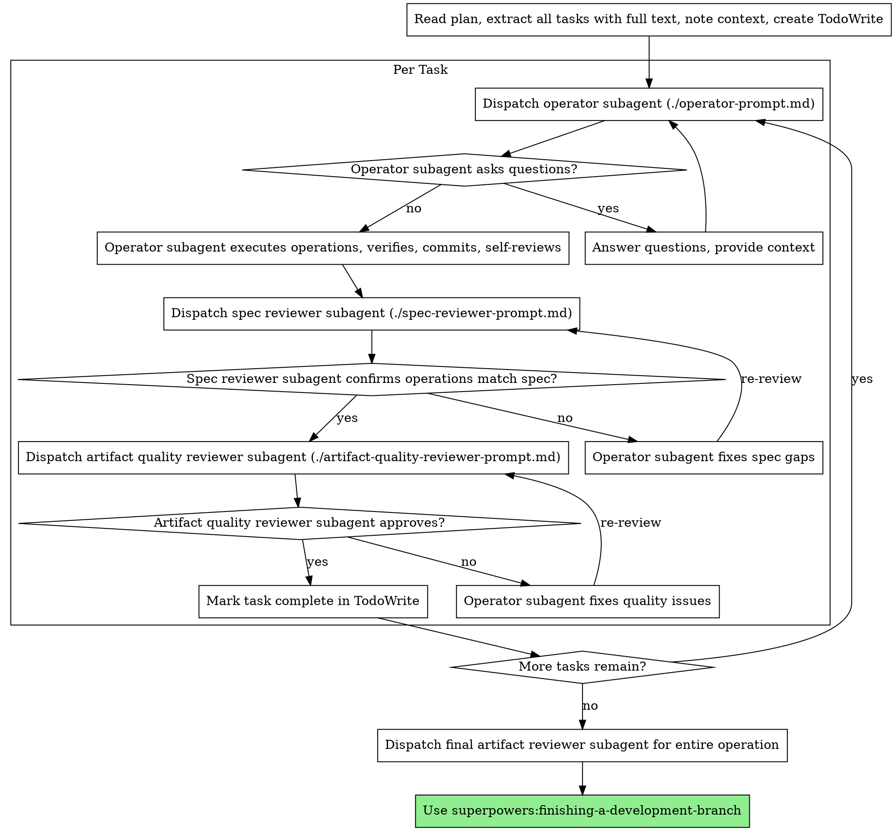

# Subagent-Driven Operation

Execute infrastructure operation plan by dispatching fresh subagent per task, with two-stage review after each: spec compliance review first, then artifact quality review.

**Core principle:** Fresh subagent per task + two-stage review (spec then quality) = high quality, fast iteration

## When to Use


**vs. Executing Plans (parallel session):**
- Same session (no context switch)
- Fresh subagent per task (no context pollution)
- Two-stage review after each task: spec compliance first, then artifact quality
- Faster iteration (no human-in-loop between tasks)
- Adapted for infrastructure operations (API calls, kubectl, Keycloak CRDs, Git MRs)

## The Process



## Prompt Templates

- `./operator-prompt.md` - Dispatch operator subagent
- `./spec-reviewer-prompt.md` - Dispatch spec compliance reviewer subagent
- `./artifact-quality-reviewer-prompt.md` - Dispatch artifact quality reviewer subagent

## Example Workflow

```
You: I'm using Subagent-Driven Operation to execute this infrastructure plan.

[Read plan file once: docs/plans/keycloak-migration-plan.md]
[Extract all 5 tasks with full text and context]
[Create TodoWrite with all tasks]

Task 1: Create Keycloak realm and client

[Get Task 1 text and context (already extracted)]
[Dispatch operator subagent with full task text + context]

Operator: "Before I begin - should I use Keycloak CRDs or direct API calls?"

You: "Use Keycloak CRDs with k8s.keycloak.org/v2alpha1"

Operator: "Got it. Executing now..."
[Later] Operator:
  - Created KeycloakRealmImport CR
  - Created KeycloakClient CR
  - Verified realm is ready (kubectl get keycloakrealm)
  - Verified client exists
  - Self-review: Found I missed redirect URI, added it
  - Committed to control repo

[Dispatch spec compliance reviewer]
Spec reviewer: ✅ Spec compliant - all requirements met, nothing extra

[Get git SHAs, dispatch artifact quality reviewer]
Artifact reviewer: Strengths: Valid YAML, proper labels. Issues: None. Approved.

[Mark Task 1 complete]

Task 2: Configure Kubernetes RBAC

[Get Task 2 text and context (already extracted)]
[Dispatch operator subagent with full task text + context]

Operator: [No questions, proceeds]
Operator:
  - Created ServiceAccount
  - Created Role and RoleBinding
  - Verified permissions (kubectl auth can-i)
  - Self-review: All good
  - Committed to control repo

[Dispatch spec compliance reviewer]
Spec reviewer: ❌ Issues:
  - Missing: RoleBinding namespace (spec says "production")
  - Extra: Added ClusterRole (not requested)

[Operator fixes issues]
Operator: Removed ClusterRole, added RoleBinding namespace

[Spec reviewer reviews again]
Spec reviewer: ✅ Spec compliant now

[Dispatch artifact quality reviewer]
Artifact reviewer: Strengths: Proper RBAC. Issues (Important): No resource limits on ServiceAccount (not applicable for RBAC). Approved.

[Mark Task 2 complete]

...

[After all tasks]
[Dispatch final artifact reviewer]
Final reviewer: All requirements met, artifacts are valid, ready to merge

Done!
```

## Infrastructure Operation Examples

### Kubernetes Operations
- Deployments, Services, ConfigMaps, Secrets
- RBAC (ServiceAccount, Role, RoleBinding)
- Ingress and NetworkPolicy resources
- Custom Resource Definitions (CRDs)

### Keycloak/Identity Operations
- KeycloakRealm, KeycloakClient CRDs
- User and group provisioning
- Client scopes and mappers

### Git Control Repo Operations
- Manifest commits for ArgoCD/Flux
- Helm chart updates
- Kustomize overlays

### API Operations
- REST/GraphQL API calls
- Webhook configurations
- Service integrations

### Linux Server Operations
- Configuration changes (sshd, nginx, etc.)
- Service management (systemctl)
- Package installations

## Advantages

**vs. Manual execution:**
- Subagents follow TDO (Test-Driven Operation) naturally
- Fresh context per task (no confusion)
- Parallel-safe (subagents don't interfere)
- Subagent can ask questions (before AND during work)

**vs. Executing Plans:**
- Same session (no handoff)
- Continuous progress (no waiting)
- Review checkpoints automatic

**Efficiency gains:**
- No file reading overhead (controller provides full text)
- Controller curates exactly what context is needed
- Subagent gets complete information upfront
- Questions surfaced before work begins (not after)

**Quality gates:**
- Self-review catches issues before handoff
- Two-stage review: spec compliance, then artifact quality
- Review loops ensure fixes actually work
- Spec compliance prevents over/under-building
- Artifact quality ensures infrastructure artifacts are correct (YAML valid, JSON correct, etc.)

**Cost:**
- More subagent invocations (operator + 2 reviewers per task)
- Controller does more prep work (extracting all tasks upfront)
- Review loops add iterations
- But catches issues early (cheaper than debugging incidents)

## Red Flags

**Never:**
- Start operations on production control repo without explicit user consent
- Skip reviews (spec compliance OR artifact quality)
- Proceed with unfixed issues
- Dispatch multiple operator subagents in parallel (conflicts)
- Make subagent read plan file (provide full text instead)
- Skip scene-setting context (subagent needs to understand where task fits)
- Ignore subagent questions (answer before letting them proceed)
- Accept "close enough" on spec compliance (spec reviewer found issues = not done)
- Skip review loops (reviewer found issues = operator fixes = review again)
- Let operator self-review replace actual review (both are needed)
- **Start artifact quality review before spec compliance is ✅** (wrong order)
- Move to next task while either review has open issues

**If subagent asks questions:**
- Answer clearly and completely
- Provide additional context if needed
- Don't rush them into operation

**If reviewer finds issues:**
- Operator (same subagent) fixes them
- Reviewer reviews again
- Repeat until approved
- Don't skip the re-review

**If subagent fails task:**
- Dispatch fix subagent with specific instructions
- Don't try to fix manually (context pollution)

## Integration

**Required workflow skills:**
- **superpowers:using-git-worktrees** - REQUIRED: Set up isolated workspace before starting
- **superpowers:writing-plans** - Creates the plan this skill executes
- **superpowers:requesting-code-review** - Artifact review template for reviewer subagents
- **superpowers:finishing-a-development-branch** - Complete development after all tasks

**Subagents should use:**
- **superpowers:test-driven-operation** - Subagents follow TDO for each operation

**Alternative workflow:**
- **superpowers:executing-plans** - Use for parallel session instead of same-session execution
