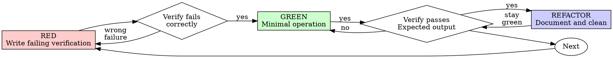

# Test-Driven Operation (TDO)

## Overview

Write the verification command first. Run it and watch it fail. Execute minimal operation to pass.

**Core principle:** If you didn't watch the verification fail, you don't know if it verifies the right thing.

**Violating the letter of the rules is violating the spirit of the rules.**

## When to Use

**Always:**
- API operations (REST, GraphQL, gRPC)
- Kubernetes operations (kubectl, helm)
- Keycloak/Identity provider operations (CRDs, admin APIs)
- Git control repo operations (MRs, commits)
- Linux server operations (configuration changes, deployments)
- Database migrations and schema changes
- Infrastructure provisioning (Terraform, CloudFormation)

**Exceptions (ask your human partner):**
- Emergency incident response (time-critical)
- Read-only diagnostic operations
- Dry-run exploration (first pass only)

Thinking "skip TDO just this once"? Stop. That's rationalization.

## The Iron Law

```
NO INFRASTRUCTURE CHANGE WITHOUT A FAILING VERIFICATION FIRST
```

Execute operation before the verification? Rollback. Start over.

**No exceptions:**
- Don't keep it as "reference"
- Don't "adapt" verification after the fact
- Don't look at it while writing verification
- Rollback means rollback (kubectl delete, git revert, API undo)

Execute fresh from verification. Period.

## Red-Green-Refactor for Operations



### RED - Write Failing Verification

Write one minimal verification showing what should exist or happen.

**Kubernetes example:**
```bash
# Verification: Pod should be running with correct label
kubectl get pod -n production -l app=api-server -o jsonpath='{.items[0].status.phase}'
```

**Keycloak example:**
```bash
# Verification: Realm should exist with client
kubectl get keycloakrealm/example-realm -o jsonpath='{.status.ready}'
```

**Git control repo example:**
```bash
# Verification: Config should be deployed
kubectl get configmap -n production app-config -o jsonpath='{.data.version}'
```

**Requirements:**
- One verifiable outcome
- Clear expected result
- Uses real verification commands (no mocks)

### Verify RED - Watch It Fail

**MANDATORY. Never skip.**

```bash
kubectl get pod -n production -l app=api-server
# Error: No resources found in production namespace
```

Confirm:
- Verification fails (not errors)
- Failure reason is expected (resource doesn't exist)
- Fails because operation not executed (not typos)

**Verification passes?** You're verifying existing state. Fix verification.

**Verification errors?** Fix command, re-run until it fails correctly.

### GREEN - Minimal Operation

Execute simplest operation to pass verification.

**Kubernetes:**
```bash
kubectl apply -f - <<EOF
apiVersion: v1
kind: Pod
metadata:
  name: api-server
  namespace: production
  labels:
    app: api-server
spec:
  containers:
  - name: api
    image: api-server:v1.0.0
EOF
```

**Keycloak CRD:**
```yaml
apiVersion: k8s.keycloak.org/v2alpha1
kind: KeycloakRealmImport
metadata:
  name: example-realm
spec:
  realmImportPath: /realm/example-realm.json
```

**Git control repo:**
```bash
git add config/app-config.yaml
git commit -m "Add app configuration v1.2.3"
git push origin cu_add_app_config
# Wait for ArgoCD sync
```

Don't add features, refactor other resources, or "improve" beyond the verification.

### Verify GREEN - Watch It Pass

**MANDATORY.**

```bash
kubectl get pod -n production -l app=api-server -o jsonpath='{.items[0].status.phase}'
# Output: Running
```

Confirm:
- Verification passes
- Output matches expected
- No errors in logs/events
- Other resources still healthy

**Verification fails?** Fix operation, not verification.

**Other resources broken?** Fix now.

### REFACTOR - Document and Clean

After green only:
- Document the operation in runbook
- Add to Git commit message
- Extract reusable patterns
- Update DR plans

Keep verification passing. Don't add behavior.

### Repeat

Next failing verification for next operation.

## Good Verifications

| Quality | Good | Bad |
|---------|------|-----|
| **Minimal** | One thing. "and" in description? Split it. | `kubectl get pod,svc,configmap` |
| **Clear** | Command describes expected state | `kubectl get all` |
| **Shows intent** | Demonstrates desired outcome | Obscures what operation should achieve |

## Operation Type Examples

### Kubernetes Operations

**RED:**
```bash
kubectl get deployment -n staging api-server -o jsonpath='{.spec.replicas}'
# Expected: 3, Actual: Error: not found
```

**GREEN:**
```bash
kubectl apply -f deployment-api-server.yaml
```

**Verify GREEN:**
```bash
kubectl get deployment -n staging api-server -o jsonpath='{.spec.replicas}'
# Output: 3
```

### API Operations

**RED:**
```bash
curl -s https://api.example.com/users/123 | jq '.email'
# Expected: user@example.com, Actual: null
```

**GREEN:**
```bash
curl -X PATCH https://api.example.com/users/123 \
  -H "Content-Type: application/json" \
  -d '{"email": "user@example.com"}'
```

**Verify GREEN:**
```bash
curl -s https://api.example.com/users/123 | jq '.email'
# Output: "user@example.com"
```

### Keycloak CRD Operations

**RED:**
```bash
kubectl get keycloakclient/my-app -n keycloak -o jsonpath='{.spec.enabled}'
# Expected: true, Actual: Error: not found
```

**GREEN:**
```yaml
apiVersion: k8s.keycloak.org/v2alpha1
kind: KeycloakClient
metadata:
  name: my-app
  namespace: keycloak
spec:
  enabled: true
  clientId: my-app
```

**Verify GREEN:**
```bash
kubectl get keycloakclient/my-app -n keycloak -o jsonpath='{.spec.enabled}'
# Output: true
```

### Git Control Repo Operations

**RED:**
```bash
kubectl get configmap -n production app-config -o jsonpath='{.data.DATABASE_URL}'
# Expected: postgresql://prod-db..., Actual: Error: not found
```

**GREEN:**
```bash
# Create config in control repo
cat > manifests/production/app-config.yaml <<EOF
apiVersion: v1
kind: ConfigMap
metadata:
  name: app-config
  namespace: production
data:
  DATABASE_URL: postgresql://prod-db.example.com:5432/app
EOF

git add manifests/production/app-config.yaml
git commit -m "Add production database config"
git push
```

**Verify GREEN:**
```bash
# Wait for ArgoCD/Flux sync
kubectl get configmap -n production app-config -o jsonpath='{.data.DATABASE_URL}'
# Output: postgresql://prod-db.example.com:5432/app
```

### Linux Server Operations

**RED:**
```bash
ssh prod-server "systemctl is-active nginx"
# Expected: active, Actual: inactive
```

**GREEN:**
```bash
ssh prod-server "sudo systemctl enable --now nginx"
```

**Verify GREEN:**
```bash
ssh prod-server "systemctl is-active nginx"
# Output: active
```

## Why Order Matters

**"I'll verify after to confirm it worked"**

Verifications written after operations pass immediately. Passing immediately proves nothing:
- Might verify wrong thing
- Might verify side effect, not actual change
- Might miss edge cases you forgot
- You never saw it catch the failure

Verification-first forces you to see the verification fail, proving it actually verifies something.

**Infrastructure example:**
- Apply ConfigMap, then write verification for `kubectl get configmap`
- Verification passes immediately (ConfigMap exists)
- But ConfigMap might have wrong data, wrong namespace, or not be deployed to pods
- Write verification FIRST, watch it fail ("not found"), THEN apply
- Now you know verification actually checks the right thing

**"I already manually checked everything works"**

Manual verification is ad-hoc. You think you verified everything but:
- No record of what you verified
- Can't re-run when infrastructure changes
- Easy to forget checks under pressure
- "It worked when I tried it" ≠ comprehensive

Automated verifications are systematic. They run the same way every time.

**Infrastructure example:**
- Manually check pod status: `kubectl get pod -n production` - Running
- Deploy new version, pod stays Running (but app crashes on startup)
- Automated verification: `kubectl get pod -n production -o jsonpath='{.status.phase}'` - shows CrashLoopBackOff
- Manual check missed container restarts, automated catches them

**"Rolling back X hours of work is wasteful"**

Sunk cost fallacy. The time is already gone. Your choice now:
- Rollback and re-execute with TDO (X more hours, high confidence)
- Keep it and verify after (30 min, low confidence, likely issues)

The "waste" is keeping changes you can't trust. Infrastructure changes without real verification are technical debt.

**Infrastructure example:**
- Spent 3 hours writing Kubernetes manifests, skipped TDO
- Applied to production, pods crash because of missing ConfigMap
- Option A: Rollback 3 hours, write verification first, re-apply (1 more hour, high confidence)
- Option B: Fix ConfigMap manually, keep manifests (30 min, low confidence, likely more issues)
- Option A wastes 3 hours. Option B risks production incident. Which is more wasteful?

**"kubectl apply succeeded, that's verification enough"**

kubectl apply succeeding ≠ resource working. Apply only submits manifests to API server.

**Infrastructure examples:**
- `kubectl apply -f deployment.yaml` succeeds (exit 0)
- But: Pods in CrashLoopBackOff, missing ConfigMap, insufficient quota, wrong image
- Verification command: `kubectl get deployment -n production app -o jsonpath='{.status.readyReplicas}'` - reveals actual state
- Apply success tells you manifests are valid YAML. Verification tells you infrastructure works.

**"The script has built-in checks, no need for separate verification"**

Script output ≠ verification. You must read and confirm script output shows expected results.

**Infrastructure example:**
- Deployment script prints "Deployed 5 pods successfully"
- But: Script didn't check if pods are actually Running
- Verification: `kubectl get pods -n production -l app=api --field-selector=status.phase=Running | wc -l` - shows actual count
- Script output is optimistic. Verification is skeptical.

## Common Rationalizations

| Excuse | Reality |
|--------|---------|
| "Too simple to verify" | Simple ops fail. Verification takes 30 seconds. |
| "I'll verify after" | Verification passing immediately proves nothing. |
| "Already manually checked" | Ad-hoc ≠ systematic. No record, can't re-run. |
| "Rolling back X hours is wasteful" | Sunk cost fallacy. Keeping unverified changes is technical debt. |
| "Need to explore first" | Fine. Throw away exploration, start with TDO. |
| "Verification too hard = design unclear" | Listen to verification. Hard to verify = hard to operate. |
| "TDO will slow me down" | TDO faster than debugging incidents. Pragmatic = verify-first. |
| "Manual check faster" | Manual doesn't prove edge cases. You'll re-verify every change. |
| "I'll verify after the operation" | Verification passing immediately proves nothing - could have been passing before |
| "Already manually checked the dashboard" | Ad-hoc ≠ systematic. No record, can't re-run, not reproducible |
| "This is just a quick server restart" | Quick operations fail too. Verification takes seconds, failures take hours |
| "Production is down, no time for verification" | Verification confirms fix works. Without it, you're guessing during emergency |
| "The script already has built-in checks" | Script output ≠ verification. You must read and confirm output |
| "kubectl apply succeeded" | Apply succeeded ≠ resource ready. Pods may crash, config may be invalid |
| "ArgoCD will deploy it automatically" | Verify deployment actually happened. Sync can fail silently |
| "API returned 200" | 200 ≠ correct response body. Response may be wrong or incomplete |
| "Dashboard shows it's up" | Dashboard ≠ verification command. Dashboards lag, cache data |
| "Git push succeeded" | Push succeeded ≠ MR created. CI pipeline may fail, MR may not exist |
| "Keycloak CRD applied" | CRD applied ≠ realm ready. Reconciliation takes time, can fail |
| "SSH access works" | SSH access ≠ service running. Port may be closed, service may be down |

## Red Flags - STOP and Start Over

- Operation before verification
- Verification after operation
- Verification passes immediately
- Can't explain why verification failed
- Verifications added "later"
- Rationalizing "just this once"
- "I already manually checked it"
- "Verifications after achieve the same purpose"
- "It's about spirit not ritual"
- "Keep as reference" or "adapt existing operation"
- "Already spent X hours, rolling back is wasteful"
- "TDO is dogmatic, I'm being pragmatic"
- "This is different because..."

**All of these mean: Rollback operation. Start over with TDO.**

## Verification Checklist

Before marking operation complete:

- [ ] Every operation has a verification command
- [ ] Watched each verification fail before executing operation
- [ ] Each verification failed for expected reason (resource missing, not typo)
- [ ] Executed minimal operation to pass each verification
- [ ] All verifications pass
- [ ] Output pristine (no errors, warnings in logs/events)
- [ ] Verifications use real commands (no mocks)
- [ ] Edge cases and error states covered
- [ ] Documented in runbook/commit message

Can't check all boxes? You skipped TDO. Rollback and start over.

## When Stuck

| Problem | Solution |
|---------|----------|
| Don't know how to verify | Write desired end state. Query for it first. Ask your human partner. |
| Verification too complicated | Operation too complicated. Break into smaller ops. |
| Must verify everything manually | Operation not observable. Add metrics/labels. |
| Verification setup huge | Extract helpers. Still complex? Simplify operation design. |

## Incident Response Integration

Incident detected? Write failing verification reproducing it. Follow TDO cycle. Verification proves fix and prevents regression.

Never fix incidents without verification.

## Final Rule

```
Infrastructure change → verification exists and failed first
Otherwise → not TDO
```

No exceptions without your human partner's permission.
