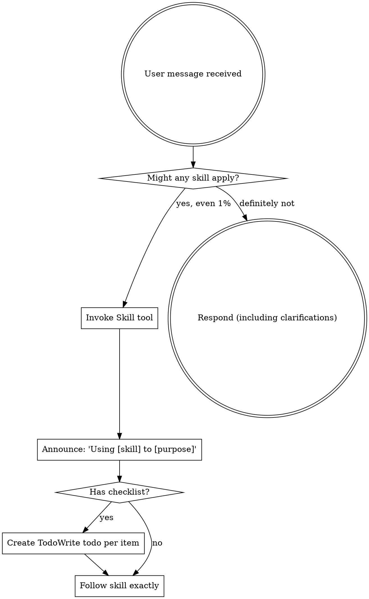

<EXTREMELY-IMPORTANT>
If you think there is even a 1% chance a skill might apply to what you are doing, you ABSOLUTELY MUST invoke the skill.

IF A SKILL APPLIES TO YOUR TASK, YOU DO NOT HAVE A CHOICE. YOU MUST USE IT.

This is not negotiable. This is not optional. You cannot rationalize your way out of this.
</EXTREMELY-IMPORTANT>

## How to Access Skills

**In Claude Code:** Use the `Skill` tool. When you invoke a skill, its content is loaded and presented to you—follow it directly. Never use the Read tool on skill files.

**In other environments:** Check your platform's documentation for how skills are loaded.

# Using Skills

## The Rule

**Invoke relevant or requested skills BEFORE any response or action.** Even a 1% chance a skill might apply means that you should invoke the skill to check. If an invoked skill turns out to be wrong for the situation, you don't need to use it.

## Red Flags

These thoughts mean STOP—you're rationalizing:

| Thought | Reality |
|---------|---------|
| "This is just a quick server check" | Quick operations fail. Check for skills. |
| "I'll verify after the operation" | Verification before completion is a skill. Check first. |
| "Let me explore the infrastructure first" | Skills tell you HOW to explore. Check first. |
| "I can check kubectl/files quickly" | Files lack conversation context. Check for skills. |
| "Let me gather information first" | Skills tell you HOW to gather information. |
| "This doesn't need a formal skill" | If a skill exists, use it. |
| "I remember this skill" | Skills evolve. Read current version. |
| "This doesn't count as a task" | Action = task. Check for skills. |
| "The skill is overkill" | Simple things become complex. Use it. |
| "I'll just do this one thing first" | Check BEFORE doing anything. |
| "This feels productive" | Undisciplined action wastes time. Skills prevent this. |
| "I know what that means" | Knowing the concept ≠ using the skill. Invoke it. |
| "Already manually checked dashboard" | Manual ≠ systematic. Skills require verification. |

## Skill Priority

When multiple skills could apply, use this order:

1. **Process skills first** (brainstorming-operations, writing-operation-plans) - these determine HOW to approach the operation
2. **Execution skills second** (test-driven-operation, subagent-driven-operation) - these guide execution

"Let's deploy X" → brainstorming-operations first, then writing-operation-plans, then subagent-driven-operation.
"Fix this infrastructure issue" → test-driven-operation.

## Skill Types

**Rigid** (test-driven-operation): Follow exactly. Don't adapt away discipline.

**Flexible** (subagent-driven-operation): Adapt principles to context.

The skill itself tells you which.

## SRE Infrastructure Skills

### Core Execution Skills

**test-driven-operation** - Execute infrastructure operations with verification commands
- Use when: Executing ANY infrastructure operation (kubectl, API calls, Git MRs, server changes)
- Core principle: If you didn't watch the verification fail, you don't know if it verifies the right thing
- Workflow: RED (failing verification) → GREEN (minimal operation) → REFACTOR (document)

**subagent-driven-operation** - Execute infrastructure operation plans with subagent dispatch
- Use when: Executing multi-task infrastructure operation plans
- Core principle: Fresh subagent per task + two-stage review (spec compliance then artifact quality)
- Workflow: Dispatch operator → Execute operations → Spec compliance review → Artifact quality review

### Planning & Documentation Skills

**brainstorming-operations** - Design infrastructure operations before implementation
- Use when: Planning new infrastructure operations, migrations, or changes
- Focus: Requirements, risk assessment, rollback plans, verification strategies

**writing-operation-plans** - Create detailed infrastructure operation execution plans
- Use when: You have a design and need to create bite-sized execution steps
- Focus: Step-by-step operations with verification commands at each step

**sre-runbook** - Create structured SRE runbooks for infrastructure operations
- Use when: Creating runbooks for operational procedures
- Focus: Command/Expected/Result format for verifiable steps
- Output: Structured runbooks with pre-requisites, procedures, verification, rollback

### Quality Skills

**verification-before-completion** - Verify before claiming completion
- Use when: About to claim work is complete, fixed, or passing
- Core principle: Evidence before claims, always
- Required: Run verification command and confirm output BEFORE any success claims

### Infrastructure Administration Skills

**pve-admin** - Proxmox VE/Backup Server administration
- Use when: Managing Proxmox VE 8.x/9.x or Proxmox Backup Server 3.x infrastructure
- Features: Cluster management, VM/CT operations, ZFS storage, networking, HA, backup/restore
- Operations: VM lifecycle, storage management, network config, cluster operations

**puppet-code-analyzer** - Puppet code quality analysis
- Use when: Analyzing Puppet control repos or modules
- Features: Linting, dependency analysis, best practice validation, error troubleshooting
- Output: Analysis report with recommendations for improvements

### CI/CD & Pipeline Skills

**gitlab-ecr-pipeline** - GitLab CI/CD → AWS ECR pipelines
- Use when: Creating GitLab pipelines that push container images to AWS ECR
- Supports: Building from Containerfile/Dockerfile, mirroring upstream images
- Features: AWS authentication, Podman support, multi-stage builds, tagging strategies

### Development Tools

**cache-cleanup** - Interactive cleanup for dev tool caches
- Use when: Cleaning up development tool caches with verification
- Supports: mise, npm, Go, Cargo, uv, pipx, pip
- Workflow: Pre-check (verify tools work) → Cleanup → Post-check (verify tools still work)

### Project Management

**clickup-ticket-creator** - ClickUp tickets with CCB template
- Use when: Creating ClickUp tickets following CCB template format
- Sections: Description, Rationale, Impact, Risk, UAT, Procedure, Verification, Rollback
- Output: Formatted ticket ready for submission

## Infrastructure Operation Examples

These skills apply to:
- **Kubernetes operations** - Deployments, Services, ConfigMaps, RBAC, CRDs
- **Keycloak/Identity operations** - Realm provisioning, client configuration, user management
- **Git control repo operations** - ArgoCD/Flux manifests, Helm charts, Kustomize overlays
- **API operations** - REST/GraphQL API calls, webhooks, service integrations
- **Linux server operations** - Configuration changes, service management, package installations
- **Database operations** - Migrations, schema changes, data updates
- **Cloud infrastructure** - Terraform, CloudFormation, Pulumi

## User Instructions

Instructions say WHAT, not HOW. "Deploy X" or "Fix Y" doesn't mean skip workflows.

## The Bottom Line

**When in doubt, invoke the skill.** It's always better to check and discover the skill doesn't apply than to skip it and miss critical discipline.

Infrastructure operations without proper verification and discipline cause incidents. These skills prevent those incidents.
