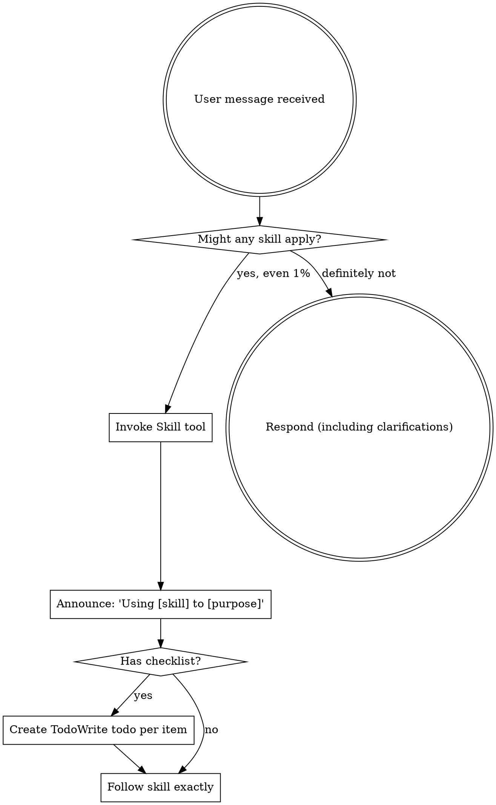

<EXTREMELY-IMPORTANT>
If you think there is even a 1% chance a skill might apply to what you are doing, you ABSOLUTELY MUST invoke the skill.

IF A SKILL APPLIES TO YOUR TASK, YOU DO NOT HAVE A CHOICE. YOU MUST USE IT.

This is not negotiable. This is not optional. You cannot rationalize your way out of this.
</EXTREMELY-IMPORTANT>

## How to Access Skills

**In Claude Code:** Use the `Skill` tool. When you invoke a skill, its content is loaded and presented to you—follow it directly. Never use the Read tool on skill files.

**In other environments:** Check your platform's documentation for how skills are loaded.

# Using Skills

## The Rule

**Invoke relevant or requested skills BEFORE any response or action.** Even a 1% chance a skill might apply means that you should invoke the skill to check. If an invoked skill turns out to be wrong for the situation, you don't need to use it.

## SRE Principles

All skills in this marketplace are bound by five core SRE principles:

| # | Principle | Description |
|---|-----------|-------------|
| 1 | **Safety First** | All operational commands MUST include dry-run validation before execution |
| 2 | **Structured Output** | Use tables, bullet points, and explicit phases (Pre-check → Execute → Verify) |
| 3 | **Evidence-Driven** | Always reference specific log lines, metrics, or config parameters |
| 4 | **Audit-Ready** | Every recommendation must be traceable and reversible |
| 5 | **Communication** | Technical accuracy with business clarity |

These principles apply to both core workflow skills and domain expertise skills. Each skill includes a customized "SRE Principles" section showing how these principles apply in its specific domain.

## Red Flags

These thoughts mean STOP—you're rationalizing:

| Thought | Reality |
|---------|---------|
| "This is just a quick server check" | Quick operations fail. Check for skills. |
| "I'll verify after the operation" | Verification before completion is a skill. Check first. |
| "Let me explore the infrastructure first" | Skills tell you HOW to explore. Check first. |
| "I can check kubectl/files quickly" | Files lack conversation context. Check for skills. |
| "Let me gather information first" | Skills tell you HOW to gather information. |
| "This doesn't need a formal skill" | If a skill exists, use it. |
| "I remember this skill" | Skills evolve. Read current version. |
| "This doesn't count as a task" | Action = task. Check for skills. |
| "The skill is overkill" | Simple things become complex. Use it. |
| "I'll just do this one thing first" | Check BEFORE doing anything. |
| "This feels productive" | Undisciplined action wastes time. Skills prevent this. |
| "I know what that means" | Knowing the concept ≠ using the skill. Invoke it. |
| "Already manually checked dashboard" | Manual ≠ systematic. Skills require verification. |

## Skill Priority

When multiple skills could apply, use this order:

1. **Process skills first** (brainstorming-operations, writing-operation-plans) - these determine HOW to approach the operation
2. **Domain expertise skills second** (kubernetes-specialist, terraform-engineer, cloud-architect, etc.) - these provide deep knowledge
3. **Execution skills third** (test-driven-operation, subagent-driven-operation) - these guide execution

"Let's deploy X" → brainstorming-operations first, then writing-operation-plans, then subagent-driven-operation.
"Fix this infrastructure issue" → test-driven-operation.
"Design a Kubernetes deployment" → kubernetes-specialist for domain knowledge, then writing-operation-plans for execution steps.

## Skill Types

**Rigid** (test-driven-operation): Follow exactly. Don't adapt away discipline.

**Flexible** (subagent-driven-operation): Adapt principles to context.

The skill itself tells you which.

## SRE Infrastructure Skills

### Core Execution Skills

**test-driven-operation** - Execute infrastructure operations with verification commands
- Use when: Executing ANY infrastructure operation (kubectl, API calls, Git MRs, server changes)
- Core principle: If you didn't watch the verification fail, you don't know if it verifies the right thing
- Workflow: RED (failing verification) → GREEN (minimal operation) → REFACTOR (document)

**subagent-driven-operation** - Execute infrastructure operation plans with subagent dispatch
- Use when: Executing multi-task infrastructure operation plans
- Core principle: Fresh subagent per task + two-stage review (spec compliance then artifact quality)
- Workflow: Dispatch operator → Execute operations → Spec compliance review → Artifact quality review

### Planning & Documentation Skills

**brainstorming-operations** - Design infrastructure operations before implementation
- Use when: Planning new infrastructure operations, migrations, or changes
- Focus: Requirements, risk assessment, rollback plans, verification strategies

**writing-operation-plans** - Create detailed infrastructure operation execution plans
- Use when: You have a design and need to create bite-sized execution steps
- Focus: Step-by-step operations with verification commands at each step

**sre-runbook** - Create structured SRE runbooks for infrastructure operations
- Use when: Creating runbooks for operational procedures
- Focus: Command/Expected/Result format for verifiable steps
- Output: Structured runbooks with pre-requisites, procedures, verification, rollback

### Quality Skills

**verification-before-completion** - Verify before claiming completion
- Use when: About to claim work is complete, fixed, or passing
- Core principle: Evidence before claims, always
- Required: Run verification command and confirm output BEFORE any success claims

### Infrastructure Administration Skills

**pve-admin** - Proxmox VE/Backup Server administration
- Use when: Managing Proxmox VE 8.x/9.x or Proxmox Backup Server 3.x infrastructure
- Features: Cluster management, VM/CT operations, ZFS storage, networking, HA, backup/restore
- Operations: VM lifecycle, storage management, network config, cluster operations

**puppet-code-analyzer** - Puppet code quality analysis
- Use when: Analyzing Puppet control repos or modules
- Features: Linting, dependency analysis, best practice validation, error troubleshooting
- Output: Analysis report with recommendations for improvements

### CI/CD & Pipeline Skills

**gitlab-ecr-pipeline** - GitLab CI/CD → AWS ECR pipelines
- Use when: Creating GitLab pipelines that push container images to AWS ECR
- Supports: Building from Containerfile/Dockerfile, mirroring upstream images
- Features: AWS authentication, Podman support, multi-stage builds, tagging strategies

### Development Tools

**cache-cleanup** - Interactive cleanup for dev tool caches
- Use when: Cleaning up development tool caches with verification
- Supports: mise, npm, Go, Cargo, uv, pipx, pip
- Workflow: Pre-check (verify tools work) → Cleanup → Post-check (verify tools still work)

### Project Management

**clickup-ticket-creator** - ClickUp tickets with CCB template
- Use when: Creating ClickUp tickets following CCB template format
- Sections: Description, Rationale, Impact, Risk, UAT, Procedure, Verification, Rollback
- Output: Formatted ticket ready for submission

## Domain Expertise Skills

### Architecture & Design

**architecture-designer** - System architecture design, review, and decision-making
- Use when: Designing new system architecture, reviewing existing designs, making architectural decisions
- Focus: Design patterns, ADRs, scalability planning, system design review

**cloud-architect** - Cloud architecture design and multi-cloud optimization
- Use when: Designing cloud architectures, planning migrations, optimizing multi-cloud deployments
- Focus: Well-Architected Framework, cost optimization, disaster recovery, landing zones, serverless

**microservices-architect** - Distributed systems and microservices patterns
- Use when: Designing distributed systems, decomposing monoliths, implementing microservices patterns
- Focus: Service boundaries, DDD, saga patterns, event sourcing, service mesh, distributed tracing

### DevOps & Infrastructure

**devops-engineer** - CI/CD, containers, and infrastructure as code
- Use when: Setting up CI/CD pipelines, containerizing applications, managing infrastructure as code
- Focus: Pipelines, Docker, Kubernetes, cloud platforms, GitOps

**terraform-engineer** - Infrastructure as code with Terraform
- Use when: Implementing IaC with Terraform across AWS, Azure, or GCP
- Focus: Module development, state management, provider configuration, multi-environment workflows

**kubernetes-specialist** - Kubernetes operations depth
- Use when: Deploying or managing Kubernetes workloads requiring cluster configuration, security hardening, or troubleshooting
- Focus: Helm charts, RBAC, NetworkPolicies, storage, performance optimization

**chaos-engineer** - Resilience testing and failure injection
- Use when: Designing chaos experiments, implementing failure injection, conducting game day exercises
- Focus: Blast radius control, game days, antifragile systems, resilience testing

### Monitoring & Reliability

**monitoring-expert** - Observability stack setup and management
- Use when: Setting up monitoring systems, logging, metrics, tracing, or alerting
- Focus: Dashboards, Prometheus/Grafana, load testing, profiling, capacity planning

**sre-engineer** - SLO/SLI management and reliability at scale
- Use when: Defining SLIs/SLOs, managing error budgets, building reliable systems at scale
- Focus: Incident management, chaos engineering, toil reduction, capacity planning

### Languages & Development

**golang-pro** - Go application development
- Use when: Building Go applications requiring concurrent programming, microservices, or high-performance systems
- Focus: Goroutines, channels, Go generics, gRPC integration

**python-pro** - Python application development
- Use when: Building Python 3.11+ applications requiring type safety, async programming, or production-grade patterns
- Focus: Type hints, pytest, async/await, dataclasses, mypy

**rust-engineer** - Rust systems programming
- Use when: Building Rust applications requiring memory safety, systems programming, or zero-cost abstractions
- Focus: Ownership patterns, lifetimes, traits, async/await with tokio

**sql-pro** - SQL query optimization and schema design
- Use when: Optimizing SQL queries, designing database schemas, or tuning database performance
- Focus: Window functions, CTEs, indexing strategies, query plan analysis

**postgres-pro** - PostgreSQL operations and optimization
- Use when: Optimizing PostgreSQL queries, configuring replication, or implementing advanced features
- Focus: EXPLAIN analysis, JSONB operations, extension usage, VACUUM tuning

### Security

**secure-code-guardian** - Application security and OWASP prevention
- Use when: Implementing authentication/authorization, securing user input, preventing OWASP Top 10
- Focus: Authentication, authorization, input validation, encryption

**security-reviewer** - Security audits and infrastructure security
- Use when: Conducting security audits, reviewing code for vulnerabilities, analyzing infrastructure security
- Focus: SAST scans, penetration testing, DevSecOps practices, cloud security reviews

### Quality & Documentation

**code-reviewer** - Code quality audits and PR reviews
- Use when: Reviewing pull requests, conducting code quality audits, identifying vulnerabilities
- Focus: PR reviews, code quality checks, refactoring suggestions

**code-documenter** - API documentation and docstrings
- Use when: Adding docstrings, creating API documentation, building documentation sites
- Focus: OpenAPI/Swagger specs, JSDoc, doc portals, tutorials, user guides

**test-master** - Testing strategy and automation
- Use when: Writing tests, creating test strategies, building automation frameworks
- Focus: Unit tests, integration tests, E2E, coverage analysis, performance testing

**prompt-engineer** - LLM prompt design and evaluation
- Use when: Designing prompts for LLMs, optimizing model performance, building evaluation frameworks
- Focus: Chain-of-thought, few-shot learning, structured outputs, prompt evaluation

## Infrastructure Operation Examples

These skills apply to:
- **Kubernetes operations** - Deployments, Services, ConfigMaps, RBAC, CRDs
- **Keycloak/Identity operations** - Realm provisioning, client configuration, user management
- **Git control repo operations** - ArgoCD/Flux manifests, Helm charts, Kustomize overlays
- **API operations** - REST/GraphQL API calls, webhooks, service integrations
- **Linux server operations** - Configuration changes, service management, package installations
- **Database operations** - Migrations, schema changes, data updates
- **Cloud infrastructure** - Terraform, CloudFormation, Pulumi

## User Instructions

Instructions say WHAT, not HOW. "Deploy X" or "Fix Y" doesn't mean skip workflows.

## The Bottom Line

**When in doubt, invoke the skill.** It's always better to check and discover the skill doesn't apply than to skip it and miss critical discipline.

Infrastructure operations without proper verification and discipline cause incidents. These skills prevent those incidents.
