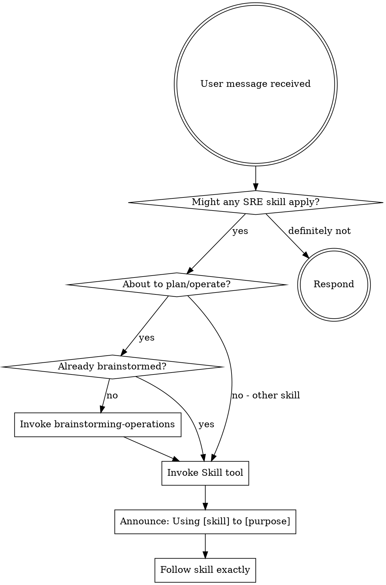

<EXTREMELY-IMPORTANT>
If you think there is even a 1% chance a skill might apply to what you are doing, you ABSOLUTELY MUST invoke the skill.

IF A SKILL APPLIES TO YOUR TASK, YOU DO NOT HAVE A CHOICE. YOU MUST USE IT.

This is not negotiable. This is not optional. You cannot rationalize your way out of this.
</EXTREMELY-IMPORTANT>

## How to Access Skills

**In Claude Code:** Use the `Skill` tool. When you invoke a skill, its content is loaded and presented to you — follow it directly. Never use the Read tool on skill files.

**Skill namespace:** All SRE infrastructure skills are under `srepowers:` (e.g., `srepowers:test-driven-operation`).

# Using SRE Skills

## The Rule

**Invoke relevant or requested skills BEFORE any response or action.** Even a 1% chance a skill might apply means you should invoke the skill to check. If an invoked skill turns out to be wrong for the situation, you don't need to use it.

```dot
digraph skill_flow {
    "User message received" [shape=doublecircle];
    "Might any SRE skill apply?" [shape=diamond];
    "About to plan/operate?" [shape=diamond];
    "Already brainstormed?" [shape=diamond];
    "Invoke brainstorming-operations" [shape=box];
    "Invoke Skill tool" [shape=box];
    "Announce: Using [skill] to [purpose]" [shape=box];
    "Follow skill exactly" [shape=box];
    "Respond" [shape=doublecircle];

    "User message received" -> "Might any SRE skill apply?";
    "Might any SRE skill apply?" -> "About to plan/operate?" [label="yes"];
    "Might any SRE skill apply?" -> "Respond" [label="definitely not"];
    "About to plan/operate?" -> "Already brainstormed?" [label="yes"];
    "About to plan/operate?" -> "Invoke Skill tool" [label="no - other skill"];
    "Already brainstormed?" -> "Invoke brainstorming-operations" [label="no"];
    "Already brainstormed?" -> "Invoke Skill tool" [label="yes"];
    "Invoke brainstorming-operations" -> "Invoke Skill tool";
    "Invoke Skill tool" -> "Announce: Using [skill] to [purpose]";
    "Announce: Using [skill] to [purpose]" -> "Follow skill exactly";
}
```

## Available Skills

For the full skill catalog organized by category, load `references/skill-catalog.md`.

**Core workflow (strict order, do NOT skip steps):** brainstorming-operations → writing-operation-plans → (subagent-driven-operation OR executing-operation-plans) → verification-before-completion → finishing-operation-branch

**Key categories:** Safety & Review, Incident Response, SRE Practices, Platform & Infrastructure, Architecture & Cloud, Languages & Development, Security & Quality

## Red Flags — You Are Rationalizing

| Thought | Reality |
|---------|---------|
| "This is just a quick operation" | Quick ops fail. Check for skills. |
| "I need more context first" | Skill check comes BEFORE gathering context. |
| "Let me just run the command" | TDO first. Always. |
| "I remember this skill" | Skills evolve. Invoke the current version. |
| "This doesn't need brainstorming" | All operations need design. Use brainstorming-operations. |
| "I'll verify after" | Verification-first is the rule. |
| "The skill is overkill here" | Simple things become complex. Use it. |
| "Exit 0 means success" | Exit code ≠ correct result. Use verification-before-completion. |
| "This doesn't count as a task" | Action = task. Check for skills. |
| "Agent reported success" | Verify independently. Trust output, not reports. |

## Skill Priority

1. **Process skills first** (brainstorming-operations, systematic-troubleshooting) — determines HOW to approach
2. **Workflow skills second** (writing-operation-plans, executing-operation-plans) — structures execution
3. **Domain skills third** (kubernetes-specialist, terraform-engineer) — guides implementation

## Skill Types

**Rigid** (test-driven-operation, executing-operation-plans): Follow exactly. The discipline is the point.

**Flexible** (architecture-designer, cost-optimizer): Adapt principles to context.

The skill itself tells you which type it is.
