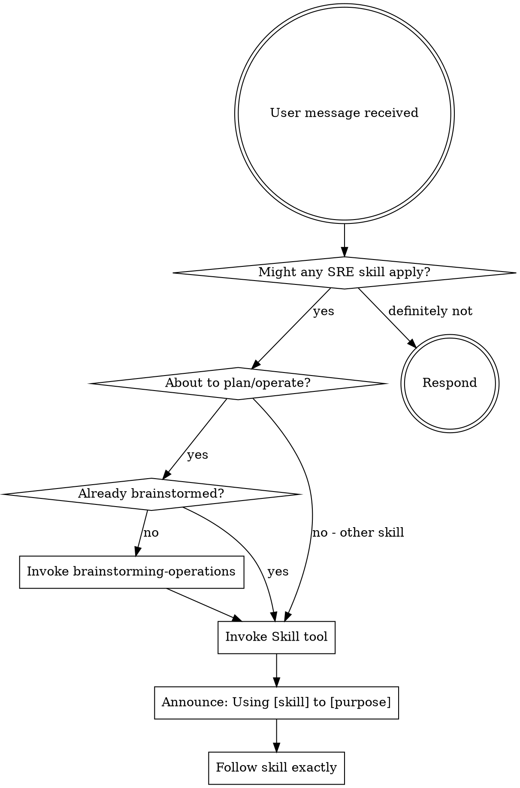

<EXTREMELY-IMPORTANT>
If you think there is even a 1% chance a skill might apply to what you are doing, you ABSOLUTELY MUST invoke the skill.

IF A SKILL APPLIES TO YOUR TASK, YOU DO NOT HAVE A CHOICE. YOU MUST USE IT.

This is not negotiable. This is not optional. You cannot rationalize your way out of this.
</EXTREMELY-IMPORTANT>

## How to Access Skills

**In Claude Code:** Use the `Skill` tool. When you invoke a skill, its content is loaded and presented to you — follow it directly. Never use the Read tool on skill files.

**Skill namespace:** All SRE infrastructure skills are under `srepowers:` (e.g., `srepowers:test-driven-operation`).

# Using SRE Skills

## The Rule

**Invoke relevant or requested skills BEFORE any response or action.** Even a 1% chance a skill might apply means you should invoke the skill to check. If an invoked skill turns out to be wrong for the situation, you don't need to use it.


```dot
digraph skill_flow {
    "User message received" [shape=doublecircle];
    "Might any SRE skill apply?" [shape=diamond];
    "About to plan/operate?" [shape=diamond];
    "Already brainstormed?" [shape=diamond];
    "Invoke brainstorming-operations" [shape=box];
    "Invoke Skill tool" [shape=box];
    "Announce: Using [skill] to [purpose]" [shape=box];
    "Follow skill exactly" [shape=box];
    "Respond" [shape=doublecircle];

    "User message received" -> "Might any SRE skill apply?";
    "Might any SRE skill apply?" -> "About to plan/operate?" [label="yes"];
    "Might any SRE skill apply?" -> "Respond" [label="definitely not"];
    "About to plan/operate?" -> "Already brainstormed?" [label="yes"];
    "About to plan/operate?" -> "Invoke Skill tool" [label="no - other skill"];
    "Already brainstormed?" -> "Invoke brainstorming-operations" [label="no"];
    "Already brainstormed?" -> "Invoke Skill tool" [label="yes"];
    "Invoke brainstorming-operations" -> "Invoke Skill tool";
    "Invoke Skill tool" -> "Announce: Using [skill] to [purpose]";
    "Announce: Using [skill] to [purpose]" -> "Follow skill exactly";
}
```

## Skill Workflow Order

Infrastructure operations follow this sequence:

```
brainstorming-operations → writing-operation-plans → (subagent-driven-operation OR executing-operation-plans) → [verification-before-completion] → finishing-operation-branch
```

Each skill hands off explicitly to the next. Do NOT skip steps.

## Available Skills

### Core Operation Workflow
| Skill | Use When |
|-------|----------|
| `srepowers:brainstorming-operations` | Starting any operation — design before executing |
| `srepowers:writing-operation-plans` | You have a design, need a detailed execution plan |
| `srepowers:executing-operation-plans` | Running a written plan in a separate session with checkpoints |
| `srepowers:subagent-driven-operation` | Running a written plan with fresh subagents per task |
| `srepowers:test-driven-operation` | Executing individual infrastructure operations with verification |
| `srepowers:finishing-operation-branch` | Operation complete, ready to merge/PR |

### Safety and Review
| Skill | Use When |
|-------|----------|
| `srepowers:safety-validator` | Reviewing proposed commands before execution |
| `srepowers:verification-before-completion` | About to claim work is done, deployed, or healthy |
| `srepowers:receiving-code-review-sre` | Processing code review feedback on infra changes |
| `srepowers:environment-health-check` | Verifying SREPowers environment is configured |

### Incident Response
| Skill | Use When |
|-------|----------|
| `srepowers:incident-commander` | Coordinating major infrastructure incidents |
| `srepowers:systematic-troubleshooting` | Root cause analysis for incidents or failures |
| `srepowers:post-mortem-writer` | Writing blameless post-mortems |
| `srepowers:sre-runbook` | Creating structured runbooks |

### Parallel and Workflow Tools
| Skill | Use When |
|-------|----------|
| `srepowers:dispatching-parallel-agents-sre` | 2+ independent infrastructure problems |
| `srepowers:using-git-worktrees-sre` | Isolated workspace for operations |
| `srepowers:writing-skills-sre` | Creating or editing SRE skills |
| `srepowers:playground-tutorial` | Learning SREPowers for the first time |

### SRE Practices
| Skill | Use When |
|-------|----------|
| `srepowers:sre-engineer` | SLI/SLO, error budgets, reliability |
| `srepowers:toil-analysis` | Identifying and reducing operational toil |
| `srepowers:observability-integration` | Metrics/traces/logs verification |
| `srepowers:observability-engineer` | Setting up observability stacks |
| `srepowers:progressive-delivery` | Canary, blue-green deployments |
| `srepowers:chaos-engineer` | Chaos experiments, resilience testing |

### Platform and Infrastructure
| Skill | Use When |
|-------|----------|
| `srepowers:kubernetes-specialist` | K8s deployments, cluster management |
| `srepowers:terraform-engineer` | IaC with Terraform |
| `srepowers:terragrunt-expert` | Terragrunt module orchestration |
| `srepowers:platform-engineer` | Internal developer platforms |
| `srepowers:devops-engineer` | CI/CD, containers, IaC |
| `srepowers:gitlab-ecr-pipeline` | GitLab CI/CD → AWS ECR |
| `srepowers:container-engineer` | Container builds and security |
| `srepowers:network-engineer` | Cloud and hybrid networking |
| `srepowers:pve-admin` | Proxmox VE/PBS administration |
| `srepowers:puppet-code-analyzer` | Puppet code quality analysis |

### Architecture and Cloud
| Skill | Use When |
|-------|----------|
| `srepowers:architecture-designer` | System architecture design |
| `srepowers:cloud-architect` | Cloud architecture and migrations |
| `srepowers:microservices-architect` | Distributed systems design |
| `srepowers:cost-optimizer` | Cloud cost optimization |

### Languages and Development
| Skill | Use When |
|-------|----------|
| `srepowers:golang-pro` | Go application development |
| `srepowers:python-pro` | Python 3.11+ development |
| `srepowers:rust-engineer` | Rust systems programming |
| `srepowers:postgresql-engineer` | PostgreSQL operations |

### Security and Quality
| Skill | Use When |
|-------|----------|
| `srepowers:security-reviewer` | Security audits |
| `srepowers:secure-code-guardian` | Application security |
| `srepowers:code-reviewer` | PR reviews, code quality |
| `srepowers:code-documenter` | API documentation |
| `srepowers:test-master` | Testing strategy |

## Red Flags — You Are Rationalizing

| Thought | Reality |
|---------|---------|
| "This is just a quick operation" | Quick ops fail. Check for skills. |
| "I need more context first" | Skill check comes BEFORE gathering context. |
| "Let me just run the command" | TDO first. Always. |
| "I remember this skill" | Skills evolve. Invoke the current version. |
| "This doesn't need brainstorming" | All operations need design. Use brainstorming-operations. |
| "I'll verify after" | Verification-first is the rule. |
| "The skill is overkill here" | Simple things become complex. Use it. |
| "Exit 0 means success" | Exit code ≠ correct result. Use verification-before-completion. |
| "This doesn't count as a task" | Action = task. Check for skills. |
| "Agent reported success" | Verify independently. Trust output, not reports. |

## Skill Priority

1. **Process skills first** (brainstorming-operations, systematic-troubleshooting) — determines HOW to approach
2. **Workflow skills second** (writing-operation-plans, executing-operation-plans) — structures execution
3. **Domain skills third** (kubernetes-specialist, terraform-engineer) — guides implementation

## Skill Types

**Rigid** (test-driven-operation, executing-operation-plans): Follow exactly. The discipline is the point.

**Flexible** (architecture-designer, cost-optimizer): Adapt principles to context.

The skill itself tells you which type it is.
